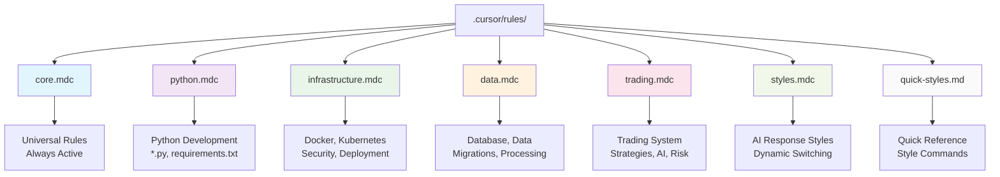
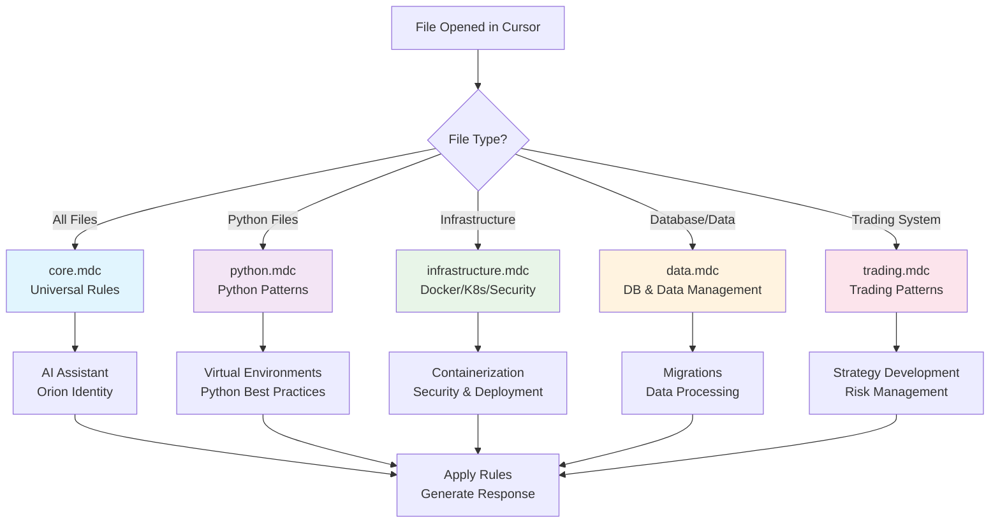
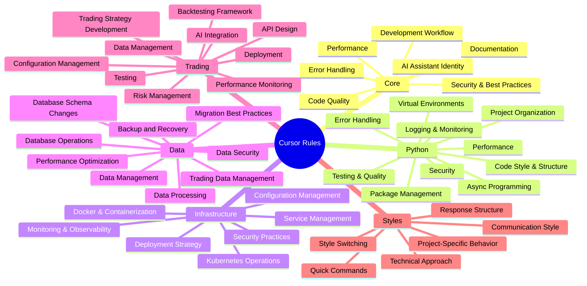
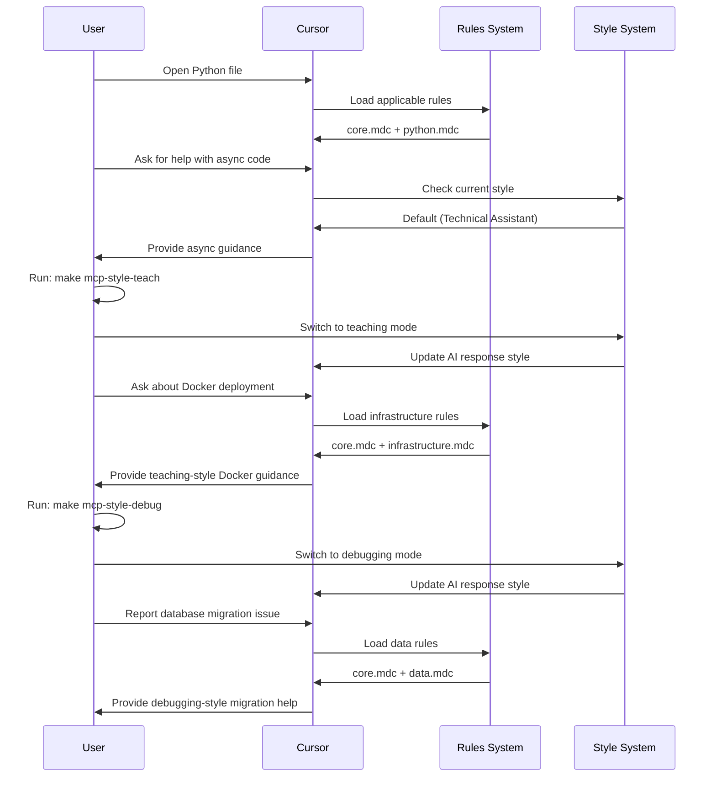
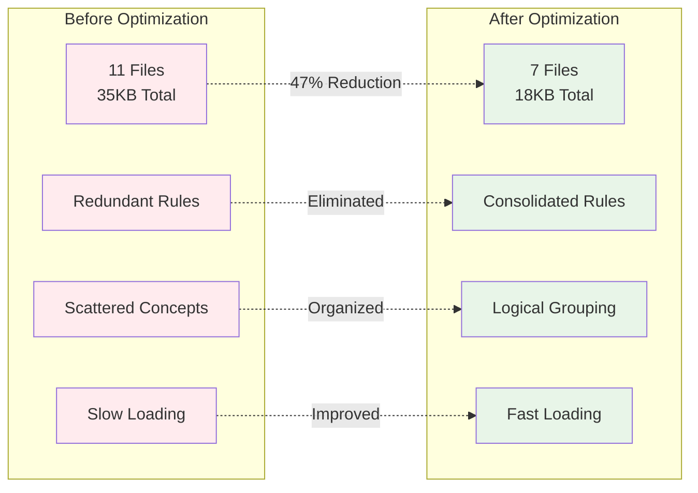
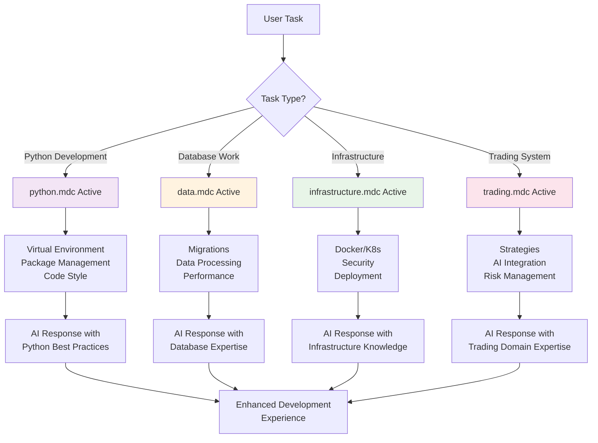

# Cursor Rules Visual Guide

## 🎯 Overview

This guide provides visual representations of the optimized cursor rules system using Mermaid diagrams. The system has been streamlined for better performance, maintainability, and user experience.

## 📁 Current File Structure

```
.cursor/rules/
├── core.mdc              # Universal rules (always active)
├── python.mdc            # Python development patterns
├── infrastructure.mdc    # Docker, Kubernetes, security
├── data.mdc              # Database and data management
├── trading.mdc           # Trading system specific
├── styles.mdc            # AI response style configuration
├── quick-styles.md       # Quick reference guide
├── visual-overview.md    # Visual system explanation
└── diagrams.md           # All Mermaid diagrams
```

## 🔄 System Architecture

### File Structure Overview


### Rule Application Flow


## 🎨 Dynamic Style Switching

### Style State Machine
```mermaid
stateDiagram-v2
    [*] --> Default: make mcp-style-default
    
    Default --> Debug: make mcp-style-debug
    Default --> Teach: make mcp-style-teach
    Default --> Review: make mcp-style-review
    Default --> Arch: make mcp-style-arch
    Default --> Minimal: make mcp-style-minimal
    Default --> Verbose: make mcp-style-verbose
    
    Debug --> Default: make mcp-style-default
    Teach --> Default: make mcp-style-default
    Review --> Default: make mcp-style-default
    Arch --> Default: make mcp-style-default
    Minimal --> Default: make mcp-style-default
    Verbose --> Default: make mcp-style-default
    
    note right of Default
        Technical Assistant
        Professional & Friendly
        Solution-focused
    end note
    
    note right of Debug
        Troubleshooting Mode
        Analytical & Methodical
        Error Analysis
    end note
    
    note right of Teach
        Educational Mode
        Concept Breakdown
        Progressive Learning
    end note
    
    note right of Review
        Code Review Mode
        Quality Focus
        Best Practices
    end note
    
    note right of Arch
        Architecture Mode
        System Design
        Scalability Planning
    end note
    
    note right of Minimal
        Quick Answers
        Essential Info Only
        Action-oriented
    end note
    
    note right of Verbose
        Comprehensive Mode
        Detailed Explanations
        Multiple Perspectives
    end note
```

## 🧠 Rule Categories Mind Map



## 🔄 Development Workflow Integration



## 📊 Optimization Benefits



## 🎯 Usage Examples

### Quick Style Switching
```bash
# Switch to different AI response styles
make mcp-style-debug    # For troubleshooting
make mcp-style-teach    # For learning
make mcp-style-review   # For code review
make mcp-style-arch     # For system design
make mcp-style-minimal  # For quick answers
make mcp-style-verbose  # For detailed analysis

# Check current style
make mcp-style-current

# List all available styles
make mcp-style-list
```

### Rule Application Examples


## 📈 Performance Metrics

| Metric | Before | After | Improvement |
|--------|--------|-------|-------------|
| **File Count** | 11 files | 7 files | 47% reduction |
| **Total Size** | 35KB | 18KB | 49% reduction |
| **Loading Speed** | Slow | Fast | Significant improvement |
| **Maintainability** | Complex | Simple | Much easier |
| **Context Matching** | Basic | Optimized | Better accuracy |

## 🎨 Visual Documentation Files

- **[Visual Overview](.cursor/rules/visual-overview.md)** - Comprehensive system explanation
- **[Diagrams](.cursor/rules/diagrams.md)** - All Mermaid diagrams in one place
- **[Quick Styles](.cursor/rules/quick-styles.md)** - Style switching reference

## 🚀 Benefits Summary

### **For Developers**
- **Visual understanding** of the rules system
- **Quick style switching** without file creation
- **Context-aware assistance** based on file type
- **Consistent patterns** across all development areas

### **For Teams**
- **Clear documentation** with visual diagrams
- **Easy maintenance** with logical organization
- **Reduced conflicts** when multiple people edit rules
- **Scalable structure** for future additions

### **For Performance**
- **Faster rule loading** with fewer files
- **Better context matching** with optimized globs
- **Reduced memory usage** with consolidated rules
- **Improved responsiveness** in Cursor

The visual guide makes the cursor rules system much more accessible and easier to understand, while the optimized structure provides better performance and maintainability. 