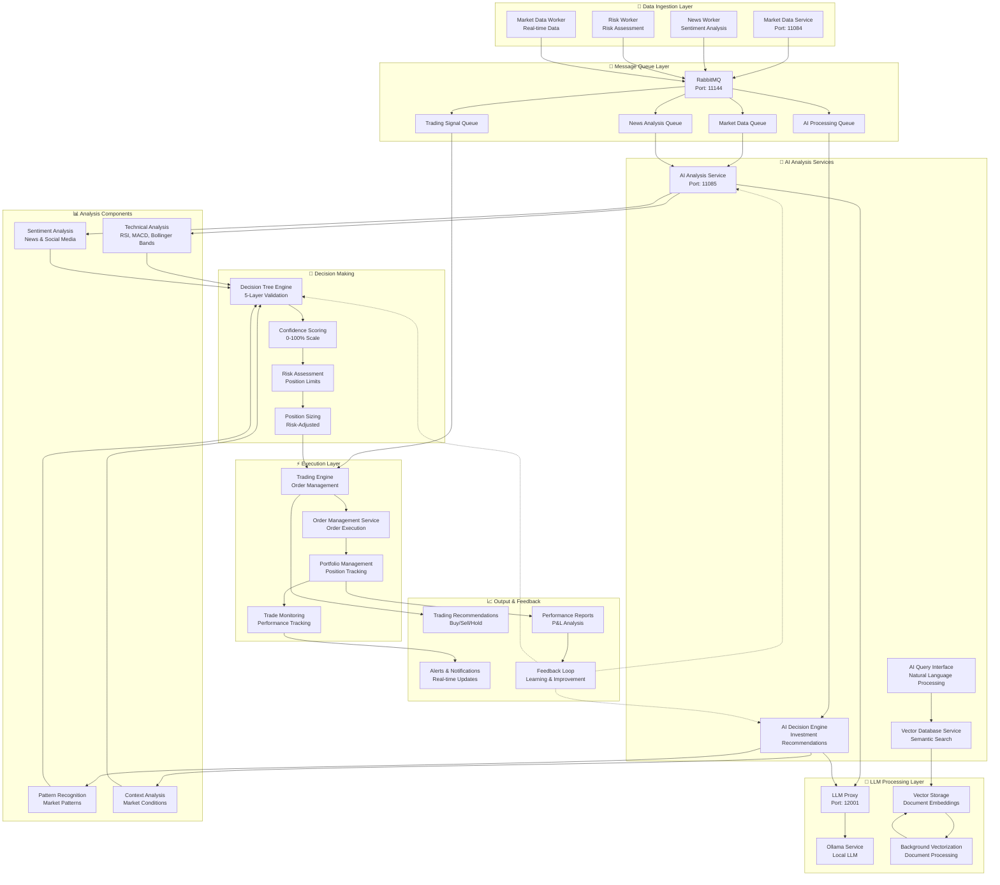
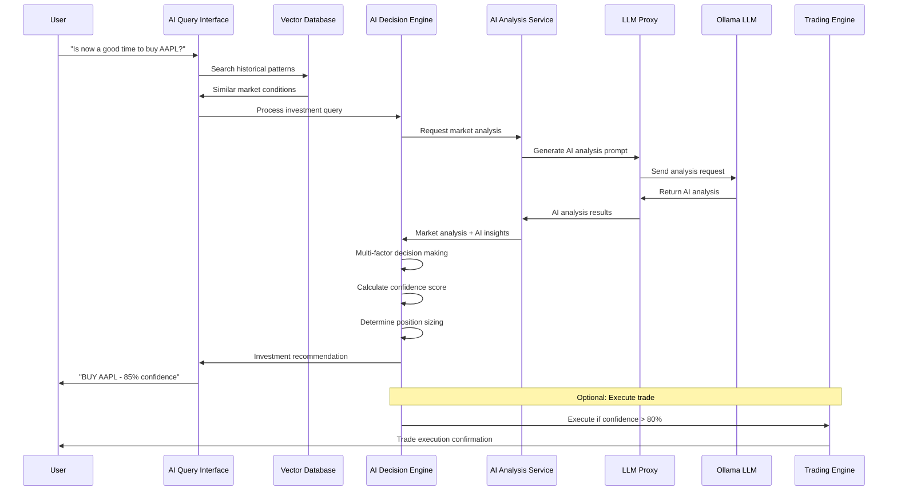
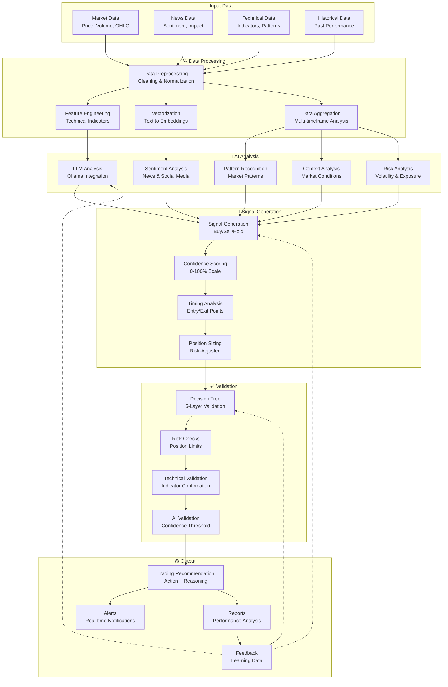
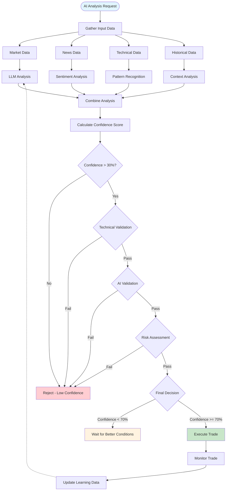
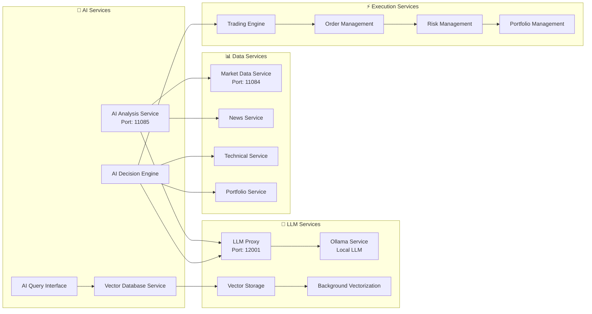
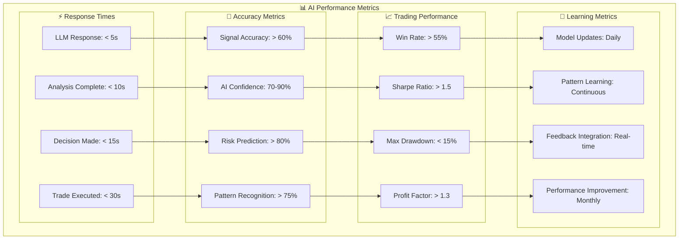

# 🤖 AI Processing Map - Trading System

## Overview
This document shows the complete AI processing workflow in the trading system using Mermaid.js diagrams.

## 🧠 AI Processing Architecture

## 🔄 AI Processing Workflow

## 🧠 AI Analysis Pipeline

## 🎯 AI Decision Tree Process

## 🔧 AI Service Integration

## 📈 Performance Metrics

## 🚀 Current Status

**MCP Service Status**: ✅ **Healthy and Running**
- **Version**: 1.0.0
- **Port**: 11117 (Port-forwarded)
- **Status**: All tools available
- **Documentation**: 166+ files indexed
- **AI Services**: 4 active AI services

**No new deployment needed** - the MCP service is fully operational with all AI processing capabilities available through the API endpoints.

