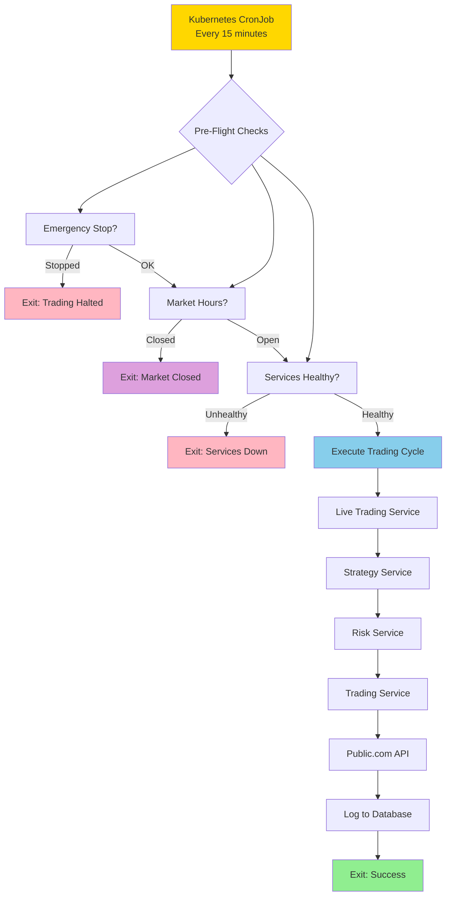

# Automated Live Trading Setup Guide

## Overview

This guide explains how to set up automated live trading using Kubernetes CronJobs. The system will:

✅ Execute trades every 15 minutes during market hours  
✅ Sync order status every 2 minutes (during market hours)  
✅ Check market hours automatically (9:30 AM - 4:00 PM ET)  
✅ Enforce risk limits (daily loss, position size, max positions)  
✅ Provide emergency stop capability  
✅ Run in paper trading mode by default (safe testing)  
✅ Log all decisions to database  
✅ Keep local database aligned with Public.com order status  

---

## Architecture



---

## Files Created

### Trading Execution
1. **`k8s/live-trading-executor-cronjob.yaml`** - Kubernetes CronJob for trade execution
2. **`Makefile.live-trading`** - Management commands for live trading
3. **`docs/AUTOMATED_LIVE_TRADING_GUIDE.md`** - This guide

### Order Synchronization
4. **`k8s/order-sync-cronjob.yaml`** - Kubernetes CronJob for order status sync
5. **`Makefile.order-sync`** - Management commands for order sync
6. **`services/live-trading-service/src/services/live_trading/order_sync_service.py`** - Order sync service
7. **`services/live-trading-service/routes/orders.py`** - Order sync API endpoint

---

## Configuration

### Key Settings (in CronJob YAML)

```yaml
# Execution Schedule
schedule: "*/15 * * * 1-5"  # Every 15 minutes, Mon-Fri

# Trading Mode
TRADING_MODE: "paper"  # Change to "live" for real trading

# Risk Limits
MAX_DAILY_LOSS: "500"        # Max $500 loss per day
MAX_POSITION_SIZE: "0.20"    # Max 20% per position
MAX_POSITIONS: "5"           # Max 5 concurrent positions

# Market Hours
MARKET_OPEN_TIME: "09:30"    # 9:30 AM ET
MARKET_CLOSE_TIME: "16:00"   # 4:00 PM ET
ENFORCE_MARKET_HOURS: "true" # Check market hours

# Emergency Kill Switch
TRADING_ENABLED: "true"      # Set to "false" to disable
```

---

## Deployment Steps

### Step 1: Review Configuration

```bash
# Edit the CronJob configuration
nano k8s/live-trading-executor-cronjob.yaml

# IMPORTANT: Check these settings:
# - TRADING_MODE: "paper" (keep as paper until fully tested)
# - TRADING_ACCOUNT_ID: Your actual account ID
# - MAX_DAILY_LOSS: Your risk tolerance
# - Risk limits match your strategy
```

### Step 2: Deploy the CronJob

```bash
# Deploy the CronJob
kubectl apply -f k8s/live-trading-executor-cronjob.yaml

# Verify deployment
kubectl get cronjob -n default
kubectl get cronjob live-trading-executor -n default -o yaml
```

### Step 3: Monitor First Execution

```bash
# Wait for first run (up to 15 minutes)
# Check if jobs are created
kubectl get jobs -n default | grep live-trading-executor

# View logs from most recent job
kubectl logs -n default -l app=live-trading-executor --tail=100

# Follow logs in real-time
kubectl logs -n default -l app=live-trading-executor -f
```

### Step 4: Verify Execution

```bash
# Check job history
kubectl get jobs -n default | grep live-trading-executor

# Check for successful completions
kubectl get pods -n default | grep live-trading-executor | grep Completed

# Check for failures
kubectl get pods -n default | grep live-trading-executor | grep Error
```

---

## Order Synchronization Worker

The order sync worker automatically syncs pending orders with Public.com to keep your local database up to date.

### Deploy Order Sync Worker

```bash
# Deploy the order sync CronJob
make -f Makefile.order-sync deploy-sync-worker

# Check status
make -f Makefile.order-sync status-sync-worker

# View logs
make -f Makefile.order-sync logs-sync-worker
```

### Schedule Configuration

By default, the worker syncs **every 2 minutes** during market hours (9 AM - 4 PM ET, Mon-Fri).

```bash
# Change sync interval to 1 minute (more frequent)
make -f Makefile.order-sync set-sync-interval-1

# Change sync interval to 5 minutes (less frequent)
make -f Makefile.order-sync set-sync-interval-5

# Back to default (2 minutes)
make -f Makefile.order-sync set-sync-interval-2
```

### Manual Sync

Trigger an immediate sync outside of the schedule:

```bash
# Trigger manual sync
make -f Makefile.order-sync manual-sync

# View results
make -f Makefile.order-sync logs-sync-worker
```

### Pause/Resume Sync Worker

```bash
# Pause order syncing
make -f Makefile.order-sync suspend-sync-worker

# Resume order syncing
make -f Makefile.order-sync resume-sync-worker
```

### What Gets Synced

The sync worker:
- ✅ Fetches all pending orders from the local database
- ✅ Queries Public.com for each order's current status
- ✅ Updates local database with:
  - Order status (FILLED, CANCELLED, REJECTED, etc.)
  - Fill price (for filled orders)
  - Fill timestamp
  - Rejection reason (if rejected)

### Sync Results

Each sync shows:
- **Synced**: Number of orders updated
- **Filled**: Number of orders that got filled
- **Still Pending**: Number of orders still waiting

Example output:
```
📊 Sync Results:
   ✅ Synced: 2
   💰 Filled: 2
   ⏳ Still Pending: 0
```

---

## Emergency Stop

### Method 1: Environment Variable (Quick)

```bash
# Edit the CronJob
kubectl edit cronjob live-trading-executor -n default

# Change TRADING_ENABLED to "false"
# env:
# - name: TRADING_ENABLED
#   value: "false"

# Save and exit (next run will be skipped)
```

### Method 2: ConfigMap (Persistent)

```bash
# Update the emergency stop ConfigMap
kubectl patch configmap live-trading-executor-emergency-stop -n default \
  --type merge -p '{"data":{"emergency_stop":"true","stop_reason":"Manual emergency stop","stop_timestamp":"'$(date -u +"%Y-%m-%dT%H:%M:%SZ")'"}}'

# Verify
kubectl get configmap live-trading-executor-emergency-stop -n default -o yaml
```

### Method 3: Delete CronJob (Nuclear Option)

```bash
# Delete the CronJob (stops all future executions)
kubectl delete cronjob live-trading-executor -n default

# Verify deletion
kubectl get cronjob -n default | grep live-trading-executor
```

---

## Resume Trading

### Resume from Emergency Stop

```bash
# Method 1: Update environment variable
kubectl edit cronjob live-trading-executor -n default
# Change TRADING_ENABLED back to "true"

# Method 2: Update ConfigMap
kubectl patch configmap live-trading-executor-emergency-stop -n default \
  --type merge -p '{"data":{"emergency_stop":"false","stop_reason":"","stop_timestamp":""}}'

# Next scheduled run will execute normally
```

---

## Monitoring

### View Logs

```bash
# Most recent job logs
kubectl logs -n default -l app=live-trading-executor --tail=100

# Specific job logs
kubectl logs -n default job/live-trading-executor-{timestamp}

# Follow logs in real-time
kubectl logs -n default -l app=live-trading-executor -f
```

### Check Execution History

```bash
# List recent jobs
kubectl get jobs -n default | grep live-trading-executor | head -10

# Count successful executions today
kubectl get jobs -n default | grep live-trading-executor | grep -c Completed

# Count failed executions
kubectl get jobs -n default | grep live-trading-executor | grep -c Failed
```

### Database Monitoring

```bash
# Connect to database
kubectl exec -it -n trading-system deployment/timescaledb -- psql -U trading_user -d trading_bot

# Check recent trades
SELECT * FROM live_trades ORDER BY created_at DESC LIMIT 10;

# Check today's performance
SELECT 
  COUNT(*) as trades,
  SUM(CASE WHEN status = 'FILLED' THEN 1 ELSE 0 END) as filled,
  SUM(CASE WHEN status = 'REJECTED' THEN 1 ELSE 0 END) as rejected
FROM live_trades 
WHERE created_at::date = CURRENT_DATE;
```

---

## Schedule Customization

### Every 15 Minutes (Default)
```yaml
schedule: "*/15 * * * 1-5"
```

### Every 30 Minutes
```yaml
schedule: "*/30 * * * 1-5"
```

### Every Hour
```yaml
schedule: "0 * * * 1-5"
```

### Only at Market Open and Close
```yaml
# Two separate CronJobs
schedule: "30 13 * * 1-5"  # 9:30 AM ET (13:30 UTC)
schedule: "0 20 * * 1-5"   # 4:00 PM ET (20:00 UTC)
```

### Custom Times
```yaml
# At 10:00 AM, 12:00 PM, 2:00 PM ET
schedule: "0 14,16,18 * * 1-5"
```

---

## Switching to Live Trading

### ⚠️ WARNING: Only after thorough paper trading!

```bash
# 1. Stop the CronJob
kubectl delete cronjob live-trading-executor -n default

# 2. Edit configuration
nano k8s/live-trading-executor-cronjob.yaml

# 3. Change TRADING_MODE
# Find this line:
#   - name: TRADING_MODE
#     value: "paper"
# Change to:
#   - name: TRADING_MODE
#     value: "live"

# 4. Update account ID if needed
#   - name: TRADING_ACCOUNT_ID
#     value: "YOUR_ACTUAL_ACCOUNT_ID"

# 5. Review ALL risk limits carefully!
#   - MAX_DAILY_LOSS
#   - MAX_POSITION_SIZE
#   - MAX_POSITIONS

# 6. Re-deploy
kubectl apply -f k8s/live-trading-executor-cronjob.yaml

# 7. Monitor VERY closely for first few runs!
kubectl logs -n default -l app=live-trading-executor -f
```

---

## Troubleshooting

### Job Not Running

```bash
# Check CronJob status
kubectl describe cronjob live-trading-executor -n default

# Check if schedule is correct
kubectl get cronjob live-trading-executor -n default -o jsonpath='{.spec.schedule}'

# Check for suspended CronJobs
kubectl get cronjob live-trading-executor -n default -o jsonpath='{.spec.suspend}'
```

### Job Failing

```bash
# Get last failed pod
kubectl get pods -n default | grep live-trading-executor | grep Error | tail -1

# View logs from failed pod
kubectl logs -n default <pod-name>

# Describe failed pod for events
kubectl describe pod -n default <pod-name>
```

### Services Not Healthy

```bash
# Check Live Trading Service
kubectl port-forward -n default svc/live-trading-service 11120:8080
curl http://localhost:11120/health

# Check Strategy Service
kubectl port-forward -n trading-system svc/strategy-service 11103:80
curl http://localhost:11103/health
```

### Market Hours Not Working

```bash
# Check logs for market hours messages
kubectl logs -n default -l app=live-trading-executor | grep -i "market"

# Verify timezone setting
kubectl get cronjob live-trading-executor -n default -o yaml | grep MARKET_TIMEZONE

# Test market hours manually
python -c "
from datetime import datetime
import pytz
tz = pytz.timezone('America/New_York')
now = datetime.now(tz)
print(f'Current ET time: {now.strftime(\"%Y-%m-%d %H:%M:%S %Z\")}')
print(f'Weekday: {now.weekday()} (0=Mon, 6=Sun)')
"
```

---

## Safety Checklist

Before enabling automated live trading:

- [ ] Tested thoroughly in paper trading mode for at least 1 week
- [ ] Verified risk limits are appropriate for account size
- [ ] Confirmed market hours checking works correctly
- [ ] Tested emergency stop mechanism
- [ ] Set up monitoring and alerts
- [ ] Reviewed all trade logs from paper trading
- [ ] Documented expected behavior
- [ ] Confirmed account ID is correct
- [ ] Set appropriate daily loss limits
- [ ] Tested service health checking
- [ ] Verified broker API credentials are valid
- [ ] Set up database backup strategy
- [ ] Tested failover scenarios
- [ ] Documented rollback procedure
- [ ] Confirmed you can stop trading quickly

---

## Best Practices

1. **Start with Paper Trading**
   - Run for at least 1 week in paper mode
   - Verify all trades are as expected
   - Check risk limits are enforced

2. **Monitor Closely**
   - Check logs after first few runs
   - Set up alerts for failures
   - Review daily trade reports

3. **Conservative Risk Limits**
   - Start with small position sizes
   - Low daily loss limits
   - Limited number of concurrent positions

4. **Regular Reviews**
   - Daily review of trades
   - Weekly performance analysis
   - Monthly strategy evaluation

5. **Emergency Preparedness**
   - Know how to stop trading quickly
   - Have phone alerts set up
   - Test emergency stop regularly

---

## Support

For issues or questions:

1. Check logs: `kubectl logs -n default -l app=live-trading-executor`
2. Review this guide
3. Check service health
4. Verify configuration

---

**Remember: Automated trading carries risk. Always start with paper trading and monitor closely!**

