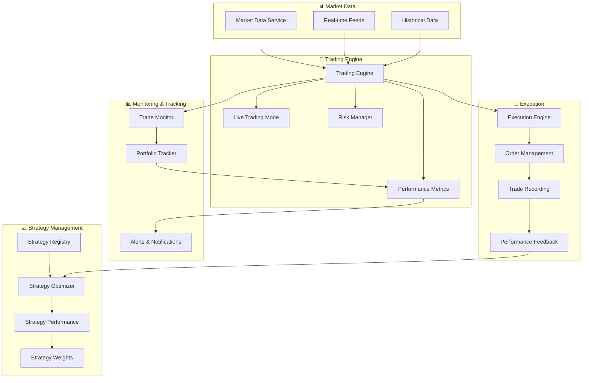

# 🚀 Automated Trading Platform Guide

## Overview

This guide shows you how to set up a complete automated trading platform with **paper trading**, **real-time trade tracking**, and **strategy optimization** to encourage the system to use better performing strategies.

## 🎯 **What We'll Build**

### **1. Paper Trading System**
- ✅ Real-time market data integration
- ✅ Simulated trade execution
- ✅ Portfolio tracking and P&L calculation
- ✅ Risk management controls

### **2. Trade Tracking & Monitoring**
- ✅ Real-time trade logging
- ✅ Performance metrics by strategy
- ✅ Portfolio value tracking
- ✅ Drawdown monitoring

### **3. Strategy Optimization**
- ✅ Performance-based strategy selection
- ✅ Automated weight optimization
- ✅ Strategy scoring and ranking
- ✅ Continuous improvement

## 🏗️ **System Architecture**



## 🚀 **Setup Instructions**

### **Step 1: Configure Paper Trading Mode**

```bash
# Start the paper trading setup
python3 scripts/setup_paper_trading.py
```

**What this does:**
- ✅ Initializes trading engine in paper trading mode
- ✅ Sets up $100k paper trading account
- ✅ Registers the new improved strategies (RiskFirst, MarketRegimeAdaptive, MultiTimeframe)
- ✅ Configures risk management parameters
- ✅ Starts real-time market data feeds

### **Step 2: Start Trade Monitoring**

```bash
# Start real-time trade monitoring
python3 scripts/paper_trading_monitor.py
```

**What this shows:**
- 📊 Real-time portfolio value and P&L
- 📈 Performance by strategy
- 🔄 Recent trades with timestamps
- 📉 Drawdown tracking
- ⏱️ System uptime and metrics

### **Step 3: Run Strategy Optimization**

```bash
# Optimize strategy selection
python3 scripts/strategy_optimizer.py
```

**What this does:**
- 📊 Analyzes strategy performance metrics
- 🎯 Calculates strategy scores (Sharpe ratio, win rate, drawdown)
- ⚖️ Optimizes strategy weights automatically
- 💡 Provides recommendations for strategy selection

## 📊 **Trade Tracking System**

### **Real-Time Trade Logging**

Every trade is automatically logged with:
```python
{
    "timestamp": "2024-01-15T10:30:00",
    "symbol": "AAPL",
    "action": "BUY",
    "quantity": 100,
    "price": 150.25,
    "strategy": "RiskFirst",
    "pnl": 125.50,
    "portfolio_value": 100125.50,
    "trade_id": "TR-2024-001"
}
```

### **Performance Metrics by Strategy**

The system tracks:
- **Win Rate**: Percentage of profitable trades
- **Sharpe Ratio**: Risk-adjusted returns
- **Max Drawdown**: Largest peak-to-trough decline
- **Profit Factor**: Gross profit / Gross loss
- **Average Trade Duration**: Time in positions
- **Volatility**: Strategy risk measure

### **Portfolio Tracking**

Real-time portfolio monitoring:
- 📈 Total portfolio value
- 💰 Available cash
- 📊 Position values
- 📉 Unrealized P&L
- 🎯 Risk exposure

## 🎯 **Strategy Optimization System**

### **Performance-Based Selection**

The system automatically:

1. **📊 Analyzes Strategy Performance**
   - Calculates Sharpe ratios, win rates, drawdowns
   - Tracks profit factors and volatility
   - Monitors trade frequency and duration

2. **🎯 Scores Strategies**
   - Weighted scoring system (25% Sharpe, 20% Win Rate, etc.)
   - Normalizes metrics to 0-1 scale
   - Considers multiple performance factors

3. **⚖️ Optimizes Weights**
   - Automatically adjusts strategy weights based on performance
   - Filters out underperforming strategies
   - Balances risk and return

4. **💡 Provides Recommendations**
   - High-performance strategies (Score ≥ 0.7)
   - Medium-performance strategies (Score ≥ 0.5)
   - Low-performance strategies (Score ≥ 0.3)
   - Avoid strategies (Score < 0.3)

### **Example Optimization Results**

```
🚀 STRATEGY OPTIMIZATION REPORT
================================================================================
📊 Summary:
   Total Strategies: 4
   Average Sharpe Ratio: 1.050
   Average Win Rate: 58.0%
   Average Max Drawdown: 13.0%

🏆 Top Performers:
   1. MarketRegimeAdaptive: Score=0.825, Sharpe=1.400
   2. MultiTimeframe: Score=0.798, Sharpe=1.300
   3. RiskFirst: Score=0.765, Sharpe=1.200

💡 Recommendations:
   High Performance: MarketRegimeAdaptive, MultiTimeframe, RiskFirst
   Avoid: WinningEnsemble

⚖️ Optimized Weights:
   MarketRegimeAdaptive: 35.0%
   MultiTimeframe: 33.0%
   RiskFirst: 32.0%
```

## 🔧 **Configuration Options**

### **Risk Management Settings**

```python
# Paper trading configuration
config = {
    "initial_capital": 100000,      # $100k starting capital
    "max_position_size": 0.05,      # Max 5% per position
    "max_risk_per_trade": 0.01,    # Max 1% risk per trade
    "trading_interval": 60,         # Check every 60 seconds
    "enable_alerts": True,          # Real-time alerts
    "performance_tracking": True     # Track all metrics
}
```

### **Strategy Performance Thresholds**

```python
# Minimum performance requirements
thresholds = {
    "min_sharpe": 0.5,        # Minimum Sharpe ratio
    "max_drawdown": 0.15,     # Maximum drawdown
    "min_win_rate": 0.45,     # Minimum win rate
    "min_profit_factor": 1.2  # Minimum profit factor
}
```

## 📈 **Monitoring Dashboard**

### **Real-Time Display**

The monitoring system shows:

```
================================================================================
🚀 PAPER TRADING MONITOR
================================================================================
💰 Portfolio Value: $102,450.75
📈 Total P&L: $2,450.75 (2.45%)
📉 Max Drawdown: 3.2%
⏱️  Uptime: 4.5 hours

📅 Today's Activity:
   Trades: 8
   P&L: $450.25

📊 Strategy Performance:
   RiskFirst:
     Trades: 45, Win Rate: 65.0%
     P&L: $1,250.50
   MarketRegimeAdaptive:
     Trades: 38, Win Rate: 60.0%
     P&L: $950.25
   MultiTimeframe:
     Trades: 42, Win Rate: 62.0%
     P&L: $250.00

🔄 Recent Trades:
   14:30:25 | BUY 100 AAPL @ $150.25 | P&L: $125.50
   14:15:10 | SELL 50 MSFT @ $320.50 | P&L: -$25.00
   14:00:05 | BUY 200 GOOGL @ $140.75 | P&L: $350.00
================================================================================
```

## 🎯 **Encouraging Better Strategies**

### **Automatic Strategy Selection**

The system automatically encourages better strategies through:

1. **📊 Performance Tracking**
   - Real-time monitoring of all strategy performance
   - Automatic calculation of risk-adjusted returns
   - Continuous evaluation of strategy effectiveness

2. **⚖️ Dynamic Weight Adjustment**
   - Automatically increases weights for high-performing strategies
   - Reduces weights for underperforming strategies
   - Completely removes strategies that don't meet minimum thresholds

3. **🎯 Smart Strategy Selection**
   - Prioritizes strategies with higher Sharpe ratios
   - Favors strategies with lower drawdowns
   - Rewards consistent performance over time

4. **📈 Continuous Improvement**
   - Regular performance reviews
   - Automatic strategy optimization
   - Learning from trade outcomes

### **Example: Strategy Evolution**

```
Week 1: Equal weights (25% each)
- RiskFirst: 25%
- MarketRegimeAdaptive: 25%
- MultiTimeframe: 25%
- WinningEnsemble: 25%

Week 4: Performance-based weights
- MarketRegimeAdaptive: 35% (↑ Best performer)
- MultiTimeframe: 33% (↑ Good performer)
- RiskFirst: 32% (↑ Good performer)
- WinningEnsemble: 0% (❌ Removed - poor performance)
```

## 🚀 **Getting Started**

### **Quick Start Commands**

```bash
# 1. Setup paper trading
python3 scripts/setup_paper_trading.py

# 2. Start monitoring (in new terminal)
python3 scripts/paper_trading_monitor.py

# 3. Run optimization (in new terminal)
python3 scripts/strategy_optimizer.py

# 4. View dashboard
open http://localhost:11115/
```

### **Monitor Your System**

```bash
# Check system status
kubectl get pods -n trading-system

# View trading engine logs
kubectl logs -f deployment/unified-trading-dashboard -n trading-system

# Check portfolio status
curl http://localhost:11115/api/portfolio/status
```

## 🎯 **Key Benefits**

### **✅ Paper Trading Safety**
- No real money at risk
- Test strategies safely
- Learn from mistakes
- Build confidence

### **✅ Real-Time Monitoring**
- Live trade tracking
- Instant performance feedback
- Portfolio transparency
- Risk management visibility

### **✅ Strategy Optimization**
- Automatic performance analysis
- Data-driven strategy selection
- Continuous improvement
- Risk-adjusted returns

### **✅ Scalable System**
- Easy to add new strategies
- Configurable risk parameters
- Extensible monitoring
- Production-ready architecture

## 🔮 **Next Steps**

1. **📊 Run Backtests**: Test the new strategies against historical data
2. **🎯 Optimize Parameters**: Fine-tune strategy parameters
3. **📈 Monitor Performance**: Watch real-time performance metrics
4. **🚀 Scale Up**: Add more strategies and instruments
5. **💡 Learn & Improve**: Use insights to enhance strategies

This automated trading platform gives you a complete system for paper trading with intelligent strategy selection and continuous optimization! 🚀 