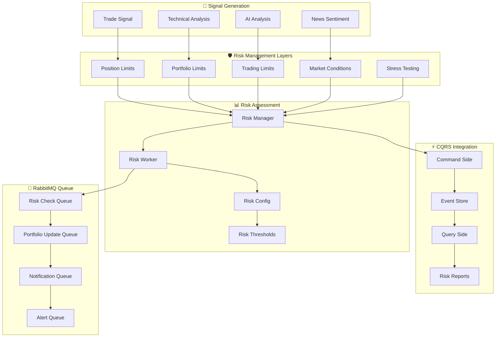
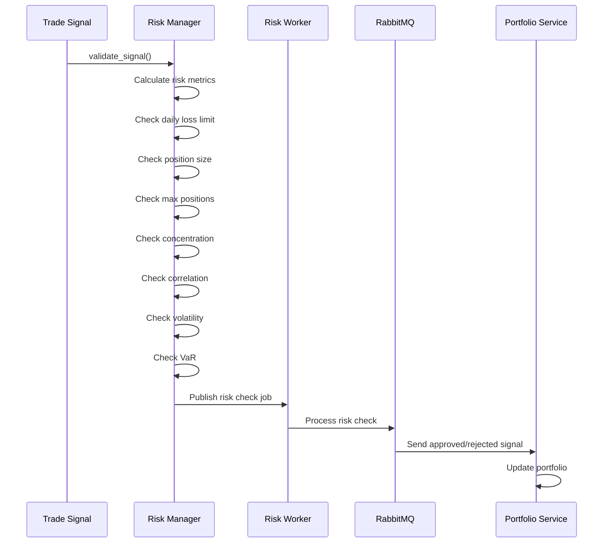

# 🛡️ Comprehensive Risk Management System Guide

## Overview

Your Space Trading Station features a **sophisticated multi-layered risk management system** that integrates seamlessly with the CQRS (Command Query Responsibility Segregation) pattern and RabbitMQ message queue architecture. This system provides real-time risk assessment, dynamic position sizing, and comprehensive portfolio protection.

## 🏗️ Risk Management Architecture

### **Multi-Layer Risk Protection System**



## 🎯 Risk Management Components

### **1. Risk Manager (`src/risk/risk_manager.py`)**

The core risk management engine that performs comprehensive signal validation:

```python
class RiskManager:
    """Comprehensive risk management system with CQRS integration"""
    
    async def validate_signal(self, signal: TradeSignal, portfolio: Portfolio) -> Tuple[bool, Dict[str, Any]]:
        """
        Comprehensive signal validation against risk rules
        
        Returns:
            Tuple[bool, Dict]: (is_valid, risk_assessment)
        """
```

**Key Features:**
- **Multi-layer validation**: 7 different risk checks
- **Real-time metrics**: VaR, Sharpe ratio, drawdown, volatility
- **Dynamic adjustments**: Market condition-based position sizing
- **CQRS integration**: Event-driven risk assessment
- **RabbitMQ integration**: Asynchronous risk processing

### **2. Risk Configuration (`src/utils/risk_config.py`)**

Centralized configuration for all risk parameters:

```python
@dataclass
class RiskConfig:
    """Comprehensive risk management configuration"""
    
    # Risk profiles
    risk_profile: RiskProfile = RiskProfile.MODERATE
    
    # Risk limits
    position_limits: PositionLimits = field(default_factory=PositionLimits)
    portfolio_limits: PortfolioLimits = field(default_factory=PortfolioLimits)
    trading_limits: TradingLimits = field(default_factory=TradingLimits)
    risk_thresholds: RiskThresholds = field(default_factory=RiskThresholds)
```

**Risk Profiles:**
- **Ultra Conservative**: 5% max position, $25 daily loss limit
- **Conservative**: 8% max position, $50 daily loss limit
- **Moderate**: 15% max position, $100 daily loss limit (default)
- **Aggressive**: 25% max position, $150 daily loss limit
- **Ultra Aggressive**: 35% max position, $200 daily loss limit

### **3. Risk Worker (`src/services/workers/risk_worker.py`)**

RabbitMQ worker that processes risk management jobs:

```python
class RiskWorker:
    """Worker for processing risk management jobs"""
    
    # Job handlers
    self.job_handlers = {
        'risk_check': self._handle_risk_check,
        'portfolio_risk_assessment': self._handle_portfolio_risk_assessment,
        'position_risk_check': self._handle_position_risk_check,
        'stress_test': self._handle_stress_test,
        'risk_alert': self._handle_risk_alert,
        'risk_metrics_update': self._handle_risk_metrics_update
    }
```

## 🔄 Risk Management Workflow

### **1. Signal Validation Process**



### **2. Risk Assessment Steps**

#### **Step 1: Daily Loss Limit Check**
```python
def _check_daily_loss_limit(self) -> bool:
    """Check if daily loss limit is exceeded"""
    current_date = datetime.now().date()
    
    # Reset daily metrics if it's a new day
    if current_date > self.last_reset_date:
        self.daily_loss = 0.0
        self.daily_trades = 0
        self.last_reset_date = current_date
    
    return self.daily_loss <= self.risk_limits.max_daily_loss
```

#### **Step 2: Position Size Check**
```python
def _check_position_size(self, signal: TradeSignal, portfolio: Portfolio) -> bool:
    """Check if position size is within limits"""
    position_value = signal.quantity * signal.price
    max_position_value = portfolio.total_value * self.risk_limits.max_position_size
    
    return position_value <= max_position_value
```

#### **Step 3: Portfolio Concentration Check**
```python
def _check_concentration(self, signal: TradeSignal, portfolio: Portfolio) -> bool:
    """Check portfolio concentration limits"""
    new_position_value = signal.quantity * signal.price
    total_portfolio_value = portfolio.total_value + new_position_value
    
    # Check if any single position would exceed concentration limit
    return new_position_value / total_portfolio_value <= self.risk_limits.max_sector_concentration
```

#### **Step 4: VaR Check**
```python
def _check_var(self, risk_metrics: RiskMetrics) -> bool:
    """Check VaR limits"""
    return risk_metrics.var_95 <= self.risk_limits.var_limit
```

## 📊 Risk Metrics & Calculations

### **Comprehensive Risk Metrics**

```python
@dataclass
class RiskMetrics:
    """Comprehensive risk metrics"""
    # Portfolio-level metrics
    total_risk_score: float
    var_95: float  # Value at Risk (95%)
    var_99: float  # Value at Risk (99%)
    expected_shortfall: float
    sharpe_ratio: float
    max_drawdown: float
    volatility: float
    beta: float
    
    # Position-level metrics
    concentration_risk: float
    correlation_risk: float
    sector_concentration: Dict[str, float]
    leverage: float
    cash_ratio: float
    
    # Trading metrics
    daily_loss: float
    daily_trades: int
    max_daily_loss_remaining: float
    position_count: int
    avg_position_size: float
```

### **Risk Score Calculation**

```python
# Calculate overall risk score
total_risk_score = min(100, (
    concentration_risk * 30 +
    correlation_risk * 20 +
    max(0, leverage - 1) * 25 +
    max(0, 0.1 - cash_ratio) * 15 +
    (daily_loss / max_daily_loss) * 10
))
```

## 🎛️ Risk Configuration Profiles

### **Risk Profile Settings**

| Risk Profile | Max Position | Daily Loss | Max Positions | Stop Loss | Take Profit |
|--------------|--------------|------------|---------------|-----------|-------------|
| **Ultra Conservative** | 5% | $25 | 3 | 3% | 8% |
| **Conservative** | 8% | $50 | 4 | 5% | 10% |
| **Moderate** | 15% | $100 | 5 | 8% | 15% |
| **Aggressive** | 25% | $150 | 6 | 12% | 20% |
| **Ultra Aggressive** | 35% | $200 | 8 | 15% | 25% |

### **Market Condition Adjustments**

```python
@dataclass
class MarketConditionAdjustments:
    """Market condition-based risk adjustments"""
    # Volatility adjustments
    high_volatility_multiplier: float = 0.7  # Reduce position size by 30% in high volatility
    low_volatility_multiplier: float = 1.2  # Increase position size by 20% in low volatility
    
    # Market regime adjustments
    bull_market_multiplier: float = 1.1  # 10% increase in bull market
    bear_market_multiplier: float = 0.6  # 40% decrease in bear market
    crisis_multiplier: float = 0.3  # 70% decrease in crisis
```

## 🚨 Risk Alerts & Notifications

### **Alert Types**

```python
@dataclass
class RiskAlertConfig:
    """Risk alert configuration"""
    # Alert thresholds
    high_risk_threshold: float = 0.7  # 70% risk score triggers high alert
    medium_risk_threshold: float = 0.5  # 50% risk score triggers medium alert
    low_risk_threshold: float = 0.3  # 30% risk score triggers low alert
    
    # Alert types
    position_limit_breach: bool = True
    daily_loss_limit_breach: bool = True
    concentration_risk_alert: bool = True
    correlation_risk_alert: bool = True
    volatility_spike_alert: bool = True
    var_breach_alert: bool = True
```

### **Alert Processing**

```python
async def _handle_risk_alert(self, job: JobMessage):
    """Handle risk alert job"""
    try:
        alert_data = job.payload.get('alert', {})
        alert_type = alert_data.get('type', 'unknown')
        alert_level = alert_data.get('level', 'medium')
        
        # Process alert based on type
        if alert_type == 'position_limit_breach':
            await self._handle_position_limit_alert(alert_data)
        elif alert_type == 'daily_loss_limit_breach':
            await self._handle_daily_loss_alert(alert_data)
        # ... other alert types
```

## 🧪 Stress Testing

### **Stress Test Scenarios**

```python
async def _run_stress_scenario(self, portfolio: Portfolio, scenario: str) -> Dict[str, Any]:
    """Run a specific stress test scenario"""
    
    if scenario == 'market_crash_20':
        # Simulate 20% market crash
        portfolio_value_after = portfolio.total_value * 0.8
        max_loss = portfolio.total_value - portfolio_value_after
        
        return {
            'scenario': scenario,
            'portfolio_value_before': portfolio.total_value,
            'portfolio_value_after': portfolio_value_after,
            'max_loss': max_loss,
            'loss_percentage': 0.20,
            'risk_level': 'high' if max_loss > self.risk_config.trading_limits.max_daily_loss else 'medium'
        }
```

**Available Scenarios:**
- **Market Crash 20%**: 20% market decline simulation
- **Volatility Spike 50%**: 50% volatility increase
- **Correlation Breakdown**: Loss of diversification benefits
- **Liquidity Crisis**: Reduced market liquidity

## 🔧 Integration with CQRS

### **Command Side Integration**

```python
# Risk validation as part of command processing
async def validate_signal(self, signal: TradeSignal, portfolio: Portfolio) -> Tuple[bool, Dict[str, Any]]:
    """Comprehensive signal validation against risk rules"""
    
    # Calculate comprehensive risk metrics
    risk_metrics = await self._calculate_risk_metrics(portfolio)
    
    # Perform risk checks
    risk_assessment = {
        'signal_id': signal.signal_id,
        'symbol': signal.symbol,
        'timestamp': datetime.now().isoformat(),
        'checks': {},
        'overall_risk_score': 0.0,
        'recommendation': 'reject'
    }
    
    # Multiple risk checks...
    
    return all_checks_passed, risk_assessment
```

### **Event Side Integration**

```python
# Risk events for event sourcing
class RiskValidationEvent(Event):
    """Event when risk validation is performed"""
    signal_id: str
    risk_assessment: Dict[str, Any]
    approved: bool
    timestamp: datetime

class RiskLimitBreachEvent(Event):
    """Event when risk limit is breached"""
    limit_type: str
    current_value: float
    limit_value: float
    timestamp: datetime
```

### **Query Side Integration**

```python
# Risk reports for query side
class RiskReportQuery(Query):
    """Query for risk reports"""
    portfolio_id: str
    date_range: Optional[Tuple[datetime, datetime]]
    risk_metrics: List[str]

class RiskReportHandler:
    """Handler for risk report queries"""
    def handle(self, query: RiskReportQuery) -> RiskReport:
        # Query read database for risk data
        # Return optimized risk report
```

## 📨 RabbitMQ Integration

### **Risk Management Queues**

```python
# Queue names for risk management
self.queues = {
    'risk_check': 'risk_check_queue',
    'portfolio_update': 'portfolio_update_queue',
    'notification': 'notification_queue',
    'risk_alert': 'risk_alert_queue'
}
```

### **Job Types**

```python
# Risk management job types
job_handlers = {
    'risk_check': self._handle_risk_check,
    'portfolio_risk_assessment': self._handle_portfolio_risk_assessment,
    'position_risk_check': self._handle_position_risk_check,
    'stress_test': self._handle_stress_test,
    'risk_alert': self._handle_risk_alert,
    'risk_metrics_update': self._handle_risk_metrics_update
}
```

## 🚀 Usage Examples

### **1. Basic Risk Check**

```python
# Initialize risk manager
risk_manager = RiskManager(config)
risk_config = get_risk_config(RiskProfile.MODERATE, account_size=1000.0)

# Validate a trade signal
signal = TradeSignal(symbol="AAPL", action="BUY", quantity=10, price=150.0)
portfolio = Portfolio(total_value=1000.0, cash=500.0, positions={})

is_valid, risk_assessment = await risk_manager.validate_signal(signal, portfolio)

if is_valid:
    print(f"✅ Signal approved: {risk_assessment['recommendation']}")
else:
    print(f"❌ Signal rejected: {risk_assessment['recommendation']}")
```

### **2. Risk Worker Usage**

```python
# Initialize and start risk worker
risk_worker = RiskWorker(config, RiskProfile.MODERATE)
await risk_worker.start()

# Publish risk check job
success = await risk_worker.publish_risk_check(signal, portfolio, market_conditions)

if success:
    print("✅ Risk check job published")
else:
    print("❌ Failed to publish risk check job")
```

### **3. Dynamic Position Sizing**

```python
# Get position size adjusted for market conditions
market_conditions = {
    'volatility': 0.25,  # High volatility
    'market_regime': MarketRegime.BEAR_MARKET,
    'earnings_season': True
}

adjusted_size = risk_config.get_adjusted_position_size(0.15, market_conditions)
print(f"Adjusted position size: {adjusted_size:.2%}")
```

## 📊 Risk Monitoring Dashboard

### **Real-time Risk Metrics**

```python
# Get current risk metrics
risk_metrics = risk_manager.get_risk_metrics()

print(f"Daily Loss: ${risk_metrics['daily_loss']:.2f}")
print(f"Daily Trades: {risk_metrics['daily_trades']}")
print(f"Risk History Count: {risk_metrics['risk_history_count']}")
print(f"Risk Alerts Count: {risk_metrics['risk_alerts_count']}")
```

### **Risk Report Generation**

```python
# Generate comprehensive risk report
risk_report = {
    'portfolio_id': 'portfolio_001',
    'timestamp': datetime.now().isoformat(),
    'risk_metrics': {
        'total_risk_score': 25.5,
        'var_95': 0.015,
        'sharpe_ratio': 1.2,
        'max_drawdown': 0.08
    },
    'risk_limits': risk_config.to_dict(),
    'recommendations': [
        {
            'type': 'concentration_risk',
            'priority': 'medium',
            'message': 'Consider diversifying positions',
            'action': 'reduce_largest_positions'
        }
    ]
}
```

## 🔒 Security & Compliance

### **Risk Limit Enforcement**

- **Hard Limits**: Cannot be exceeded under any circumstances
- **Soft Limits**: Can be exceeded with manual override
- **Dynamic Limits**: Adjust based on market conditions
- **Audit Trail**: Complete record of all risk decisions

### **Compliance Features**

- **Position Limits**: Enforce regulatory position limits
- **Risk Reporting**: Generate compliance reports
- **Audit Logging**: Track all risk management decisions
- **Alert System**: Notify of limit breaches

## 🎯 Best Practices

### **1. Risk Profile Selection**

- **Start Conservative**: Begin with conservative risk profile
- **Gradual Adjustment**: Adjust risk profile based on performance
- **Account Size Consideration**: Smaller accounts need more conservative settings
- **Market Condition Awareness**: Adjust for current market conditions

### **2. Position Sizing**

- **Never Risk More Than 2%**: Per trade risk should be limited
- **Consider Correlation**: Avoid highly correlated positions
- **Dynamic Adjustment**: Adjust size based on volatility and confidence
- **Cash Management**: Maintain adequate cash reserves

### **3. Monitoring & Alerts**

- **Real-time Monitoring**: Monitor risk metrics continuously
- **Proactive Alerts**: Set alerts before limits are breached
- **Regular Reviews**: Review risk settings periodically
- **Performance Analysis**: Analyze risk-adjusted returns

### **4. Stress Testing**

- **Regular Testing**: Perform stress tests regularly
- **Multiple Scenarios**: Test various market conditions
- **Portfolio Impact**: Understand impact on overall portfolio
- **Contingency Planning**: Have plans for extreme scenarios

## 🔄 Continuous Improvement

### **Risk System Evolution**

1. **Performance Analysis**: Analyze risk-adjusted returns
2. **Limit Optimization**: Adjust limits based on performance
3. **New Risk Metrics**: Add new risk measures as needed
4. **Market Adaptation**: Adapt to changing market conditions

### **Integration Enhancements**

1. **Machine Learning**: Add ML-based risk prediction
2. **Real-time Data**: Integrate real-time market data
3. **Advanced Analytics**: Add advanced risk analytics
4. **External APIs**: Integrate with external risk services

This comprehensive risk management system provides robust protection for your trading operations while maintaining the flexibility to adapt to different market conditions and risk profiles. The integration with CQRS and RabbitMQ ensures reliable, scalable, and maintainable risk management that grows with your trading system. 