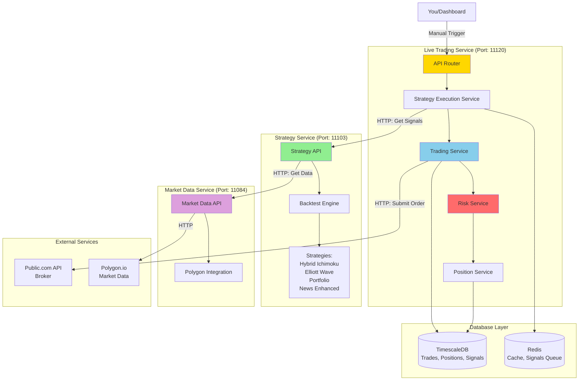
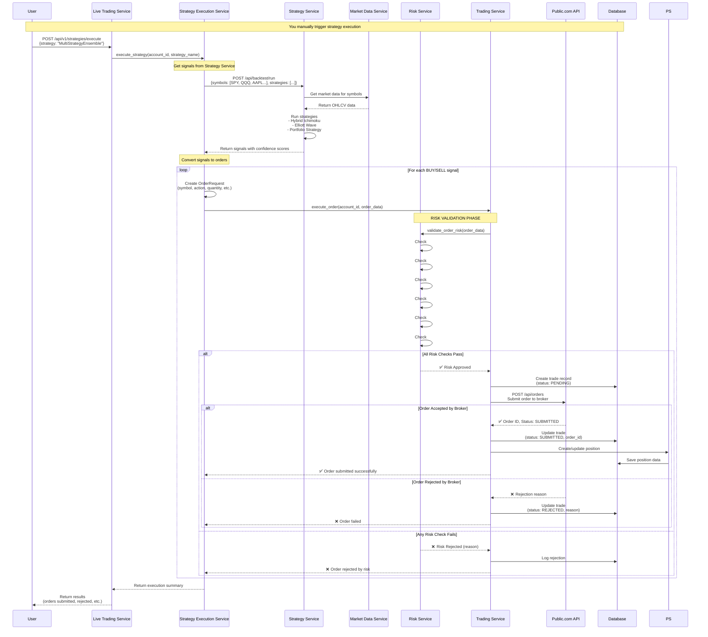
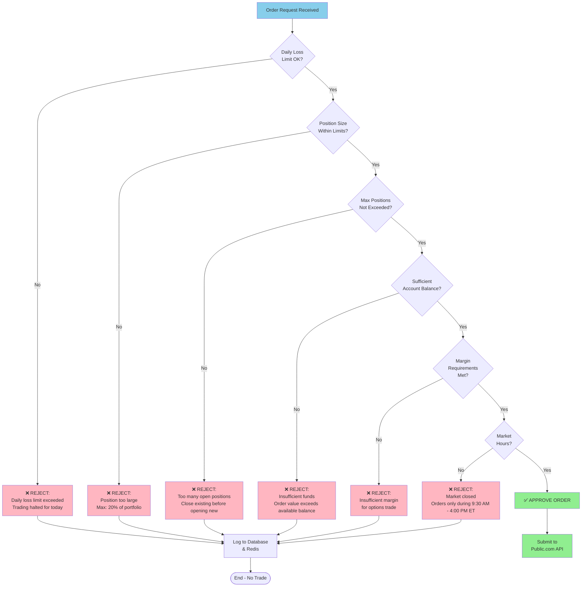
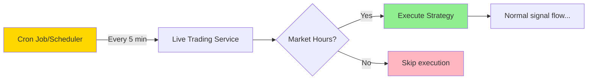
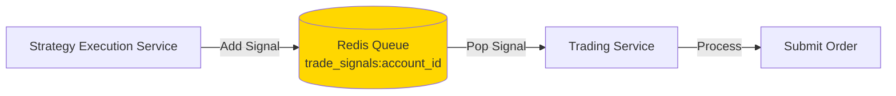

# Current Trade Signal Flow - Microservices Architecture

## 🎯 Executive Summary
Your system uses a **microservices architecture** where services communicate via HTTP APIs. There's **no single "trading engine"** - instead, the **Live Trading Service** coordinates everything and calls other services as needed.

---

## 1. Current System Architecture



---

## 2. Complete Signal-to-Trade Flow



---

## 3. Strategy Service Signal Generation

```mermaid
flowchart TD
    Start([Strategy Service Receives Request]) --> GetSymbols[Parse symbols list:<br/>SPY, QQQ, AAPL, etc.]
    
    GetSymbols --> GetData[Fetch market data<br/>from Market Data Service]
    GetData --> CheckData{Sufficient<br/>data?}
    CheckData -->|No| ReturnError[Return error]
    CheckData -->|Yes| RunStrategies
    
    subgraph RunStrategies["Run All Strategies in Parallel"]
        H[Hybrid Ichimoku Strategy]
        E[Elliott Wave Strategy]
        P[Portfolio Strategy]
        N[News Enhanced Strategy]
    end
    
    RunStrategies --> Analyze
    
    subgraph Analyze["Each Strategy Analyzes"]
        A1[Calculate technical indicators]
        A2[Check Elliott Wave patterns]
        A3[Analyze market regime]
        A4[Calculate confidence score]
        A1 --> A2 --> A3 --> A4
    end
    
    Analyze --> GenSignals{Generate<br/>signals?}
    GenSignals -->|Yes| CreateSignal[Create TradeSignal:<br/>- Symbol<br/>- Action (BUY/SELL)<br/>- Confidence<br/>- Quantity<br/>- Metadata]
    GenSignals -->|No| NoSignal[No signal]
    
    CreateSignal --> Return[Return signals to<br/>Live Trading Service]
    NoSignal --> Return
    ReturnError --> End([End])
    Return --> End
    
    style Start fill:#90EE90
    style RunStrategies fill:#E6F3FF
    style Analyze fill:#FFE6CC
    style CreateSignal fill:#87CEEB
    style Return fill:#90EE90
```

---

## 4. Risk Service Validation Process



---

## 5. How Signals Are Triggered (Manual vs Automated)

### Current State: **Manual Trigger**
```
You → Dashboard → POST /api/v1/strategies/execute → Live Trading Service → Strategy Execution
```

### Potential Automated Trigger (if configured):


**Note**: Currently you need to **manually trigger** strategy execution via API or dashboard.

---

## 6. Safety Layers Summary

### Layer 1: Strategy Service (Signal Generation)
- ✅ Confidence threshold filtering
- ✅ Technical indicator validation
- ✅ Elliott Wave pattern confirmation
- ✅ Market regime analysis

### Layer 2: Live Trading Service (Coordination)
- ✅ Strategy execution orchestration
- ✅ Order request construction
- ✅ Position size calculation

### Layer 3: Risk Service (Validation)
- ✅ Daily loss limits
- ✅ Position size limits
- ✅ Max positions enforcement
- ✅ Account balance checks
- ✅ Margin requirement validation
- ✅ Market hours verification

### Layer 4: Trading Service (Execution)
- ✅ Database record creation
- ✅ Broker API integration
- ✅ Order status tracking
- ✅ Position management

### Layer 5: External (Public.com)
- ✅ Broker-level validation
- ✅ Regulatory compliance
- ✅ Order execution
- ✅ Fill confirmation

---

## 7. Service Communication Details

### Live Trading Service → Strategy Service
**Endpoint**: `POST http://strategy-service.trading-system.svc.cluster.local:80/api/backtest/run`

**Request**:
```json
{
  "symbols": ["SPY", "QQQ", "AAPL", "MSFT", "GOOGL"],
  "start_date": "2025-07-08",  // Last 100 days
  "end_date": "2025-10-07",
  "strategies": ["MultiStrategyEnsemble"]
}
```

**Response**:
```json
{
  "success": true,
  "results": [
    {
      "name": "MultiStrategyEnsemble",
      "signals": [
        {
          "symbol": "AAPL",
          "action": "BUY",
          "confidence": 0.85,
          "quantity": 10,
          "metadata": {...}
        }
      ]
    }
  ]
}
```

### Live Trading Service → Public.com API
**Endpoint**: `POST https://public-api.public.com/api/orders`

**Request**:
```json
{
  "account_id": "YOUR_ACCOUNT_ID",
  "symbol": "AAPL",
  "action": "BUY",
  "quantity": 10,
  "order_type": "MARKET",
  "time_in_force": "DAY"
}
```

**Response**:
```json
{
  "order_id": "123456",
  "status": "SUBMITTED",
  "filled_quantity": 0,
  "remaining_quantity": 10
}
```

---

## 8. Signal Queue System (Redis)

The system uses **Redis** to queue trade signals for processing:



**Redis Keys**:
- `trade_signals:{account_id}` - Queue of pending signals
- `positions:{account_id}` - Cached position data
- `market_hours_status` - Market hours check cache
- `daily_trades:{account_id}:{date}` - Daily trade counter

---

## 9. Key Configuration

### Live Trading Service
**Location**: `services/live-trading-service/main.py`  
**Port**: 11120 (external), 8080 (internal)  
**Key Routes**:
- `POST /api/v1/strategies/execute` - Execute a strategy
- `POST /api/v1/trading/orders` - Submit an order
- `GET /api/v1/risk/assessment` - Get risk assessment
- `GET /api/v1/positions` - Get current positions

### Strategy Service
**Location**: `services/strategy-service/main.py`  
**Port**: 11103 (external), 80 (internal)  
**Key Routes**:
- `POST /api/backtest/run` - Run backtest/get signals
- `GET /api/trading/recommendations` - Get recommendations
- `POST /api/trading/generate-trade` - Test trade generation

### Symbols Traded
**Location**: `services/live-trading-service/src/services/live_trading/strategy_execution_service.py:43-46`

```python
self.symbols = [
    'SPY', 'QQQ', 'AAPL', 'MSFT', 'GOOGL', 
    'AMZN', 'TSLA', 'NVDA', 'META', 'NFLX'
]
```

---

## 10. Anxiety Relief Checklist ✅

- ✅ **Manual control** - Nothing executes unless YOU trigger it
- ✅ **6 risk checks** - Every order validated before submission
- ✅ **Database logging** - Complete audit trail of all decisions
- ✅ **Broker validation** - Public.com does final validation
- ✅ **Market hours only** - No trading outside 9:30 AM - 4:00 PM ET
- ✅ **Position limits** - Can't over-leverage (max 20% per position)
- ✅ **Daily loss limits** - Trading stops if daily loss threshold hit
- ✅ **Separation of concerns** - Strategy generation separate from execution
- ✅ **Redis queue** - Signals queued, not executed immediately
- ✅ **Multiple service layers** - Each service validates independently

---

## 11. What Actually Happens (Current System - Automated!)

### Automated Execution (Every 15 Minutes via CronJob)

1. **CronJob triggers** automatically (or manual via `make -f Makefile.live-trading test-execution`)
2. **Market hours check** - Skip if outside 9:30 AM - 4:00 PM ET
3. **Emergency stop check** - Halt if emergency stop enabled
4. **Live Trading Service** → calls Strategy Service `/api/trading/recommendations`
5. **Strategy Service** → Returns Elliott Wave analysis with BUY/SELL signals:
   - TSLA: STRONG BUY (68% confidence)
   - QQQ, MSFT, GOOGL: BUY (50-56% confidence)
   - SPY, NVDA: WEAK SELL (skipped)
6. **Live Trading Service** → Filters signals (confidence >= 50%)
7. **Live Trading Service** → Creates order for each qualifying signal
8. **Risk Service** validates each order:
   - Position size < 15% of portfolio
   - Daily loss < $200
   - Portfolio risk < 5%
   - Max 10 daily trades
9. **If approved**: Order submitted to Public.com API (account `5OS44958`)
10. **If rejected**: Logged to database, no trade executed
11. **Public.com** validates and executes
12. **Trading Service** updates database with results
13. **Position Service** tracks your positions

**Every step is logged. System runs automatically every 15 minutes during market hours.**

### Control Commands

```bash
# Emergency stop (immediate!)
make -f Makefile.live-trading emergency-stop

# Resume trading
make -f Makefile.live-trading emergency-resume

# Check status
make -f Makefile.live-trading status-auto-trading

# Watch live
make -f Makefile.live-trading logs-auto-trading-live
```

---

## Quick Reference: Current Services

| Service | Purpose | Port (External) | Port (Internal) |
|---------|---------|-----------------|-----------------|
| **Live Trading Service** | Order execution & coordination | 11120 | 8080 |
| **Strategy Service** | Signal generation | 11103 | 80 |
| **Market Data Service** | Market data feeds | 11084 | 11084 |
| **Unified Trading Dashboard** | UI for monitoring | 11115 | 8080 |
| **TimescaleDB** | Trade/position storage | 11140 | 5432 |
| **Redis** | Cache & signal queue | 11142 | 6379 |
| **Grafana** | Monitoring dashboards | 11044 | 3000 |

---

## Summary

**No "Trading Engine"** in the old sense. Instead:
- **Live Trading Service** coordinates everything
- **Strategy Service** generates signals
- **Risk Service** validates orders
- **Trading Service** executes via Public.com API

**You're in control**: Nothing trades unless you trigger it via the dashboard or API.

**Multiple safety layers**: Strategy filtering → Risk validation → Broker validation

**Complete transparency**: Every decision logged to database

