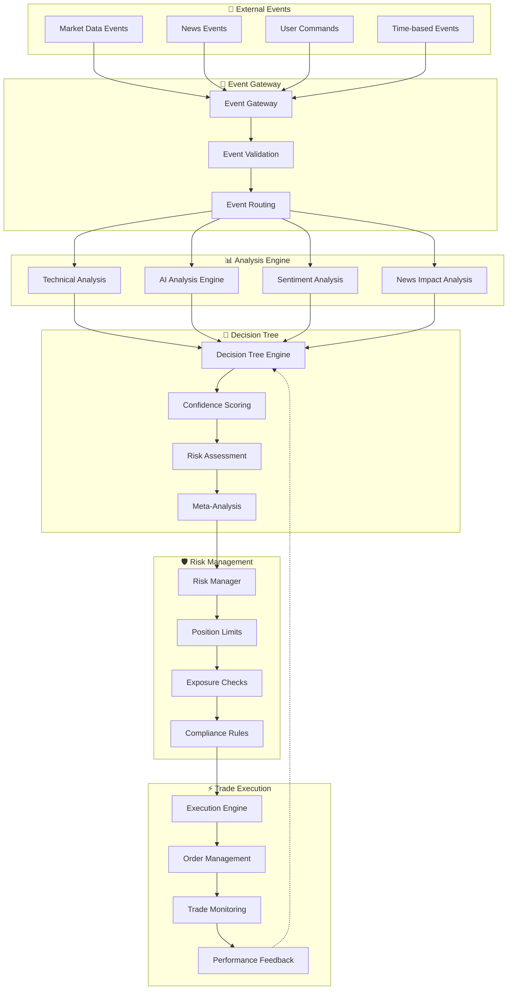
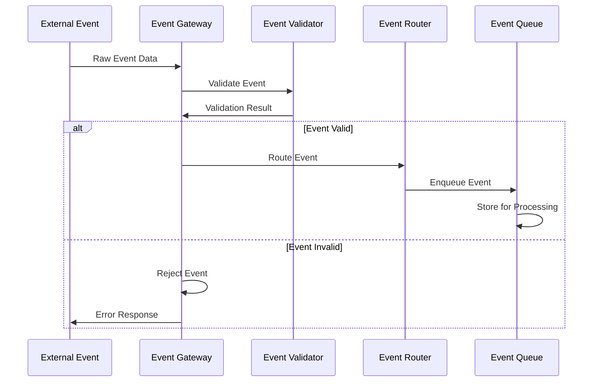
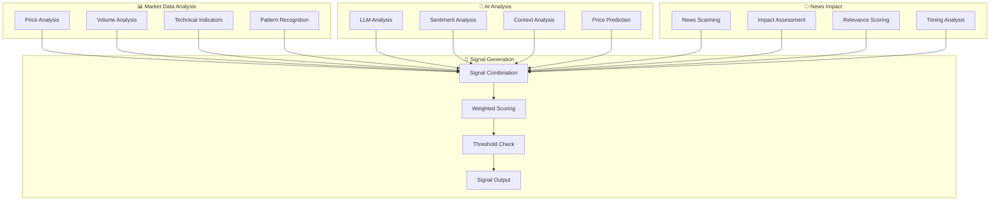
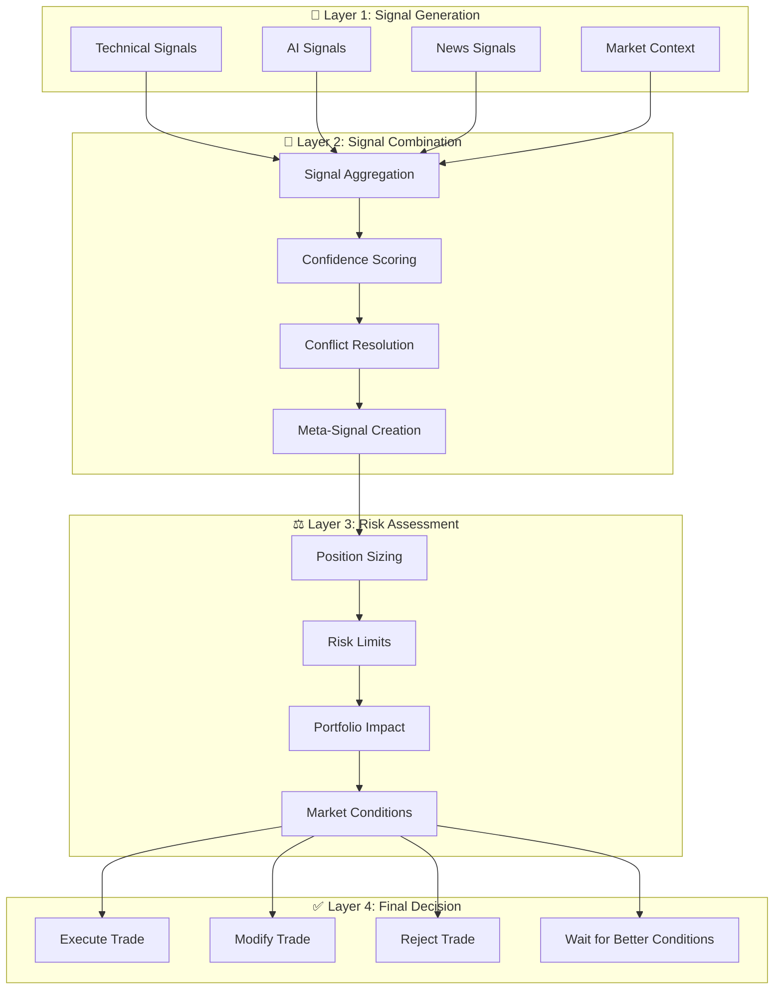
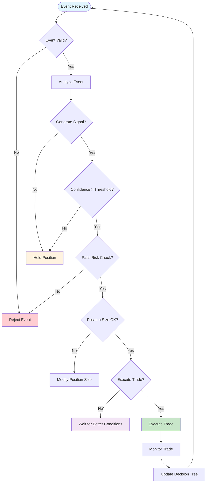
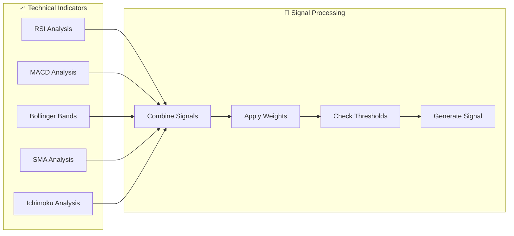
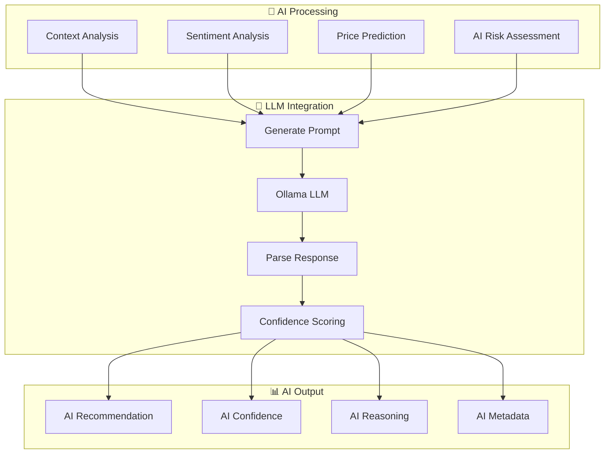
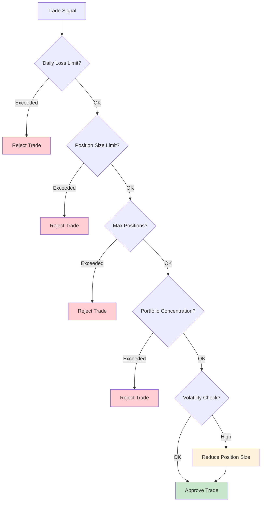
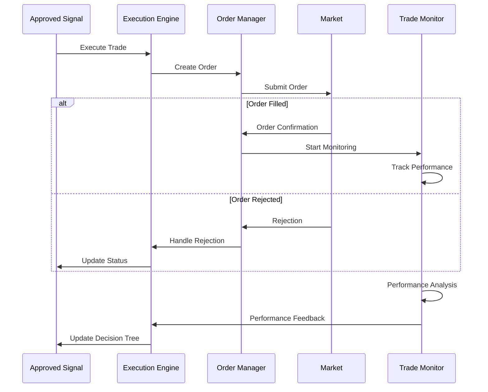
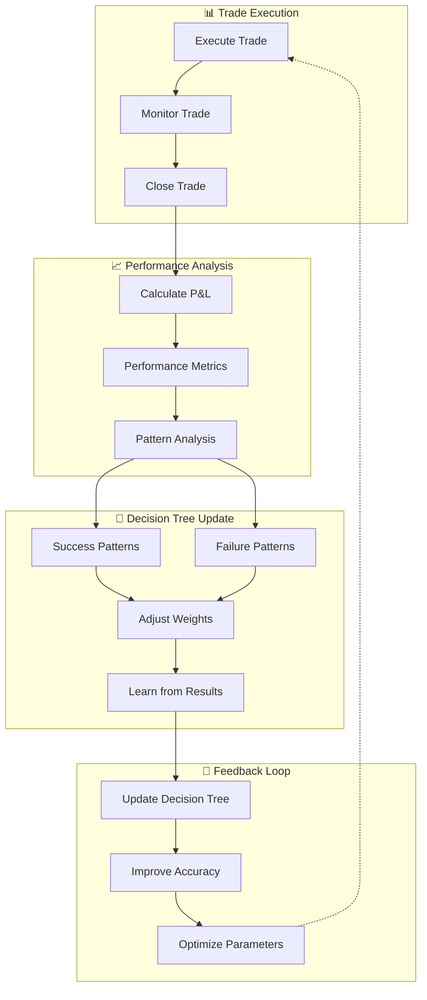

# 🚀 Event-Driven Architecture & Decision Tree Flow

## Overview

Your Space Trading Station uses a sophisticated **event-driven architecture** with a **multi-layered decision tree** to process events and determine whether to execute real trades. This document explains the complete data flow from event ingestion to trade execution.

## 🎯 System Architecture Overview

## 🔄 Event Flow Pipeline

### **1. Event Ingestion & Validation**

### **2. Analysis Engine Processing**

## 🎲 Decision Tree Architecture

### **Multi-Layer Decision Process**

### **Decision Tree Logic Flow**

## 📊 Data Flow Through Analysis Engine

### **Technical Analysis Flow**

### **AI Analysis Flow**

## 🛡️ Risk Management Decision Tree

### **Risk Validation Flow**

## ⚡ Trade Execution Flow

### **Execution Decision Process**

## 🔄 Feedback Loop & Learning

### **Performance Feedback Integration**

## 🎯 Key Decision Points

### **1. Event Validation**
- **Data Quality**: Is the event data complete and valid?
- **Source Reliability**: Is the event source trustworthy?
- **Timing**: Is the event current and relevant?

### **2. Signal Generation**
- **Technical Thresholds**: Do technical indicators meet thresholds?
- **AI Confidence**: Does AI analysis provide sufficient confidence?
- **News Impact**: Does news sentiment support the signal?

### **3. Risk Assessment**
- **Position Limits**: Does the trade fit within position limits?
- **Portfolio Impact**: How does this affect overall portfolio risk?
- **Market Conditions**: Are current market conditions suitable?

### **4. Execution Decision**
- **Confidence Level**: Is overall confidence high enough?
- **Risk/Reward**: Is the risk/reward ratio acceptable?
- **Timing**: Is this the optimal time to execute?

## 🚀 Implementation Benefits

### **Event-Driven Architecture**
- **Scalability**: Handle high-frequency events efficiently
- **Fault Tolerance**: Isolated failures don't crash the system
- **Flexibility**: Easy to add new event types and handlers
- **Real-time Processing**: Immediate response to market events

### **Decision Tree System**
- **Transparency**: Clear decision-making process
- **Consistency**: Uniform application of rules
- **Adaptability**: Learn and improve from results
- **Risk Management**: Multi-layer risk validation

### **Analysis Engine**
- **Multi-Source**: Combine technical, AI, and news analysis
- **Weighted Scoring**: Intelligent signal combination
- **Confidence-Based**: Only act on high-confidence signals
- **Continuous Learning**: Improve accuracy over time

This architecture ensures that every trade decision is thoroughly analyzed, validated, and executed with proper risk management, while maintaining the flexibility to adapt to changing market conditions. 