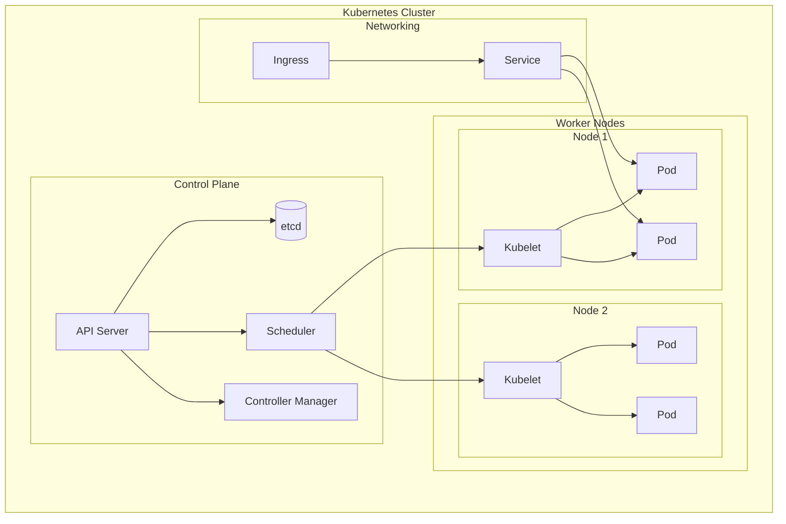
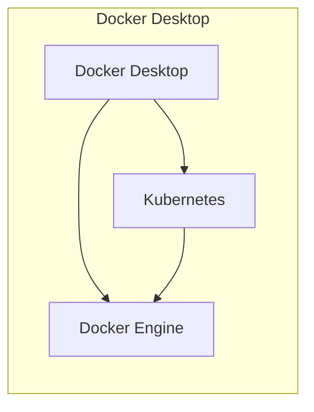
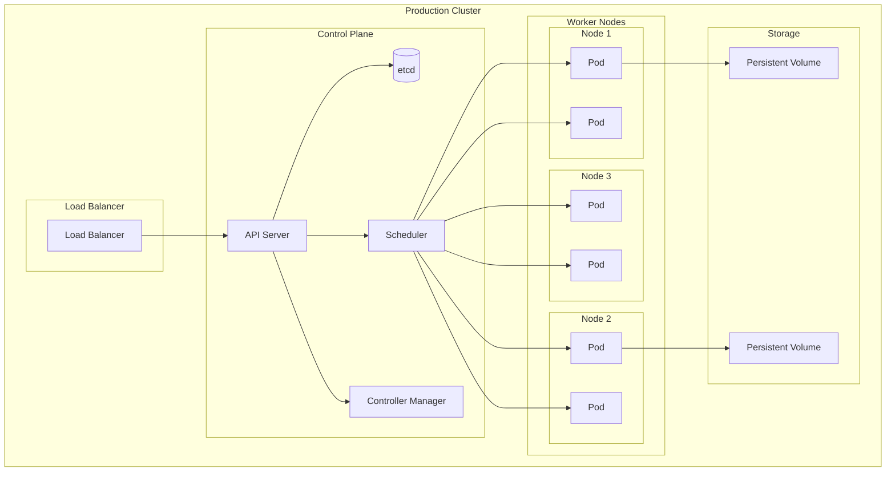
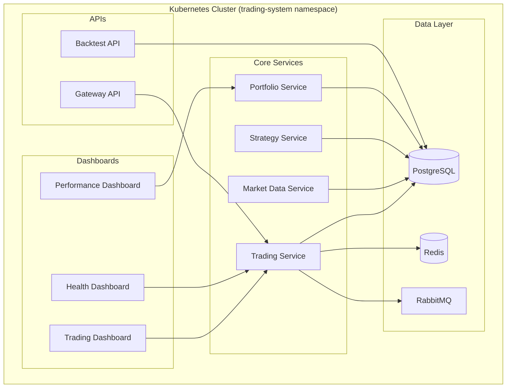
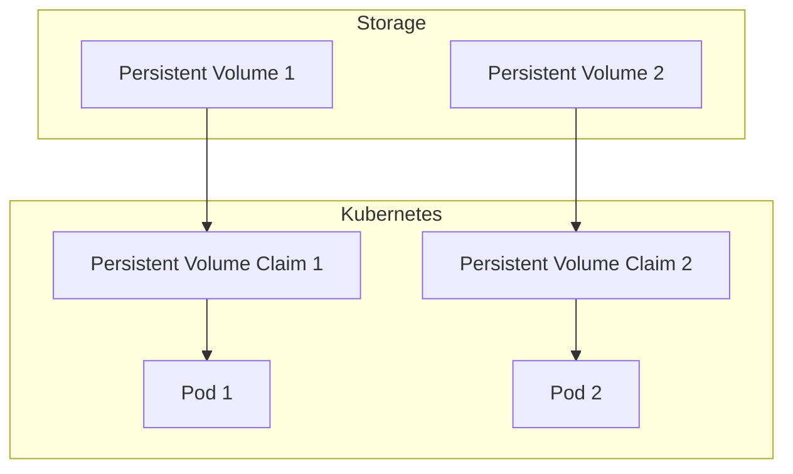
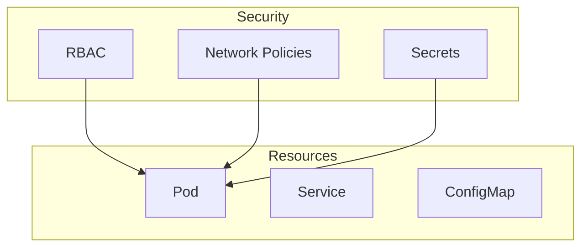

# 🎓 Kubernetes Learning Guide

## 📚 Overview

This guide is designed to help you learn Kubernetes through hands-on experience with our trading system. It covers everything from basic concepts to advanced production scenarios.

## 🎯 Learning Objectives

By the end of this guide, you'll be able to:
- Understand Kubernetes core concepts and architecture
- Use common kubectl commands effectively
- Deploy and manage applications on Kubernetes
- Troubleshoot common issues
- Understand the differences between Docker Desktop and production Kubernetes
- Create and manage resources like pods, services, deployments, and configmaps

## 🏗️ Kubernetes Architecture



## 🐳 Docker Desktop vs Production Kubernetes

### Docker Desktop Kubernetes



**Characteristics:**
- ✅ **Easy Setup**: One-click installation
- ✅ **Local Development**: Perfect for learning and testing
- ✅ **Resource Sharing**: Uses host resources efficiently
- ✅ **Integrated**: Works seamlessly with Docker
- ❌ **Limited Scale**: Single-node cluster
- ❌ **Resource Constraints**: Limited by host machine
- ❌ **No High Availability**: Single point of failure
- ❌ **No Load Balancing**: Basic networking only

### Production Kubernetes



**Characteristics:**
- ✅ **High Availability**: Multiple nodes and replicas
- ✅ **Auto-scaling**: Horizontal and vertical scaling
- ✅ **Load Balancing**: Advanced networking and routing
- ✅ **Production Ready**: Enterprise-grade features
- ✅ **Monitoring**: Comprehensive observability
- ❌ **Complex Setup**: Requires infrastructure expertise
- ❌ **Resource Intensive**: Needs dedicated resources
- ❌ **Cost**: Infrastructure and management overhead

## 🎯 Common Kubernetes Commands

### 🔍 **Viewing Resources**

| Command | Purpose | When to Use |
|---------|---------|-------------|
| `kubectl get pods` | List all pods | Check pod status |
| `kubectl get pods -n trading-system` | List pods in namespace | Check specific namespace |
| `kubectl get services` | List all services | Check service endpoints |
| `kubectl get deployments` | List all deployments | Check deployment status |
| `kubectl get configmaps` | List all configmaps | Check configuration |
| `kubectl get secrets` | List all secrets | Check sensitive data |
| `kubectl get nodes` | List all nodes | Check cluster nodes |
| `kubectl get events` | List all events | Debug issues |

### 📊 **Detailed Information**

| Command | Purpose | When to Use |
|---------|---------|-------------|
| `kubectl describe pod <pod-name>` | Detailed pod info | Debug pod issues |
| `kubectl describe service <service-name>` | Detailed service info | Debug networking |
| `kubectl describe deployment <deployment-name>` | Detailed deployment info | Check deployment status |
| `kubectl describe node <node-name>` | Detailed node info | Check node resources |

### 📝 **Logs and Debugging**

| Command | Purpose | When to Use |
|---------|---------|-------------|
| `kubectl logs <pod-name>` | View pod logs | Debug application issues |
| `kubectl logs -f <pod-name>` | Follow pod logs | Real-time debugging |
| `kubectl exec -it <pod-name> -- /bin/bash` | Interactive shell | Debug inside pod |
| `kubectl exec -it <pod-name> -- /bin/sh` | Interactive shell (Alpine) | Debug inside Alpine pod |

### 🚀 **Deployment and Management**

| Command | Purpose | When to Use |
|---------|---------|-------------|
| `kubectl apply -f <file.yaml>` | Apply configuration | Deploy resources |
| `kubectl delete -f <file.yaml>` | Delete resources | Remove deployments |
| `kubectl scale deployment <name> --replicas=3` | Scale deployment | Adjust capacity |
| `kubectl rollout restart deployment <name>` | Restart deployment | Apply changes |
| `kubectl rollout status deployment <name>` | Check rollout status | Monitor deployment |

### 🔧 **Configuration Management**

| Command | Purpose | When to Use |
|---------|---------|-------------|
| `kubectl create configmap <name> --from-file=<file>` | Create configmap | Store configuration |
| `kubectl create secret generic <name> --from-literal=<key>=<value>` | Create secret | Store sensitive data |
| `kubectl get configmap <name> -o yaml` | View configmap | Check configuration |
| `kubectl edit configmap <name>` | Edit configmap | Update configuration |

## 🎮 Interactive Learning Scenarios

### Scenario 1: First Deployment

**Objective**: Deploy your first application to Kubernetes

```bash
# 1. Check cluster status
kubectl cluster-info

# 2. Create namespace
kubectl create namespace trading-system

# 3. Deploy a simple application
kubectl apply -f k8s/core/namespace.yaml

# 4. Check deployment status
kubectl get pods -n trading-system

# 5. View logs
kubectl logs -f deployment/trading-service -n trading-system
```

### Scenario 2: Debugging a Failing Pod

**Objective**: Learn to troubleshoot common issues

```bash
# 1. Check pod status
kubectl get pods -n trading-system

# 2. Get detailed information
kubectl describe pod <pod-name> -n trading-system

# 3. Check logs
kubectl logs <pod-name> -n trading-system

# 4. Check events
kubectl get events -n trading-system --sort-by=.metadata.creationTimestamp

# 5. Interactive debugging
kubectl exec -it <pod-name> -n trading-system -- /bin/bash
```

### Scenario 3: Scaling Applications

**Objective**: Learn to scale applications up and down

```bash
# 1. Check current replicas
kubectl get deployments -n trading-system

# 2. Scale up
kubectl scale deployment trading-service --replicas=3 -n trading-system

# 3. Monitor scaling
kubectl get pods -n trading-system -l app=trading-service

# 4. Scale down
kubectl scale deployment trading-service --replicas=1 -n trading-system
```

### Scenario 4: Configuration Management

**Objective**: Learn to manage configuration and secrets

```bash
# 1. Create a configmap
kubectl create configmap app-config --from-literal=ENVIRONMENT=production -n trading-system

# 2. Create a secret
kubectl create secret generic app-secret --from-literal=API_KEY=secret123 -n trading-system

# 3. View configuration
kubectl get configmap app-config -n trading-system -o yaml

# 4. Update configuration
kubectl edit configmap app-config -n trading-system
```

## 🏗️ Our Trading System Architecture



## 🎯 Learning Path

### Phase 1: Fundamentals (Week 1-2)
- [ ] Understand Kubernetes architecture
- [ ] Learn basic kubectl commands
- [ ] Deploy simple applications
- [ ] Understand pods, services, and deployments

### Phase 2: Intermediate (Week 3-4)
- [ ] Work with namespaces and resource quotas
- [ ] Learn about ConfigMaps and Secrets
- [ ] Understand networking and services
- [ ] Practice debugging and troubleshooting

### Phase 3: Advanced (Week 5-6)
- [ ] Learn about persistent volumes
- [ ] Understand RBAC and security
- [ ] Work with Helm charts
- [ ] Practice monitoring and logging

### Phase 4: Production (Week 7-8)
- [ ] Understand production considerations
- [ ] Learn about high availability
- [ ] Practice disaster recovery
- [ ] Understand scaling strategies

## 🛠️ Hands-On Exercises

### Exercise 1: Deploy a Simple Web Application

```yaml
# simple-app.yaml
apiVersion: apps/v1
kind: Deployment
metadata:
  name: simple-app
  namespace: trading-system
spec:
  replicas: 2
  selector:
    matchLabels:
      app: simple-app
  template:
    metadata:
      labels:
        app: simple-app
    spec:
      containers:
      - name: simple-app
        image: nginx:alpine
        ports:
        - containerPort: 80
---
apiVersion: v1
kind: Service
metadata:
  name: simple-app-service
  namespace: trading-system
spec:
  selector:
    app: simple-app
  ports:
  - port: 80
    targetPort: 80
  type: ClusterIP
```

**Tasks:**
1. Apply the configuration
2. Check pod status
3. Access the application
4. Scale the deployment
5. View logs

### Exercise 2: Debug a Failing Application

**Scenario**: A pod is in CrashLoopBackOff state

**Tasks:**
1. Identify the failing pod
2. Check pod description
3. View logs
4. Check events
5. Fix the issue
6. Verify the fix

### Exercise 3: Configuration Management

**Scenario**: Update application configuration without rebuilding

**Tasks:**
1. Create a ConfigMap
2. Mount it in a deployment
3. Update the ConfigMap
4. Restart the deployment
5. Verify the changes

## 🎯 Advanced Topics

### Networking

```mermaid
graph TB
    subgraph "External"
        User[User]
    end
    
    subgraph "Kubernetes Cluster"
        subgraph "Ingress"
            Ingress[Ingress Controller]
        end
        
        subgraph "Services"
            Service1[Service A]
            Service2[Service B]
        end
        
        subgraph "Pods"
            Pod1[Pod A1]
            Pod2[Pod A2]
            Pod3[Pod B1]
        end
    end
    
    User --> Ingress
    Ingress --> Service1
    Ingress --> Service2
    Service1 --> Pod1
    Service1 --> Pod2
    Service2 --> Pod3
```

### Storage



### Security



## 🎯 Troubleshooting Guide

### Common Issues and Solutions

#### 1. Pod Stuck in Pending

**Symptoms:**
- Pod shows "Pending" status
- No events or errors

**Solutions:**
```bash
# Check node resources
kubectl describe nodes

# Check pod events
kubectl describe pod <pod-name>

# Check resource requests/limits
kubectl get pod <pod-name> -o yaml
```

#### 2. Pod in CrashLoopBackOff

**Symptoms:**
- Pod restarts repeatedly
- Application crashes

**Solutions:**
```bash
# Check logs
kubectl logs <pod-name>

# Check pod description
kubectl describe pod <pod-name>

# Check application configuration
kubectl exec -it <pod-name> -- /bin/bash
```

#### 3. Service Not Accessible

**Symptoms:**
- Service exists but not reachable
- Connection timeouts

**Solutions:**
```bash
# Check service endpoints
kubectl get endpoints <service-name>

# Check service configuration
kubectl describe service <service-name>

# Check pod labels
kubectl get pods --show-labels
```

## 🎯 Production Considerations

### High Availability

- **Multiple Replicas**: Always run multiple replicas of critical services
- **Pod Disruption Budgets**: Protect against accidental pod deletion
- **Anti-Affinity**: Distribute pods across nodes
- **Resource Limits**: Set appropriate resource limits

### Security

- **RBAC**: Implement role-based access control
- **Network Policies**: Restrict pod-to-pod communication
- **Secrets Management**: Use Kubernetes secrets for sensitive data
- **Image Scanning**: Scan images for vulnerabilities

### Monitoring

- **Health Checks**: Implement liveness and readiness probes
- **Metrics**: Collect application and infrastructure metrics
- **Logging**: Centralize logs for analysis
- **Alerting**: Set up alerts for critical issues

## 🎯 Next Steps

### Recommended Resources

1. **Official Documentation**
   - [Kubernetes Documentation](https://kubernetes.io/docs/)
   - [kubectl Cheat Sheet](https://kubernetes.io/docs/reference/kubectl/cheatsheet/)

2. **Interactive Learning**
   - [Kubernetes Playground](https://www.katacoda.com/courses/kubernetes)
   - [Minikube Tutorial](https://kubernetes.io/docs/tutorials/hello-minikube/)

3. **Advanced Topics**
   - [Helm Charts](https://helm.sh/)
   - [Istio Service Mesh](https://istio.io/)
   - [Prometheus Monitoring](https://prometheus.io/)

### Practice Projects

1. **Deploy a Multi-Tier Application**
   - Frontend, backend, and database
   - Use ConfigMaps and Secrets
   - Implement health checks

2. **Set Up Monitoring**
   - Deploy Prometheus and Grafana
   - Create custom dashboards
   - Set up alerting

3. **Implement CI/CD**
   - Set up automated deployments
   - Use Helm charts
   - Implement blue-green deployments

## 🎯 Conclusion

This guide provides a comprehensive foundation for learning Kubernetes through hands-on experience with our trading system. Remember to:

- **Practice regularly** with the exercises
- **Experiment** with different configurations
- **Ask questions** when you encounter issues
- **Share knowledge** with your team

Happy learning! 🚀
