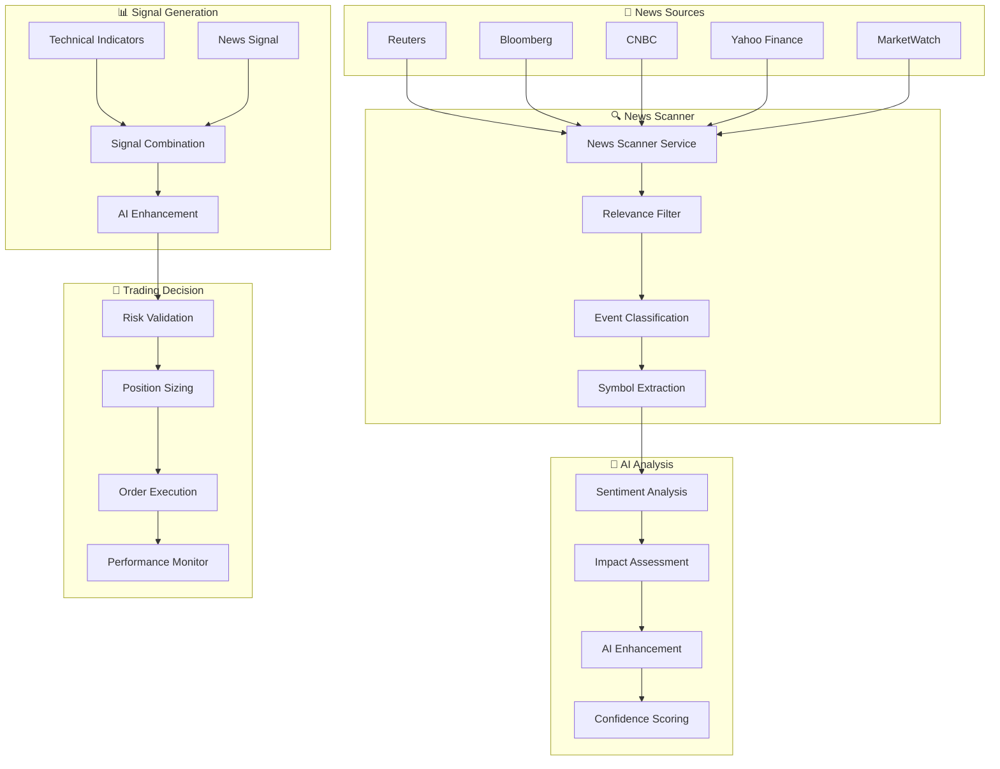
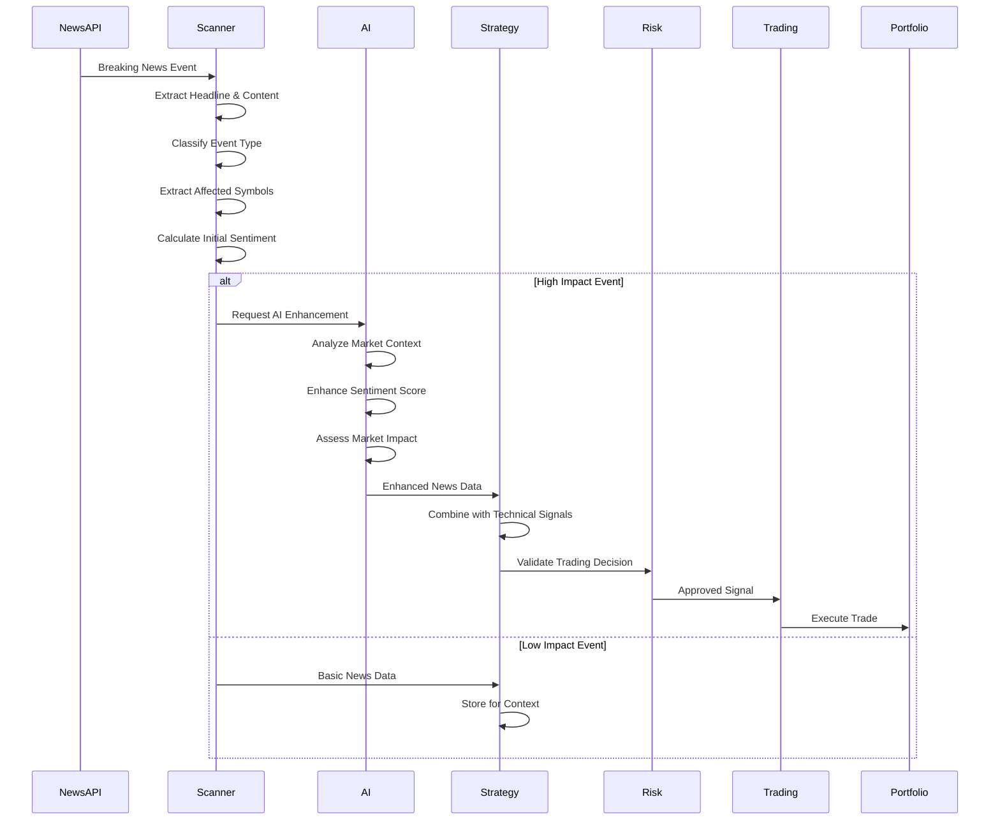
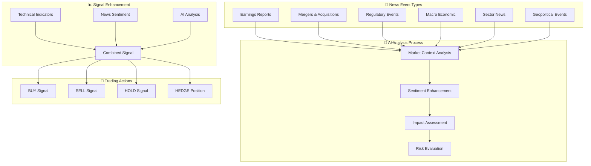
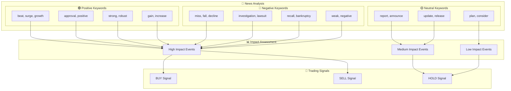
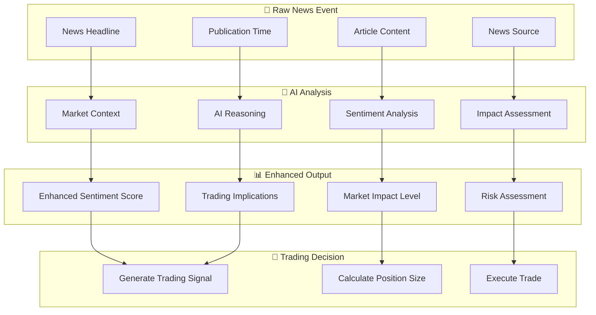
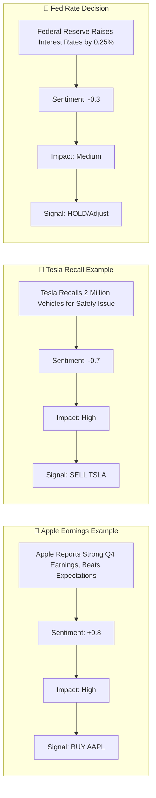
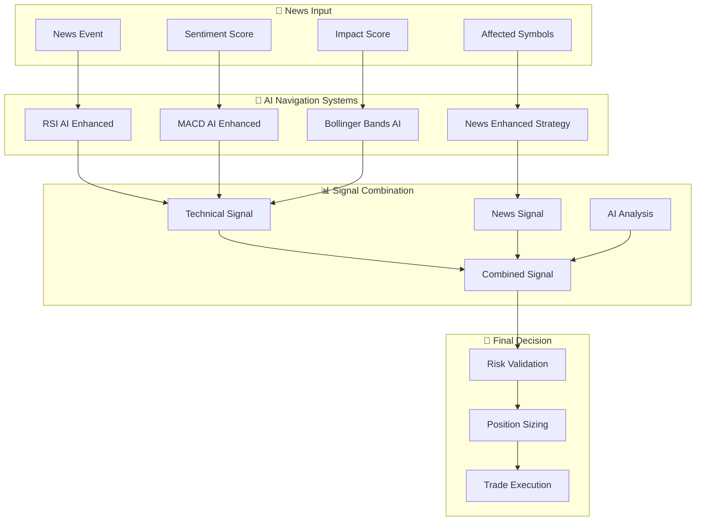
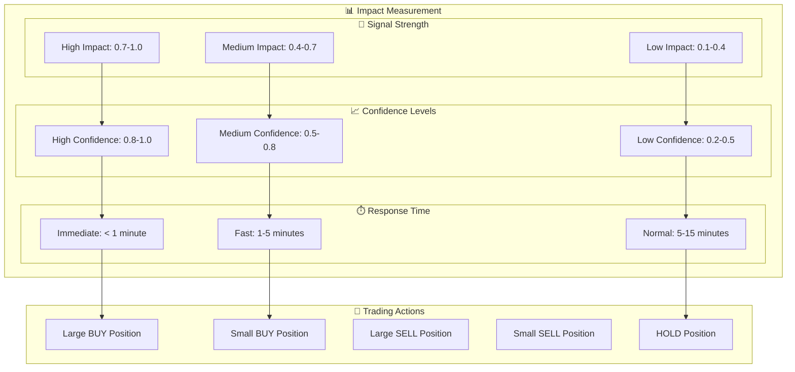

# 📰 News Impact on Trading Decisions - Space Trading Station

This document shows exactly how news events flow through your Space Trading Station to influence trading decisions.

## 🚀 News-to-Trading Flow Overview

## 📰 News Event Processing Pipeline

## 🎯 News Impact on Trading Decisions

## 📊 News Sentiment Scoring System

## 🤖 AI Enhancement of News Sentiment

## 📈 Real-World News Impact Examples

## 🔄 News Integration in AI Navigation Systems

## 📊 News Impact Metrics

---

## 🎯 Key Takeaways

### **How News Impacts Trading Decisions:**

1. **📰 Real-time Monitoring**: News scanner continuously monitors multiple financial sources
2. **🤖 AI Enhancement**: Ollama analyzes news sentiment and market context
3. **📊 Signal Combination**: News sentiment combines with technical indicators
4. **🎯 Risk Management**: News events trigger risk assessments and position adjustments
5. **⚡ Speed**: High-impact news generates immediate trading signals
6. **📈 Performance**: News-enhanced strategies show improved performance metrics

### **News Event Types & Impact:**

- **Earnings Reports**: High impact, immediate signals
- **M&A News**: High impact, position adjustments
- **Regulatory Events**: Medium impact, risk assessment
- **Macro Economic**: Medium impact, portfolio rebalancing
- **Sector News**: Low-medium impact, context enhancement

*"This is ORION, Mission Control. News integration is fully operational and enhancing all AI Navigation Systems!"* 🚀 