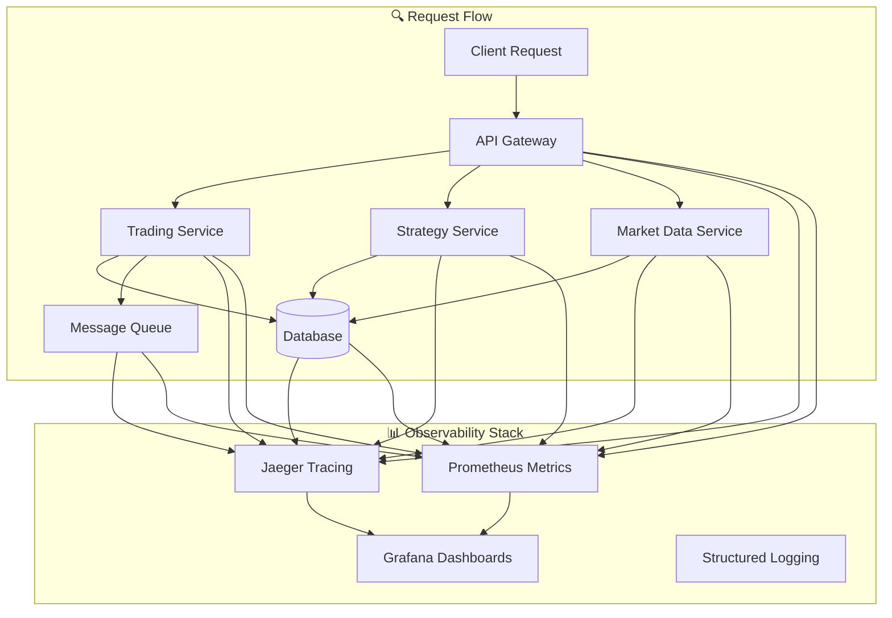

# 🔍 Observability & Request Tracking Guide

## Overview

This guide provides comprehensive observability implementation for your trading system, enabling you to track requests, identify bottlenecks, and monitor system performance in real-time.

## 🎯 What You'll Learn

- **Distributed Tracing**: Track requests across all services
- **Bottleneck Identification**: Find performance issues quickly
- **Request Flow Visualization**: See how requests move through your system
- **Performance Monitoring**: Real-time performance metrics
- **Error Tracking**: Comprehensive error analysis

## 🏗️ Architecture



## 🚀 Quick Start

### 1. Deploy Jaeger Tracing

```bash
# Deploy Jaeger
kubectl apply -f monitoring/jaeger-deployment.yaml

# Port forward Jaeger UI
kubectl port-forward service/jaeger 16686:16686 -n trading-system
```

### 2. Install OpenTelemetry Dependencies

```bash
# Add to your service requirements.txt
opentelemetry-api
opentelemetry-sdk
opentelemetry-instrumentation-fastapi
opentelemetry-instrumentation-httpx
opentelemetry-instrumentation-sqlalchemy
opentelemetry-instrumentation-redis
opentelemetry-instrumentation-rabbitmq
opentelemetry-instrumentation-prometheus-client
opentelemetry-exporter-jaeger
```

### 3. Integrate Tracing in Your Services

```python
# In your FastAPI service
from src.utils.tracing_middleware import setup_tracing_middleware
from src.utils.distributed_tracing import trace_request, trace_database_operation

app = FastAPI()

# Setup tracing middleware
setup_tracing_middleware(app, service_name="trading-service")

@app.post("/api/trade")
@trace_request(operation="create_trade")
async def create_trade(request: TradeRequest):
    # Your trading logic here
    pass

@app.get("/api/portfolio")
@trace_database_operation(operation="get_portfolio", table="portfolios")
async def get_portfolio():
    # Database query here
    pass
```

## 📊 Key Metrics to Track

### Request Metrics
```python
# HTTP Request Metrics
http_requests_total{service="trading-service", method="POST", status="200"}
http_request_duration_seconds{service="trading-service", endpoint="/api/trade"}
http_request_size_bytes{service="trading-service"}
http_response_size_bytes{service="trading-service"}
```

### Database Metrics
```python
# Database Performance
db_queries_total{service="trading-service", operation="select"}
db_query_duration_seconds{service="trading-service", table="trades"}
db_connections_active{service="trading-service"}
db_connections_idle{service="trading-service"}
```

### External API Metrics
```python
# External API Calls
http_client_requests_total{service="trading-service", target_service="market-data"}
http_client_duration_seconds{service="trading-service", target_service="polygon-api"}
http_client_errors_total{service="trading-service", target_service="polygon-api"}
```

### Message Queue Metrics
```python
# Message Queue Performance
mq_messages_total{queue="trade-signals", operation="publish"}
mq_message_duration_seconds{queue="trade-signals", operation="consume"}
mq_queue_depth{queue="trade-signals"}
mq_consumer_lag{queue="trade-signals"}
```

## 🔍 Bottleneck Identification

### 1. High Response Times
```promql
# Find slow endpoints
histogram_quantile(0.95, sum(rate(http_request_duration_seconds_bucket[5m])) by (le, service, endpoint))

# Top 10 slowest services
topk(10, sum(rate(http_request_duration_seconds_sum[5m])) by (service))
```

### 2. Database Bottlenecks
```promql
# Slow database queries
histogram_quantile(0.95, sum(rate(db_query_duration_seconds_bucket[5m])) by (le, service, table))

# High query volume
sum(rate(db_queries_total[5m])) by (service, table)
```

### 3. External API Issues
```promql
# External API performance
histogram_quantile(0.95, sum(rate(http_client_duration_seconds_bucket[5m])) by (le, target_service))

# External API errors
sum(rate(http_client_errors_total[5m])) by (target_service, error_type)
```

### 4. Message Queue Bottlenecks
```promql
# Queue depth
mq_queue_depth{queue=~".*"}

# Consumer lag
mq_consumer_lag{queue=~".*"}

# Message processing time
histogram_quantile(0.95, sum(rate(mq_message_duration_seconds_bucket[5m])) by (le, queue))
```

## 🎯 Request Flow Tracking

### 1. Trace a Complete Request

```python
# Example: Trading request flow
@trace_request(operation="process_trade")
async def process_trade(trade_request: TradeRequest):
    # 1. Validate trade
    with distributed_tracer.span("trade.validation") as span:
        span.set_attribute("trade.symbol", trade_request.symbol)
        span.set_attribute("trade.quantity", trade_request.quantity)
        # Validation logic
    
    # 2. Check risk limits
    with distributed_tracer.span("risk.check") as span:
        # Risk check logic
    
    # 3. Get market data
    with distributed_tracer.span("market.data.fetch") as span:
        # Market data fetch
    
    # 4. Execute trade
    with distributed_tracer.span("trade.execution") as span:
        # Trade execution
    
    # 5. Update portfolio
    with distributed_tracer.span("portfolio.update") as span:
        # Portfolio update
```

### 2. Database Operation Tracking

```python
@trace_database_operation(operation="insert", table="trades")
async def save_trade(trade: Trade):
    # Database operation
    pass

@trace_database_operation(operation="select", table="portfolios")
async def get_portfolio(user_id: str):
    # Database query
    pass
```

### 3. External API Tracking

```python
@trace_external_api_call("polygon-api", "/v2/aggs/ticker/{symbol}/range/1/day")
async def get_market_data(symbol: str):
    # External API call
    pass
```

## 📈 Performance Monitoring

### 1. Response Time Alerts

```yaml
# Prometheus Alert Rule
groups:
  - name: trading-system-performance
    rules:
      - alert: HighResponseTime
        expr: histogram_quantile(0.95, rate(http_request_duration_seconds_bucket[5m])) > 1
        for: 2m
        labels:
          severity: warning
        annotations:
          summary: "High response time detected"
          description: "95th percentile response time is {{ $value }}s"
```

### 2. Error Rate Alerts

```yaml
      - alert: HighErrorRate
        expr: sum(rate(http_requests_total{status=~"4..|5.."}[5m])) by (service) / sum(rate(http_requests_total[5m])) by (service) > 0.05
        for: 2m
        labels:
          severity: critical
        annotations:
          summary: "High error rate detected"
          description: "Error rate is {{ $value }}%"
```

### 3. Database Performance Alerts

```yaml
      - alert: SlowDatabaseQueries
        expr: histogram_quantile(0.95, rate(db_query_duration_seconds_bucket[5m])) > 0.5
        for: 2m
        labels:
          severity: warning
        annotations:
          summary: "Slow database queries detected"
          description: "95th percentile query time is {{ $value }}s"
```

## 🔧 Implementation Steps

### Step 1: Deploy Jaeger
```bash
kubectl apply -f monitoring/jaeger-deployment.yaml
kubectl get pods -n trading-system -l app=jaeger
```

### Step 2: Update Service Dependencies
```bash
# Add to your service Dockerfile
RUN pip install opentelemetry-api opentelemetry-sdk opentelemetry-instrumentation-fastapi opentelemetry-instrumentation-httpx opentelemetry-instrumentation-sqlalchemy opentelemetry-instrumentation-redis opentelemetry-instrumentation-rabbitmq opentelemetry-instrumentation-prometheus-client opentelemetry-exporter-jaeger
```

### Step 3: Integrate Tracing Middleware
```python
# In your service main.py
from src.utils.tracing_middleware import setup_tracing_middleware

app = FastAPI()
setup_tracing_middleware(app, service_name="your-service-name")
```

### Step 4: Add Tracing Decorators
```python
# Add to your API endpoints
@trace_request(operation="your_operation")
async def your_endpoint():
    pass

@trace_database_operation(operation="select", table="your_table")
async def your_database_operation():
    pass
```

### Step 5: Deploy Updated Services
```bash
kubectl apply -f k8s/your-service.yaml
kubectl rollout restart deployment/your-service -n trading-system
```

## 🎯 Using the Dashboards

### 1. Jaeger UI (http://localhost:16686)
- **Search Traces**: Find specific requests by service, operation, or tags
- **Trace Details**: View complete request flow with timing
- **Service Dependencies**: See how services interact
- **Error Analysis**: Identify failed requests and their causes

### 2. Grafana Request Tracing Dashboard
- **Request Flow Overview**: See request volume by service
- **Performance Metrics**: Response times, error rates, throughput
- **Bottleneck Detection**: Identify slow endpoints and services
- **Database Performance**: Query times and connection metrics
- **External API Performance**: Third-party service performance

### 3. Custom Queries for Bottleneck Analysis

```promql
# Find the slowest endpoints
topk(10, sum(rate(http_request_duration_seconds_sum[5m])) by (service, endpoint))

# Identify high error rates
sum(rate(http_requests_total{status=~"4..|5.."}[5m])) by (service, endpoint) / sum(rate(http_requests_total[5m])) by (service, endpoint) * 100

# Database connection issues
db_connections_active / db_connections_total * 100

# External API timeouts
sum(rate(http_client_errors_total{error_type="timeout"}[5m])) by (target_service)
```

## 🚨 Troubleshooting

### Common Issues

1. **Jaeger Not Collecting Traces**
   ```bash
   # Check Jaeger deployment
   kubectl get pods -n trading-system -l app=jaeger
   kubectl logs deployment/jaeger -n trading-system
   
   # Check service configuration
   kubectl get configmap jaeger-config -n trading-system -o yaml
   ```

2. **OpenTelemetry Import Errors**
   ```bash
   # Install missing dependencies
   pip install opentelemetry-api opentelemetry-sdk opentelemetry-instrumentation-fastapi
   ```

3. **No Traces in Jaeger**
   ```bash
   # Check service environment variables
   kubectl get deployment your-service -n trading-system -o yaml
   
   # Verify tracing is enabled
   kubectl exec deployment/your-service -n trading-system -- env | grep TRACING
   ```

4. **High Memory Usage**
   ```bash
   # Check Jaeger memory usage
   kubectl top pods -n trading-system -l app=jaeger
   
   # Adjust memory limits if needed
   kubectl patch deployment jaeger -n trading-system -p '{"spec":{"template":{"spec":{"containers":[{"name":"jaeger","resources":{"limits":{"memory":"1Gi"}}}]}}}}'
   ```

## 📚 Best Practices

### 1. Trace Naming Conventions
```python
# Use consistent naming
"http.{method}.{endpoint}"  # http.post.api.trade
"database.{operation}.{table}"  # database.select.trades
"external.{service}.{operation}"  # external.polygon.get_market_data
"mq.{operation}.{queue}"  # mq.publish.trade_signals
```

### 2. Attribute Naming
```python
# Use standard OpenTelemetry attributes
span.set_attribute("http.method", "POST")
span.set_attribute("http.url", "/api/trade")
span.set_attribute("db.system", "postgresql")
span.set_attribute("db.name", "trading_bot")
span.set_attribute("db.table", "trades")
```

### 3. Error Handling
```python
try:
    # Your operation
    result = await your_operation()
    span.set_attribute("operation.success", True)
except Exception as e:
    span.set_attribute("operation.success", False)
    span.set_attribute("operation.error", str(e))
    span.set_attribute("operation.error_type", type(e).__name__)
    raise
```

### 4. Performance Optimization
```python
# Sample traces in high-traffic environments
TRACE_SAMPLE_RATE=0.1  # Sample 10% of traces

# Use batch processing for Jaeger
BATCH_SIZE=100
BATCH_TIMEOUT=5s
```

## 🎯 Next Steps

1. **Deploy Jaeger**: Start with the basic deployment
2. **Instrument Core Services**: Add tracing to trading-service, strategy-service
3. **Create Custom Dashboards**: Build specific dashboards for your use cases
4. **Set Up Alerts**: Configure alerts for performance issues
5. **Optimize Performance**: Use tracing data to identify and fix bottlenecks

## 🔗 Useful Links

- **Jaeger Documentation**: https://www.jaegertracing.io/docs/
- **OpenTelemetry Python**: https://opentelemetry.io/docs/languages/python/
- **Grafana Dashboards**: https://grafana.com/docs/grafana/latest/dashboards/
- **Prometheus Querying**: https://prometheus.io/docs/prometheus/latest/querying/

This observability setup will give you complete visibility into your trading system's performance and help you identify and resolve bottlenecks quickly.


