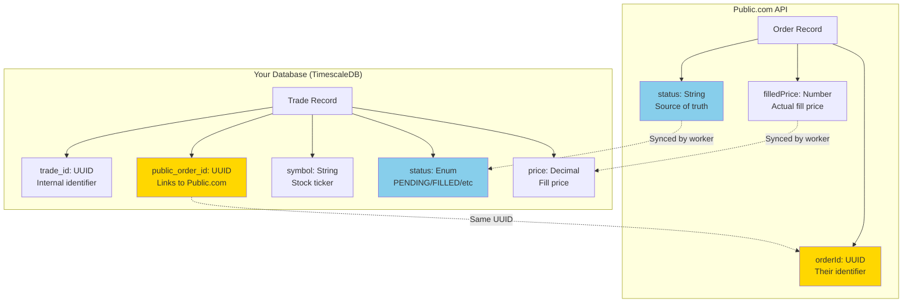

# Order Linkage - How Database Records Connect to Public.com

## Overview

This document explains how orders in your local database are linked to orders at Public.com, and how the sync worker keeps them aligned.

## Current Status

Based on your latest data:

- ✅ **2 orders with real Public.com IDs** (can be synced)
- ⚠️ **5 orders with TEMP IDs** (from old CloudFront errors, cannot be synced)
- 📊 **7 total pending orders** waiting for fills

## The Linkage Model



## Database Schema

### `live_trades` Table

| Column | Type | Purpose | Example |
|--------|------|---------|---------|
| `trade_id` | UUID | **Your internal ID** (primary key) | `02168c78-6901-4b51-8e43-377702f2f1bb` |
| `public_order_id` | UUID | **Link to Public.com** | `59f69619-e692-4631-99af-43228225b092` |
| `account_id` | UUID | Links to your trading account | `19c25392-8b61-4b71-a344-0eb04d275528` |
| `symbol` | VARCHAR | Stock ticker | `QQQ`, `AAPL`, `MSFT` |
| `action` | VARCHAR | Trade direction | `BUY`, `SELL` |
| `quantity` | INTEGER | Number of shares | `1` |
| `status` | ENUM | Current order status | `PENDING`, `FILLED`, `CANCELLED` |
| `price` | DECIMAL | Fill price (when filled) | `450.25` |
| `created_at` | TIMESTAMP | When order was created | `2025-10-07 19:00:01` |
| `filled_at` | TIMESTAMP | When order was filled | `2025-10-07 09:31:15` |

## How the Link Is Created

### Step 1: Order Submission

When you submit an order:

```python
# 1. Generate UUIDs
trade_id = uuid.uuid4()          # e.g., 02168c78-6901-4b51-8e43-377702f2f1bb
order_id = uuid.uuid4()          # e.g., 59f69619-e692-4631-99af-43228225b092

# 2. Create database record
trade = LiveTrade(
    trade_id=trade_id,           # Internal ID
    public_order_id=order_id,    # Link to Public.com
    symbol="QQQ",
    action="BUY",
    quantity=1,
    status="PENDING"
)
db.add(trade)

# 3. Submit to Public.com
public_api.submit_order({
    "orderId": order_id,         # Same UUID sent to Public.com
    "symbol": "QQQ",
    "side": "BUY",
    "quantity": 1
})
```

### Step 2: The Link Exists

Now you have:

**In Your Database:**
```
trade_id:         02168c78-6901-4b51-8e43-377702f2f1bb
public_order_id:  59f69619-e692-4631-99af-43228225b092  ← This is the link!
symbol:           QQQ
status:           PENDING
```

**At Public.com:**
```
orderId:  59f69619-e692-4631-99af-43228225b092  ← Same UUID!
symbol:   QQQ
status:   PENDING
```

## How Sync Works

### Step 1: Fetch Pending Orders

The sync worker queries your database:

```sql
SELECT trade_id, public_order_id, symbol, status
FROM live_trades
WHERE status = 'PENDING'
```

**Result:**
```
trade_id                              | public_order_id                       | symbol | status
02168c78-6901-4b51-8e43-377702f2f1bb | 59f69619-e692-4631-99af-43228225b092 | QQQ    | PENDING
6094c81c-874b-4e43-8c9d-b3b222a8b0fa | 537e7c0b-7b75-48e5-9db8-acdccd5af1bc | QQQ    | PENDING
```

### Step 2: Query Public.com

For each order, the worker queries Public.com:

```http
GET /trading/{account_id}/orders/{public_order_id}
```

Example:
```http
GET /trading/5OS44958/orders/59f69619-e692-4631-99af-43228225b092
```

**Public.com Response:**
```json
{
  "orderId": "59f69619-e692-4631-99af-43228225b092",
  "symbol": "QQQ",
  "status": "FILLED",
  "filledQuantity": 1,
  "averagePrice": 450.25,
  "filledAt": "2025-10-07T09:31:15Z"
}
```

### Step 3: Update Your Database

Worker updates your database using the `trade_id`:

```sql
UPDATE live_trades
SET 
    status = 'FILLED',
    price = 450.25,
    filled_quantity = 1,
    filled_at = '2025-10-07 09:31:15'
WHERE trade_id = '02168c78-6901-4b51-8e43-377702f2f1bb'
```

## Your Current Orders

### ✅ Orders with Real Public.com IDs (Can Sync)

| Trade ID | Symbol | Public Order ID | Status |
|----------|--------|----------------|--------|
| `02168c78-...` | QQQ | `59f69619-...` | PENDING |
| `6094c81c-...` | QQQ | `537e7c0b-...` | PENDING |

These orders:
- ✅ Have real Public.com `orderId`s
- ✅ Can be synced by the worker
- ✅ Will update to FILLED when Public.com fills them

### ⚠️ Orders with TEMP IDs (Cannot Sync)

| Trade ID | Symbol | Public Order ID | Status |
|----------|--------|----------------|--------|
| `ba6b2c0c-...` | QQQ | `TEMP_1759862702.040189` | PENDING |
| `212d1771-...` | MSFT | `TEMP_1759862701.230061` | PENDING |
| `28aba0d1-...` | QQQ | `TEMP_1759862685.796322` | PENDING |
| `4d18af26-...` | AAPL | `TEMP_1759862685.233462` | PENDING |
| `367447df-...` | MSFT | `TEMP_1759862684.536224` | PENDING |

These orders:
- ❌ Have temporary IDs (from CloudFront errors)
- ❌ Cannot be synced (Public.com doesn't know these IDs)
- ⚠️ Should be cancelled manually or will expire

## Querying Orders

### Check All Orders and Their Links

```bash
./scripts/check_order_links.sh
```

### Check Specific Order Link

```sql
-- Find by trade_id (your internal ID)
SELECT trade_id, public_order_id, symbol, status
FROM live_trades
WHERE trade_id = '02168c78-6901-4b51-8e43-377702f2f1bb';

-- Find by public_order_id (Public.com's ID)
SELECT trade_id, public_order_id, symbol, status
FROM live_trades
WHERE public_order_id = '59f69619-e692-4631-99af-43228225b092';

-- Find by symbol
SELECT trade_id, public_order_id, symbol, status
FROM live_trades
WHERE symbol = 'QQQ' AND status = 'PENDING';
```

### Check Pending Orders Only

```sql
SELECT 
    trade_id,
    public_order_id,
    symbol,
    action,
    quantity,
    created_at
FROM live_trades
WHERE status = 'PENDING'
ORDER BY created_at DESC;
```

## Sync Worker Process

### What Happens Every 2 Minutes

```
1. Worker starts
   ↓
2. Query database: "SELECT * FROM live_trades WHERE status = 'PENDING'"
   ↓
3. For each pending order:
   a. Extract public_order_id
   b. Skip if public_order_id starts with "TEMP_"
   c. Query Public.com: GET /trading/{account}/orders/{public_order_id}
   d. Get current status from Public.com
   e. Update database: "UPDATE live_trades SET status = ... WHERE trade_id = ..."
   ↓
4. Log results:
   ✅ Synced: X orders
   💰 Filled: X orders
   ⏳ Still Pending: X orders
```

### Example Sync Log

```
🔄 Order Sync Worker - Tue Oct  7 19:05:27 UTC 2025
🔍 Syncing pending orders with Public.com...

Processing trade 02168c78-6901-4b51-8e43-377702f2f1bb (QQQ)
  → Querying Public.com order 59f69619-e692-4631-99af-43228225b092
  → Status: FILLED at $450.25
  → Updated database

Processing trade ba6b2c0c-cb5c-45e3-bd8c-e31bed9e3d0f (QQQ)
  → Skipping TEMP_1759862702.040189 (temporary ID)

📊 Sync Results:
   ✅ Synced: 2
   💰 Filled: 1
   ⏳ Still Pending: 6
✅ Order sync completed successfully
```

## Troubleshooting

### Issue: Order Not Syncing

**Check if it has a real Public.com ID:**

```bash
./scripts/check_order_links.sh | grep -E "TEMP_|Public Order ID"
```

If you see `TEMP_*`, the order cannot be synced because Public.com doesn't know about it.

**Solution:**
1. These orders will expire automatically (24 hours)
2. Or cancel them manually:
   ```sql
   UPDATE live_trades 
   SET status = 'CANCELLED', 
       rejection_reason = 'Temporary ID - cannot sync'
   WHERE public_order_id LIKE 'TEMP_%';
   ```

### Issue: Order Status Not Updating

**Check sync worker logs:**

```bash
kubectl logs -n default -l app=order-sync-worker --tail=50
```

Look for:
- ✅ "Synced: X" - number of orders updated
- ❌ Errors about authentication or API failures

**Check if worker is running:**

```bash
make -f Makefile.order-sync status-sync-worker
```

### Issue: Finding an Order by Public.com ID

**If you have a Public.com order ID and want to find it in your database:**

```sql
SELECT * FROM live_trades
WHERE public_order_id = 'YOUR_PUBLIC_ORDER_ID_HERE';
```

**Or use the helper script:**

```bash
./scripts/check_order_links.sh | grep "YOUR_ORDER_ID"
```

## Best Practices

1. **Always check the link** after submitting orders:
   ```bash
   ./scripts/check_order_links.sh
   ```

2. **Monitor sync logs** to ensure orders are being updated:
   ```bash
   make -f Makefile.order-sync logs-sync-worker
   ```

3. **Clean up TEMP orders** periodically:
   ```sql
   UPDATE live_trades 
   SET status = 'CANCELLED'
   WHERE public_order_id LIKE 'TEMP_%' 
   AND created_at < NOW() - INTERVAL '1 day';
   ```

4. **Use the health check** to see overall status:
   ```bash
   ./scripts/check_trading_system.sh
   ```

## Summary

**The Link:**
- `trade_id` (your database) ←→ `public_order_id` (your database) ←→ `orderId` (Public.com)
- Both are UUIDs
- `public_order_id` is the critical link between systems

**The Sync:**
- Worker queries your DB for `PENDING` orders
- For each, it queries Public.com using `public_order_id`
- Public.com returns current status
- Worker updates your DB using `trade_id`

**Current Situation:**
- ✅ 2 orders with real links (will sync when filled)
- ⚠️ 5 orders with TEMP links (cannot sync, will expire)
- 🔄 Sync worker running every 2 minutes during market hours

**Next Steps:**
- Wait for market open (9:30 AM ET)
- Public.com will fill the 2 real orders
- Sync worker will detect fills within 2 minutes
- Database will be updated automatically

