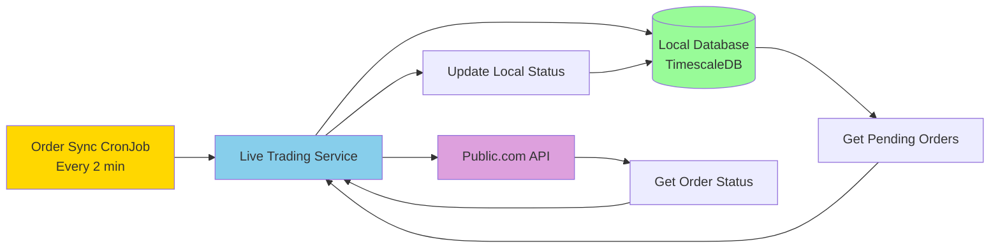

# Order Sync Worker Guide

## Overview

The Order Sync Worker is a Kubernetes CronJob that automatically synchronizes pending order statuses between your local database and Public.com. This ensures your trading system always has up-to-date information about order fills, cancellations, and rejections.

## Why Do We Need This?

When you submit orders to Public.com:
1. Orders are sent with a status of `PENDING`
2. Public.com processes them asynchronously
3. Orders may be filled, partially filled, rejected, or cancelled
4. **Without the sync worker**, your local database would never know the final status

The sync worker bridges this gap by polling Public.com every 2 minutes and updating your local database.

## Architecture



## Quick Start

### Deploy the Worker

```bash
# Deploy order sync worker
make -f makefiles/Makefile.order-sync deploy-sync-worker

# Check status
make -f makefiles/Makefile.order-sync status-sync-worker
```

### Test Manual Sync

```bash
# Trigger immediate sync (don't wait for schedule)
make -f makefiles/Makefile.order-sync test-sync

# View results
make -f makefiles/Makefile.order-sync logs-sync-worker
```

## How It Works

### 1. Fetch Pending Orders

The worker queries your local database for all orders with status `PENDING`:

```sql
SELECT * FROM live_trades 
WHERE account_id = ? 
AND status = 'PENDING'
```

### 2. Query Public.com

For each pending order, the worker calls Public.com's API:

```bash
GET /trading/{account_id}/orders/{order_id}
```

### 3. Update Local Database

Based on Public.com's response, the worker updates the local order status:

| Public.com Status | Local Status | Additional Updates |
|------------------|--------------|-------------------|
| `FILLED` | `FILLED` | Fill price, fill timestamp, filled quantity |
| `PARTIALLY_FILLED` | `PARTIALLY_FILLED` | Partial fill quantity, remaining quantity |
| `CANCELLED` | `CANCELLED` | Cancellation reason |
| `REJECTED` | `REJECTED` | Rejection reason |
| `EXPIRED` | `EXPIRED` | Expiration reason |
| `PENDING` | `PENDING` | No change |

## Schedule Management

### Default Schedule

The worker runs **every 2 minutes** during market hours (9 AM - 4 PM ET, Mon-Fri):

```yaml
schedule: "*/2 9-16 * * 1-5"
```

### Change Sync Frequency

```bash
# Every 1 minute (aggressive)
make -f makefiles/Makefile.order-sync set-sync-interval-1

# Every 2 minutes (default)
make -f makefiles/Makefile.order-sync set-sync-interval-2

# Every 5 minutes (conservative)
make -f makefiles/Makefile.order-sync set-sync-interval-5
```

### Pause/Resume

```bash
# Pause syncing (emergencies, maintenance)
make -f makefiles/Makefile.order-sync suspend-sync-worker

# Resume syncing
make -f makefiles/Makefile.order-sync resume-sync-worker
```

## Monitoring

### Check Worker Status

```bash
make -f makefiles/Makefile.order-sync status-sync-worker
```

**Example Output:**
```
📊 Order Sync Worker Status:

NAME                SCHEDULE           SUSPEND   ACTIVE   LAST SCHEDULE   AGE
order-sync-worker   */2 9-16 * * 1-5   False     0        2m              1h

📋 Recent Jobs:
NAME                              COMPLETIONS   DURATION   AGE
order-sync-manual-1759863927      1/1           2s         5m
order-sync-1759863800             1/1           3s         10m

🔍 Current Status:
   Status: ▶️  ACTIVE
```

### View Sync Logs

```bash
make -f makefiles/Makefile.order-sync logs-sync-worker
```

**Example Output:**
```
📜 Recent Order Sync Logs:

Latest job: order-sync-manual-1759863927
🔄 Order Sync Worker - Tue Oct  7 19:05:27 UTC 2025
🔍 Syncing pending orders with Public.com...
📊 Sync Results:
   ✅ Synced: 2
   💰 Filled: 2
   ⏳ Still Pending: 0
✅ Order sync completed successfully
```

## Troubleshooting

### No Orders Being Synced

**Problem:** Sync shows 0 synced, 0 filled, but you know orders were placed.

**Solutions:**
1. Check if orders have real `public_order_id` (not `TEMP_*`):
   ```bash
   kubectl exec -it deployment/timescaledb -n default -- \
     psql -U admin -d trading -c \
     "SELECT trade_id, symbol, status, public_order_id FROM live_trades WHERE status = 'PENDING' ORDER BY created_at DESC LIMIT 10;"
   ```

2. If orders have `TEMP_*` IDs, they were submitted when Public.com returned empty responses. These cannot be synced. Wait for Public.com to process them normally or cancel and resubmit.

### Authentication Errors

**Problem:** Sync logs show "Not authenticated" or "Invalid token".

**Solutions:**
1. Refresh Public.com token:
   ```bash
   make -f makefiles/Makefile.live-trading live-trading-refresh-token
   ```

2. Restart live-trading-service to pick up new token:
   ```bash
   kubectl rollout restart deployment/live-trading-service -n default
   ```

3. Check credentials in database:
   ```bash
   kubectl exec -it deployment/timescaledb -n default -- \
     psql -U admin -d trading -c \
     "SELECT account_id, is_active, created_at FROM api_credentials WHERE is_active = true ORDER BY created_at DESC LIMIT 1;" | cat
   ```

### Worker Not Running

**Problem:** No recent jobs in job history.

**Solutions:**
1. Check if CronJob exists:
   ```bash
   kubectl get cronjob order-sync-worker -n default
   ```

2. Check if suspended:
   ```bash
   kubectl get cronjob order-sync-worker -n default -o jsonpath='{.spec.suspend}'
   # Should return "false"
   ```

3. Check schedule (only runs during market hours):
   ```bash
   kubectl get cronjob order-sync-worker -n default -o jsonpath='{.spec.schedule}'
   # Should be: */2 9-16 * * 1-5
   ```

4. If outside market hours (9 AM - 4 PM ET, Mon-Fri), trigger manual sync:
   ```bash
   make -f makefiles/Makefile.order-sync test-sync
   ```

## Maintenance

### Clean Up Old Jobs

Kubernetes keeps job history for debugging. Clean up periodically:

```bash
make -f makefiles/Makefile.order-sync clean-sync-jobs
```

### Delete Worker Entirely

```bash
make -f makefiles/Makefile.order-sync delete-sync-worker
```

## Advanced Configuration

### Custom Schedule

Edit the CronJob directly for custom schedules:

```bash
kubectl edit cronjob order-sync-worker -n default
```

**Example Custom Schedules:**
- Every minute: `*/1 * * * *`
- Every 30 seconds (requires workaround): Deploy 2 CronJobs offset by 30s
- Only at market open/close: `30 9,16 * * 1-5`
- 24/7 (crypto): `*/2 * * * *`

### Environment Variables

Current environment variables in the CronJob:

```yaml
env:
  - name: ACCOUNT_ID
    value: "19c25392-8b61-4b71-a344-0eb04d275528"
```

Add more as needed (e.g., `MAX_RETRIES`, `TIMEOUT`, etc.).

### Resource Limits

Current limits are minimal (the worker is lightweight):

```yaml
resources:
  requests:
    memory: "32Mi"
    cpu: "50m"
  limits:
    memory: "64Mi"
    cpu: "100m"
```

Increase if you have many pending orders (100+).

## Integration with Live Trading

### Workflow

1. **Live Trading CronJob** runs every 15 minutes:
   - Generates signals
   - Submits orders to Public.com
   - Orders stored as `PENDING` in database

2. **Order Sync Worker** runs every 2 minutes:
   - Fetches pending orders
   - Queries Public.com for status
   - Updates database with real status

3. **Result**: Your database is always in sync with Public.com, with a max delay of 2 minutes.

### Coordinated Management

```bash
# Deploy both workers
make -f makefiles/Makefile.live-trading deploy-auto-trading
make -f makefiles/Makefile.order-sync deploy-sync-worker

# Emergency stop (pause both)
make -f makefiles/Makefile.live-trading emergency-stop
make -f makefiles/Makefile.order-sync suspend-sync-worker

# Resume (restart both)
make -f makefiles/Makefile.live-trading emergency-resume
make -f makefiles/Makefile.order-sync resume-sync-worker

# Check both statuses
make -f makefiles/Makefile.live-trading status-auto-trading
make -f makefiles/Makefile.order-sync status-sync-worker
```

## Files Reference

| File | Purpose |
|------|---------|
| `k8s/order-sync-cronjob.yaml` | Kubernetes CronJob definition |
| `Makefile.order-sync` | Management commands |
| `services/live-trading-service/src/services/live_trading/order_sync_service.py` | Core sync logic |
| `services/live-trading-service/routes/orders.py` | API endpoint for sync |
| `services/live-trading-service/src/services/live_trading/public_api_client.py` | Public.com API client |

## API Endpoint

The sync worker calls this endpoint:

```http
POST /api/v1/orders/sync/{account_id}
```

**Response:**
```json
{
  "success": true,
  "account_id": "19c25392-8b61-4b71-a344-0eb04d275528",
  "synced": 2,
  "filled": 2,
  "still_pending": 0,
  "total_pending": 7
}
```

You can call this manually for debugging:
```bash
curl -X POST http://localhost:11120/api/v1/orders/sync/19c25392-8b61-4b71-a344-0eb04d275528
```

## Best Practices

1. **Keep Default Schedule** - Every 2 minutes is a good balance between latency and API usage
2. **Monitor Logs** - Check logs periodically to ensure syncing is working
3. **Use Manual Sync for Testing** - Don't wait for schedule when debugging
4. **Pause During Maintenance** - Suspend worker when doing database migrations
5. **Clean Up Regularly** - Remove old job history to save space
6. **Coordinate with Trading** - Stop both trading and sync workers together during emergencies

## Related Documentation

- [Automated Live Trading Guide](./AUTOMATED_LIVE_TRADING_GUIDE.md)
- [Live Trading Status](./LIVE_TRADING_STATUS.md)
- [Public API CloudFront Issue](./PUBLIC_API_CLOUDFRONT_ISSUE.md)
- [Current Trade Signal Flow](./CURRENT_TRADE_SIGNAL_FLOW.md)

