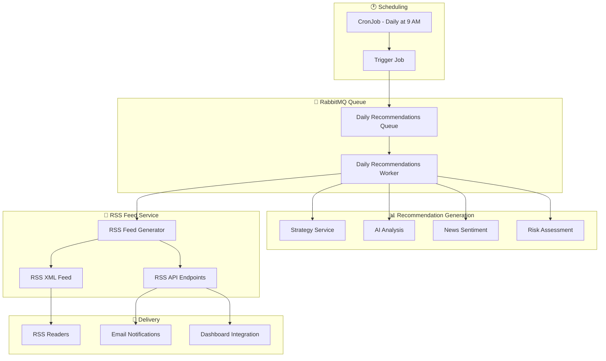
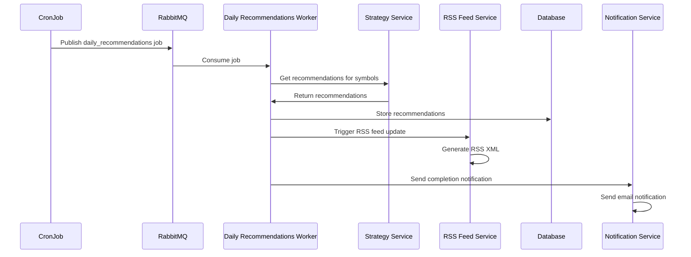

# 📰 RSS Feed System for Daily Trade Recommendations

## Overview

The RSS Feed System automatically generates and delivers daily trading recommendations via RSS feeds. It integrates with your existing RabbitMQ infrastructure to trigger recommendation generation and automatically updates RSS feeds when new recommendations are ready.

## 🏗️ Architecture



## 🚀 Quick Start

### 1. Deploy the RSS Feed System

```bash
# Build and deploy RSS feed service
make docker-build-rss-feed
make k8s-deploy-rss-feed

# Deploy daily recommendations worker
kubectl apply -f k8s/daily-recommendations-worker.yaml

# Deploy daily recommendations cron job
kubectl apply -f k8s/daily-recommendations-cronjob.yaml
```

### 2. Access RSS Feeds

```bash
# Daily recommendations RSS feed
curl http://localhost:8084/rss/daily-recommendations

# Specific symbol RSS feed
curl http://localhost:8084/rss/symbol/AAPL

# JSON API
curl http://localhost:8084/api/recommendations
```

### 3. Subscribe to RSS Feed

Add the RSS feed URL to your RSS reader:
```
http://localhost:8084/rss/daily-recommendations
```

## 📋 Components

### 1. RSS Feed Service (`services/rss-feed-service/`)

**Purpose**: Generates and serves RSS feeds for trading recommendations

**Features**:
- RSS 2.0 compliant XML feeds
- Multiple feed endpoints (daily, per-symbol)
- JSON API for programmatic access
- Health monitoring endpoints

**Endpoints**:
- `GET /rss/daily-recommendations` - Daily recommendations RSS feed
- `GET /rss/symbol/{symbol}` - Symbol-specific RSS feed
- `GET /api/recommendations` - JSON API
- `GET /health` - Health check

### 2. Daily Recommendations Worker (`src/services/workers/daily_recommendations_worker.py`)

**Purpose**: Processes daily recommendations jobs from RabbitMQ

**Job Types**:
- `daily_recommendations` - Generate recommendations for multiple symbols
- `symbol_recommendations` - Generate recommendation for single symbol
- `rss_update` - Trigger RSS feed update

**Workflow**:
1. Receives job from RabbitMQ
2. Calls Strategy Service for recommendations
3. Stores recommendations in database
4. Triggers RSS feed update
5. Sends completion notification

### 3. Daily Recommendations Cron Job (`src/services/workers/daily_recommendations_cron.py`)

**Purpose**: Triggers daily recommendations generation

**Schedule**: Every weekday at 9:00 AM (`0 9 * * 1-5`)

**Process**:
1. Gets list of symbols to analyze
2. Publishes daily recommendations job to RabbitMQ
3. Worker processes the job asynchronously

## 🔧 Configuration

### Environment Variables

| Variable | Description | Default |
|----------|-------------|---------|
| `STRATEGY_SERVICE_URL` | Strategy service URL | `http://strategy-service:8000` |
| `RSS_SERVICE_URL` | RSS service URL | `http://rss-feed-service:8084` |
| `DATABASE_URL` | Database connection URL | From secret |
| `RABBITMQ_URL` | RabbitMQ connection URL | From secret |
| `LOG_LEVEL` | Logging level | `INFO` |

### RSS Feed Configuration

```python
class RSSFeedConfig(BaseModel):
    title: str = "Daily Trading Recommendations"
    description: str = "AI-powered daily trading recommendations from Space Trading Station"
    language: str = "en-us"
    ttl: int = 60  # minutes
    max_items: int = 50
    feed_url: str = "http://localhost:8084/rss/daily-recommendations"
    site_url: str = "http://localhost:8081"
```

## 📊 RSS Feed Structure

### RSS Channel Information

```xml
<rss version="2.0" xmlns:atom="http://www.w3.org/2005/Atom">
  <channel>
    <title>Daily Trading Recommendations</title>
    <description>AI-powered daily trading recommendations from Space Trading Station</description>
    <link>http://localhost:8081</link>
    <language>en-us</language>
    <ttl>60</ttl>
    <atom:link href="http://localhost:8084/rss/daily-recommendations" rel="self" type="application/rss+xml"/>
  </channel>
</rss>
```

### RSS Item Structure

```xml
<item>
  <title>BUY AAPL - 85.2% Confidence</title>
  <description>
    <h3>BUY AAPL</h3>
    <p><strong>Current Price:</strong> $150.25</p>
    <p><strong>Target Price:</strong> $172.79</p>
    <p><strong>Confidence:</strong> 85.2%</p>
    <p><strong>Reasoning:</strong> Strong technical indicators with positive news sentiment</p>
  </description>
  <link>http://localhost:8081/dashboard/recommendations/AAPL</link>
  <guid>recommendation-AAPL-20250115</guid>
  <pubDate>Wed, 15 Jan 2025 09:00:00 +0000</pubDate>
  <category>buy</category>
</item>
```

## 🔄 Workflow

### Daily Recommendations Workflow



### 1. **Scheduling** (9:00 AM Weekdays)
- CronJob triggers daily recommendations generation
- Publishes job to RabbitMQ queue

### 2. **Job Processing**
- Daily Recommendations Worker consumes job
- Generates recommendations for configured symbols
- Calls Strategy Service for each symbol

### 3. **Recommendation Generation**
- Multi-strategy analysis (RSI, MACD, Bollinger Bands, etc.)
- AI-powered market analysis
- News sentiment analysis
- Risk assessment

### 4. **RSS Feed Update**
- Worker triggers RSS feed regeneration
- RSS service generates new XML feed
- Feed is immediately available for subscribers

### 5. **Notification**
- Completion notification sent via email
- Dashboard updated with new recommendations

## 📱 RSS Feed Consumption

### RSS Reader Integration

**Popular RSS Readers**:
- **Feedly**: Add feed URL to your Feedly account
- **Inoreader**: Subscribe to the RSS feed
- **RSS.app**: Convert RSS to email notifications
- **Zapier**: Connect RSS to Slack, email, or other services

**Feed URL**: `http://localhost:8084/rss/daily-recommendations`

### Email Notifications

Configure RSS-to-email services:
- **RSS.app**: Automatic email delivery
- **Zapier**: Custom email workflows
- **IFTTT**: Automated email notifications

### Dashboard Integration

The RSS feed integrates with your existing dashboard:
- Real-time recommendation updates
- Historical recommendation tracking
- Performance analytics

## 🛠️ Monitoring and Maintenance

### Health Checks

```bash
# Check RSS service health
curl http://localhost:8084/health

# Check worker status
kubectl get pods -n trading-system -l app=daily-recommendations-worker

# Check cron job status
kubectl get cronjobs -n trading-system daily-recommendations-cronjob
```

### Logs

```bash
# RSS service logs
kubectl logs -n trading-system deployment/rss-feed-service

# Worker logs
kubectl logs -n trading-system deployment/daily-recommendations-worker

# Cron job logs
kubectl get jobs -n trading-system -l app=daily-recommendations
kubectl logs -n trading-system job/daily-recommendations-cronjob-<timestamp>
```

### Queue Monitoring

```bash
# Check RabbitMQ queue status
kubectl exec -n trading-system deployment/rabbitmq -- rabbitmqctl list_queues

# Monitor queue messages
kubectl exec -n trading-system deployment/rabbitmq -- rabbitmqctl list_queues name messages_ready messages_unacknowledged
```

## 🔧 Customization

### Custom Schedule

Edit the cron job schedule in `k8s/daily-recommendations-cronjob.yaml`:

```yaml
spec:
  schedule: "0 9 * * 1-5"  # Every weekday at 9:00 AM
  # Options:
  # "0 9 * * 1-5" - Weekdays at 9 AM
  # "0 9,15 * * 1-5" - Weekdays at 9 AM and 3 PM
  # "0 9 * * *" - Every day at 9 AM
  # "0 */6 * * *" - Every 6 hours
```

### Custom Symbols

Modify the symbols list in the cron job:

```python
# In daily_recommendations_cron.py
symbols = get_symbols()[:20]  # Top 20 symbols
# Or specify custom symbols:
symbols = ["AAPL", "MSFT", "GOOGL", "TSLA", "NVDA"]
```

### Custom RSS Feed Configuration

Update RSS feed settings in the service:

```python
# In rss-feed-service/main.py
class RSSFeedConfig(BaseModel):
    title: str = "Your Custom Title"
    description: str = "Your custom description"
    max_items: int = 100  # Increase max items
    ttl: int = 30  # Update every 30 minutes
```

## 🚀 Advanced Features

### Multiple RSS Feeds

The system supports multiple RSS feeds:
- **Daily Recommendations**: All daily recommendations
- **Symbol-Specific**: Individual symbol feeds
- **Strategy-Specific**: Recommendations by strategy
- **Risk Level**: Recommendations by risk level

### Real-time Updates

RSS feeds are updated in real-time when:
- Daily recommendations are generated
- New recommendations are added
- Recommendations are modified

### Integration with Existing Systems

The RSS feed system integrates with:
- **Email Notifications**: Automatic email delivery
- **Dashboard**: Real-time dashboard updates
- **Mobile Apps**: RSS reader apps
- **Slack**: RSS-to-Slack integration
- **Discord**: RSS-to-Discord integration

## 📈 Performance Optimization

### Caching

RSS feeds are cached for performance:
- Feed content cached for 5 minutes
- Recommendations cached for 1 hour
- Database queries optimized

### Scalability

The system is designed for scalability:
- Multiple worker instances
- Load-balanced RSS service
- Horizontal scaling support

### Monitoring

Comprehensive monitoring includes:
- RSS feed generation metrics
- Worker performance metrics
- Queue processing metrics
- Error tracking and alerting

## 🔒 Security

### Access Control

RSS feeds are publicly accessible but can be secured:
- API key authentication
- IP whitelisting
- Rate limiting

### Data Privacy

Recommendation data is anonymized:
- No personal information in feeds
- Aggregated performance metrics
- Secure data transmission

## 📚 Troubleshooting

### Common Issues

**RSS Feed Not Updating**
```bash
# Check worker status
kubectl get pods -n trading-system -l app=daily-recommendations-worker

# Check RabbitMQ queue
kubectl exec -n trading-system deployment/rabbitmq -- rabbitmqctl list_queues | grep daily_recommendations
```

**Cron Job Not Running**
```bash
# Check cron job status
kubectl get cronjobs -n trading-system

# Check cron job logs
kubectl get jobs -n trading-system -l app=daily-recommendations
```

**RSS Service Not Responding**
```bash
# Check service health
curl http://localhost:8084/health

# Check service logs
kubectl logs -n trading-system deployment/rss-feed-service
```

### Debug Mode

Enable debug logging:

```bash
# Set debug log level
kubectl set env deployment/rss-feed-service LOG_LEVEL=DEBUG
kubectl set env deployment/daily-recommendations-worker LOG_LEVEL=DEBUG
```

## 🎯 Next Steps

1. **Deploy the System**: Follow the quick start guide
2. **Test RSS Feeds**: Subscribe to the RSS feed in your reader
3. **Configure Notifications**: Set up email or Slack notifications
4. **Monitor Performance**: Use the monitoring tools
5. **Customize**: Adjust schedules and symbols as needed

The RSS feed system provides a reliable, automated way to deliver daily trading recommendations to your preferred platforms and devices. 