# 🚀 Space Trading Station - Architecture Diagrams

This document contains comprehensive Mermaid diagrams showing how the Space Trading Station components fit together.

## 🏗️ System Architecture Overview

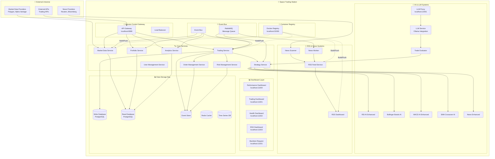

## 🔄 Data Flow Architecture

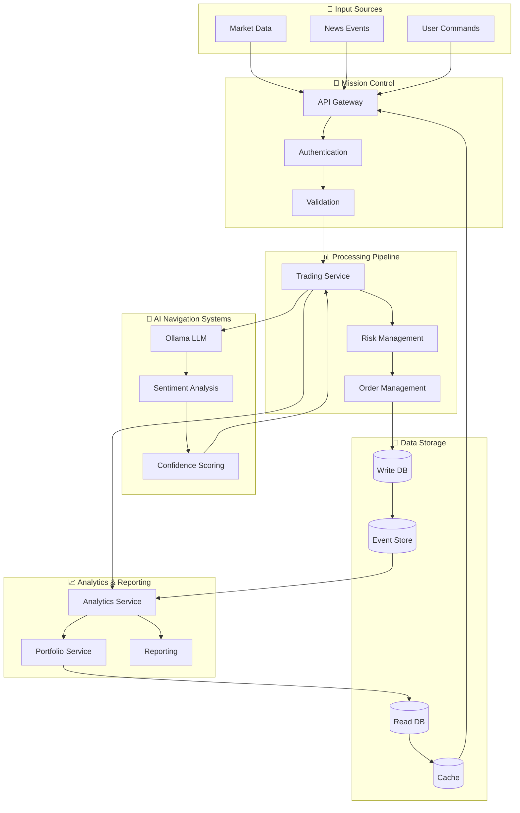

## 🚀 Deployment Architecture

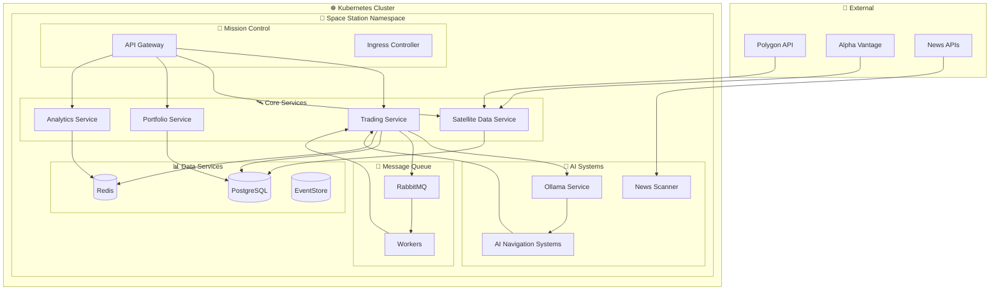

## 🔄 Event-Driven Architecture

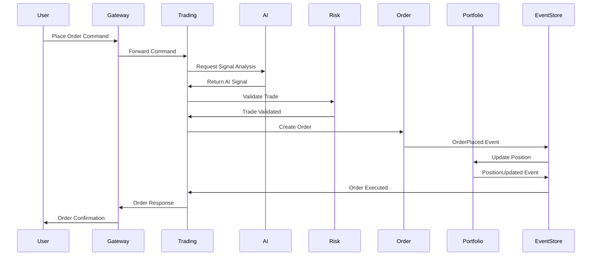

## 🤖 AI Navigation System Flow

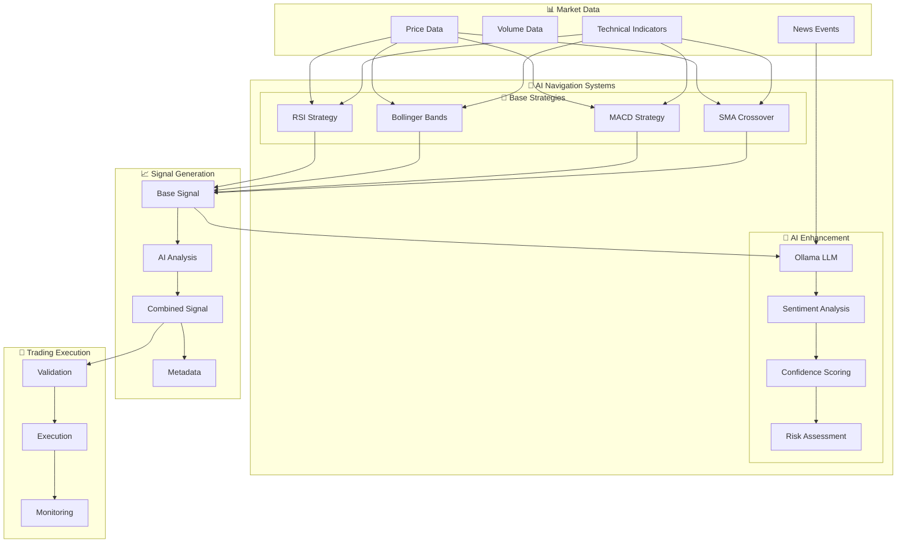

## 📊 Monitoring & Observability

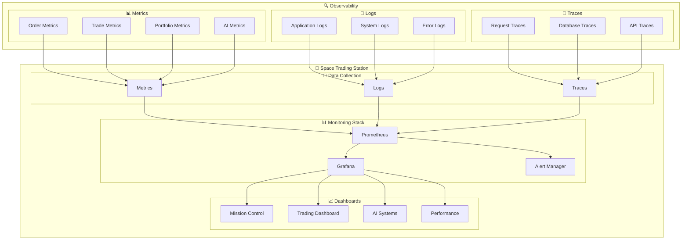

## 🔧 Development Workflow

```mermaid
graph LR
    subgraph "👨‍💻 Development"
        CODE[Code Changes]
        TEST[Testing]
        BUILD[Build]
    end
    
    subgraph "🐳 Containerization"
        DOCKER[Docker Build]
        REG[Registry]
        IMG[Images]
    end
    
    subgraph "☸️ Deployment"
        K8S[Kubernetes]
        DEPLOY[Deploy]
        ROLL[Rollout]
    end
    
    subgraph "🚀 Space Station"
        PODS[Pods]
        SVC[Services]
        ING[Ingress]
    end
    
    subgraph "📊 Monitoring"
        HEALTH[Health Checks]
        METRICS[Metrics]
        ALERTS[Alerts]
    end
    
    CODE --> TEST
    TEST --> BUILD
    BUILD --> DOCKER
    DOCKER --> REG
    REG --> IMG
    IMG --> K8S
    K8S --> DEPLOY
    DEPLOY --> ROLL
    ROLL --> PODS
    PODS --> SVC
    SVC --> ING
    ING --> HEALTH
    HEALTH --> METRICS
    METRICS --> ALERTS
```

## 🎯 Mission Control Dashboard Layout

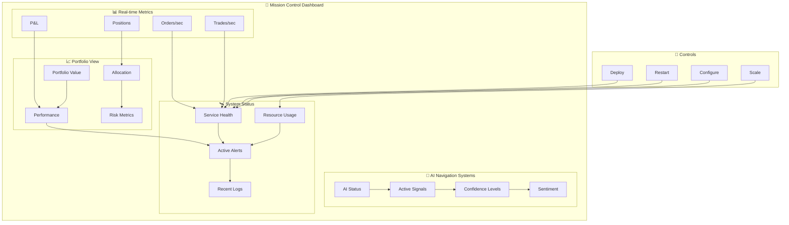

## 🛰️ Orbital Backtesting Flow

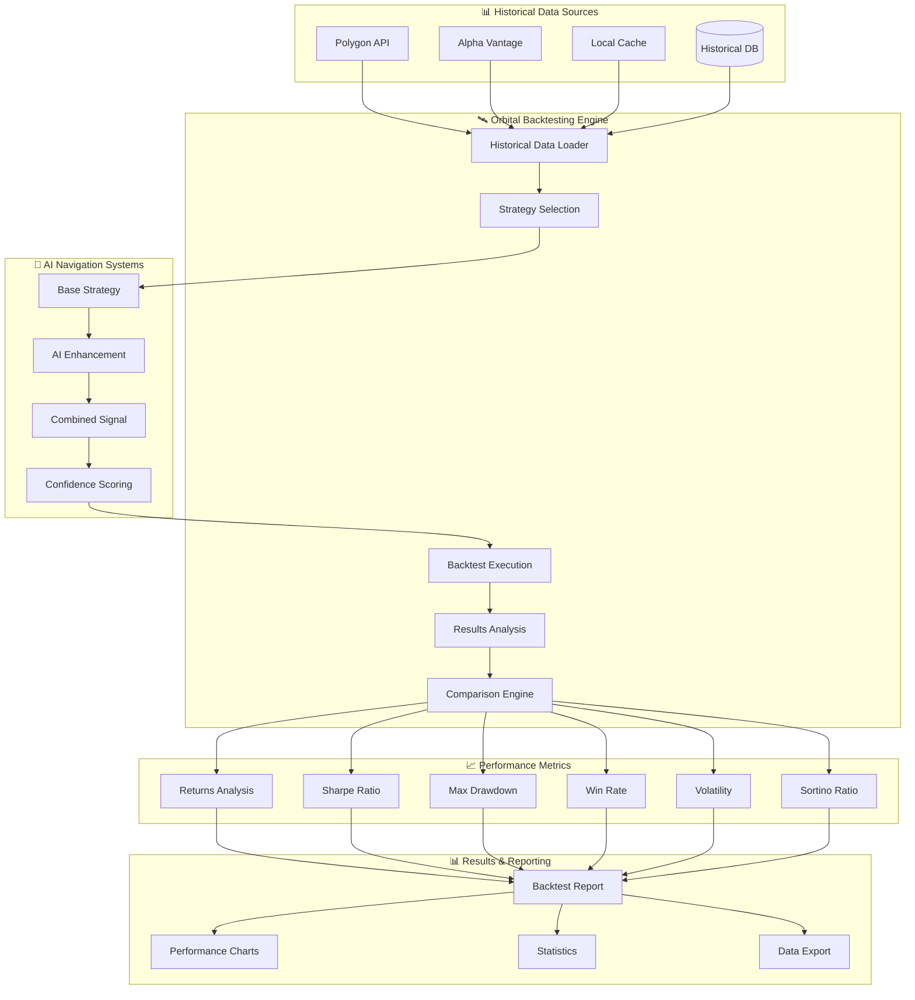

## 🛡️ Risk Management Pipeline

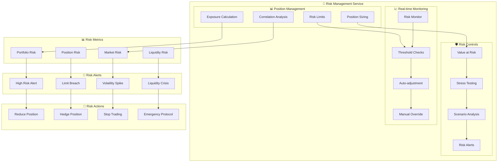

## 📰 News Integration Flow

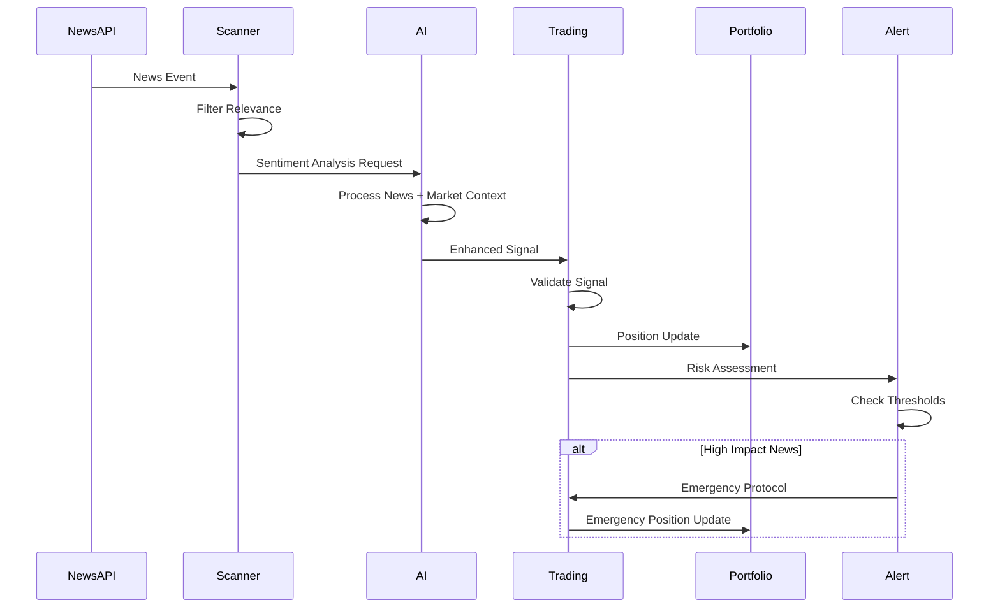

## 🗄️ Database Schema Relationships

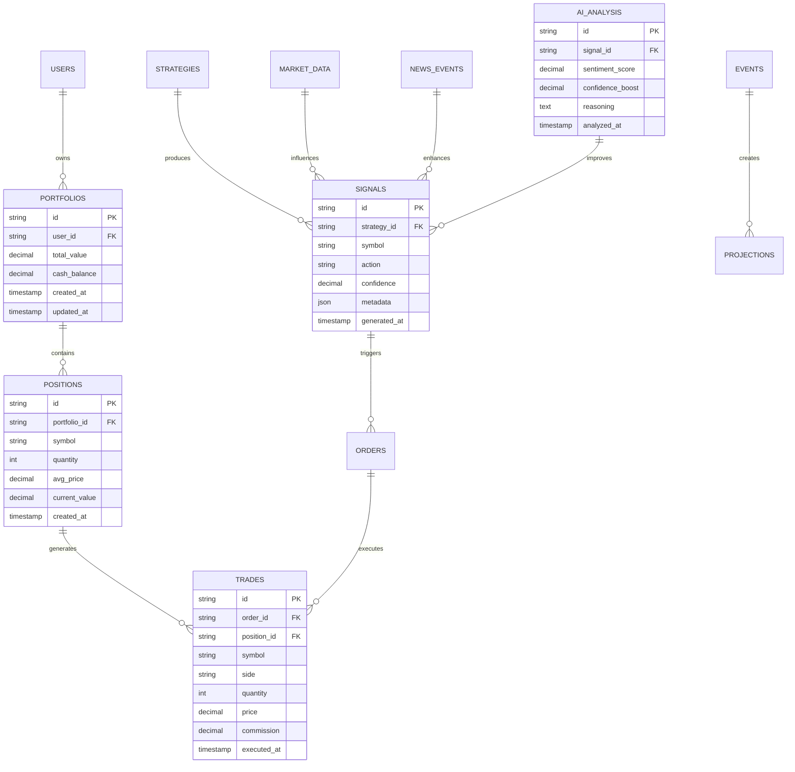

## ☸️ Kubernetes Resource Allocation

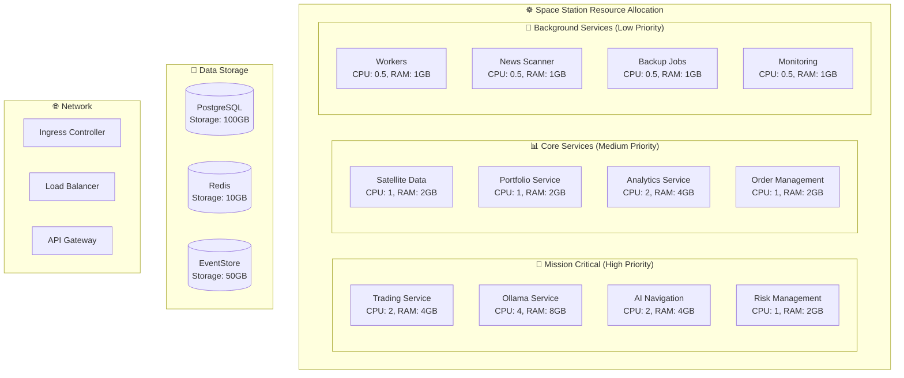

## 🛡️ Error Handling & Circuit Breakers

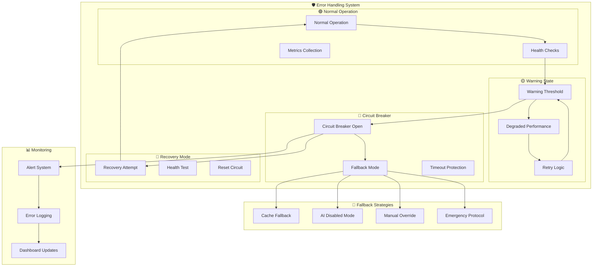

## 🎯 API Endpoints & Routes

```mermaid
graph LR
    subgraph "🎯 Mission Control API Gateway"
        subgraph "📊 Query Endpoints (Read)"
            PORT[/portfolio<br/>GET /api/v1/portfolio]
            POS[/positions<br/>GET /api/v1/positions]
            PERF[/performance<br/>GET /api/v1/performance]
            SIGNALS[/signals<br/>GET /api/v1/signals]
            MARKET[/market-data<br/>GET /api/v1/market-data]
            ANALYTICS[/analytics<br/>GET /api/v1/analytics]
        end
        
        subgraph "🚀 Command Endpoints (Write)"
            ORDER[/orders<br/>POST /api/v1/orders]
            TRADE[/trades<br/>POST /api/v1/trades]
            STRAT[/strategies<br/>POST /api/v1/strategies]
            CONFIG[/config<br/>PUT /api/v1/config]
            RISK[/risk-limits<br/>PUT /api/v1/risk-limits]
            PORTFOLIO[/portfolio<br/>PUT /api/v1/portfolio]
        end
        
        subgraph "🤖 AI Navigation Endpoints"
            AI_SIGNAL[/ai-signals<br/>GET /api/v1/ai-signals]
            AI_ANALYSIS[/ai-analysis<br/>POST /api/v1/ai-analysis]
            AI_CONSENSUS[/ai-consensus<br/>GET /api/v1/ai-consensus]
        end
        
        subgraph "🛰️ Backtesting Endpoints"
            BACKTEST[/backtest<br/>POST /api/v1/backtest]
            BACKTEST_RESULTS[/backtest-results<br/>GET /api/v1/backtest-results]
            BACKTEST_COMPARE[/backtest-compare<br/>GET /api/v1/backtest-compare]
        end
    end
```

## 📡 Data Pipeline Architecture

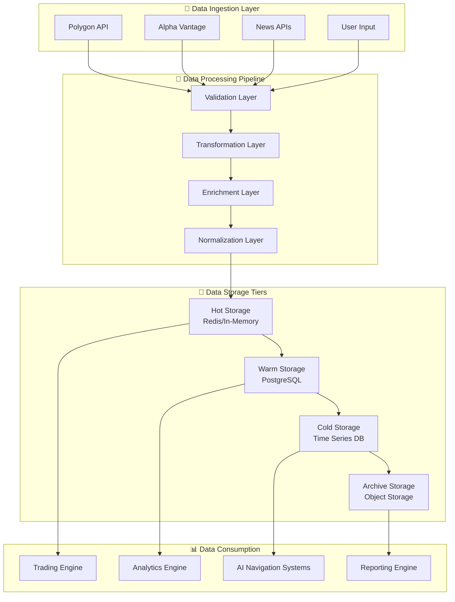

## 🧪 Testing & Quality Assurance Pipeline

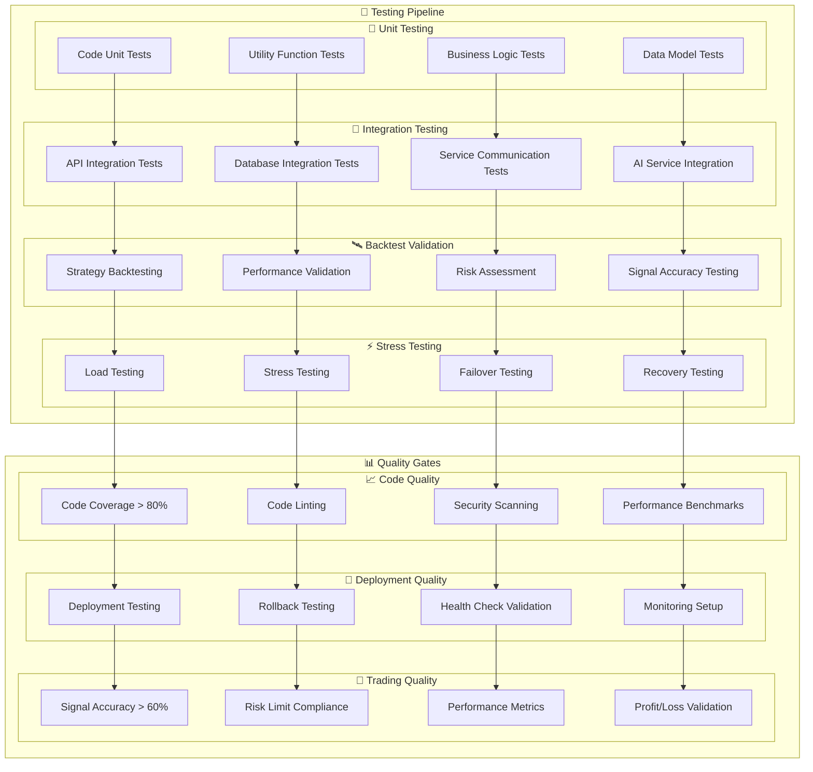

## 🔐 Security & Compliance Architecture

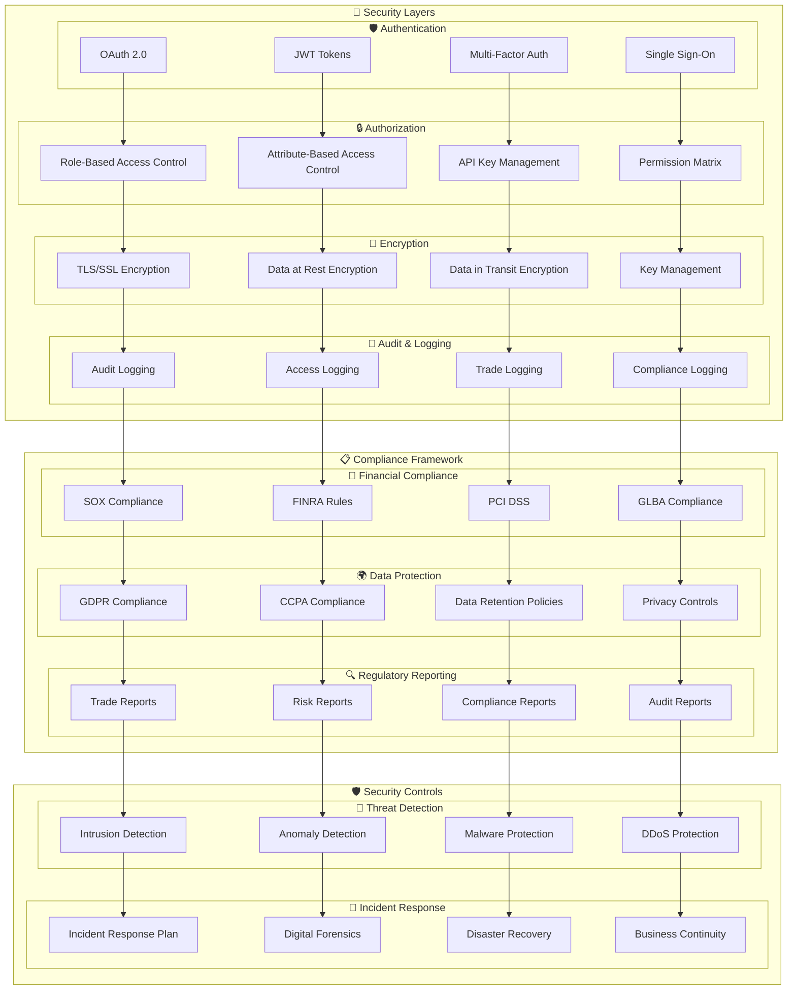

## 📈 Performance Monitoring & Alerting

```mermaid
flowchart TD
    subgraph "📊 Performance Metrics"
        subgraph "⚡ Trading Performance"
            LATENCY[Trading Latency < 100ms]
            THROUGHPUT[Order Throughput > 1000/sec]
            ACCURACY[Signal Accuracy > 60%]
            PROFIT[Profit/Loss Tracking]
        end
        
        subgraph "🤖 AI Performance"
            AI_LATENCY[AI Response Time < 5s]
            AI_ACCURACY[AI Prediction Accuracy]
            MODEL_PERFORMANCE[Model Performance]
            TRAINING_METRICS[Training Metrics]
        end
        
        subgraph "📊 System Performance"
            CPU_USAGE[CPU Usage < 80%]
            MEMORY_USAGE[Memory Usage < 85%]
            DISK_IO[Disk I/O Performance]
            NETWORK_LATENCY[Network Latency]
        end
    end
    
    subgraph "🚨 Alerting System"
        subgraph "🔴 Critical Alerts"
            SYSTEM_DOWN[System Down]
            TRADING_STOPPED[Trading Stopped]
            SECURITY_BREACH[Security Breach]
            COMPLIANCE_VIOLATION[Compliance Violation]
        end
        
        subgraph "🟡 Warning Alerts"
            HIGH_LATENCY[High Latency]
            LOW_ACCURACY[Low Signal Accuracy]
            HIGH_ERROR_RATE[High Error Rate]
            RESOURCE_CONSTRAINTS[Resource Constraints]
        end
        
        subgraph "🟢 Info Notifications"
            DEPLOYMENT_SUCCESS[Deployment Success]
            BACKUP_COMPLETE[Backup Complete]
            MAINTENANCE_SCHEDULED[Maintenance Scheduled]
            PERFORMANCE_IMPROVEMENT[Performance Improvement]
        end
        
        subgraph "🔄 Auto-Recovery"
            AUTO_RESTART[Auto Restart Services]
            LOAD_BALANCING[Load Balancing]
            FAILOVER[Automatic Failover]
            SCALING[Auto Scaling]
        end
    end
    
    subgraph "📈 Monitoring Dashboard"
        subgraph "🎯 Mission Control"
            REAL_TIME_METRICS[Real-time Metrics]
            ALERT_HISTORY[Alert History]
            SYSTEM_STATUS[System Status]
            PERFORMANCE_TRENDS[Performance Trends]
        end
        
        subgraph "📊 Trading Dashboard"
            PORTFOLIO_VALUE[Portfolio Value]
            TRADING_SIGNALS[Trading Signals]
            RISK_METRICS[Risk Metrics]
            PROFIT_LOSS[Profit/Loss]
        end
    end
    
    LATENCY --> SYSTEM_DOWN
    THROUGHPUT --> TRADING_STOPPED
    ACCURACY --> SECURITY_BREACH
    PROFIT --> COMPLIANCE_VIOLATION
    
    AI_LATENCY --> HIGH_LATENCY
    AI_ACCURACY --> LOW_ACCURACY
    MODEL_PERFORMANCE --> HIGH_ERROR_RATE
    TRAINING_METRICS --> RESOURCE_CONSTRAINTS
    
    CPU_USAGE --> DEPLOYMENT_SUCCESS
    MEMORY_USAGE --> BACKUP_COMPLETE
    DISK_IO --> MAINTENANCE_SCHEDULED
    NETWORK_LATENCY --> PERFORMANCE_IMPROVEMENT
    
    SYSTEM_DOWN --> AUTO_RESTART
    TRADING_STOPPED --> LOAD_BALANCING
    SECURITY_BREACH --> FAILOVER
    COMPLIANCE_VIOLATION --> SCALING
    
    AUTO_RESTART --> REAL_TIME_METRICS
    LOAD_BALANCING --> ALERT_HISTORY
    FAILOVER --> SYSTEM_STATUS
    SCALING --> PERFORMANCE_TRENDS
    
    REAL_TIME_METRICS --> PORTFOLIO_VALUE
    ALERT_HISTORY --> TRADING_SIGNALS
    SYSTEM_STATUS --> RISK_METRICS
    PERFORMANCE_TRENDS --> PROFIT_LOSS
```

## 🔄 CI/CD Pipeline

```mermaid
graph LR
    subgraph "🔄 Development Pipeline"
        subgraph "👨‍💻 Development"
            CODE[Code Changes]
            REVIEW[Code Review]
            BRANCH[Feature Branch]
            MERGE[Merge to Main]
        end
        
        subgraph "🧪 Testing"
            UNIT_TEST[Unit Tests]
            INTEGRATION_TEST[Integration Tests]
            BACKTEST_VALIDATION[Backtest Validation]
            SECURITY_SCAN[Security Scan]
        end
        
        subgraph "🐳 Build & Package"
            DOCKER_BUILD[Docker Build]
            IMAGE_TAG[Image Tagging]
            REGISTRY_PUSH[Registry Push]
            ARTIFACT_STORE[Artifact Store]
        end
        
        subgraph "☸️ Deployment"
            K8S_DEPLOY[Kubernetes Deploy]
            HEALTH_CHECK[Health Check]
            ROLLBACK[Rollback if Failed]
            MONITOR[Monitor Deployment]
        end
    end
    
    subgraph "🚀 Production Pipeline"
        subgraph "🎯 Staging"
            STAGING_DEPLOY[Staging Deploy]
            STAGING_TEST[Staging Tests]
            PERFORMANCE_TEST[Performance Tests]
            USER_ACCEPTANCE[User Acceptance]
        end
        
        subgraph "🚀 Production"
            PROD_DEPLOY[Production Deploy]
            BLUE_GREEN[Blue-Green Deployment]
            CANARY[Canary Deployment]
            MONITORING[Production Monitoring]
        end
    end
    
    CODE --> REVIEW
    REVIEW --> BRANCH
    BRANCH --> MERGE
    
    MERGE --> UNIT_TEST
    UNIT_TEST --> INTEGRATION_TEST
    INTEGRATION_TEST --> BACKTEST_VALIDATION
    BACKTEST_VALIDATION --> SECURITY_SCAN
    
    SECURITY_SCAN --> DOCKER_BUILD
    DOCKER_BUILD --> IMAGE_TAG
    IMAGE_TAG --> REGISTRY_PUSH
    REGISTRY_PUSH --> ARTIFACT_STORE
    
    ARTIFACT_STORE --> K8S_DEPLOY
    K8S_DEPLOY --> HEALTH_CHECK
    HEALTH_CHECK --> ROLLBACK
    ROLLBACK --> MONITOR
    
    MONITOR --> STAGING_DEPLOY
    STAGING_DEPLOY --> STAGING_TEST
    STAGING_TEST --> PERFORMANCE_TEST
    PERFORMANCE_TEST --> USER_ACCEPTANCE
    
    USER_ACCEPTANCE --> PROD_DEPLOY
    PROD_DEPLOY --> BLUE_GREEN
    BLUE_GREEN --> CANARY
    CANARY --> MONITORING
```

## 🗄️ Data Lifecycle Management

```mermaid
flowchart TD
    subgraph "📥 Data Ingestion"
        subgraph "⚡ Real-time Data"
            MARKET_DATA[Market Data Streams]
            NEWS_FEEDS[News Feeds]
            TRADING_SIGNALS[Trading Signals]
            USER_INPUT[User Input]
        end
        
        subgraph "📦 Batch Processing"
            HISTORICAL_DATA[Historical Data]
            BACKTEST_DATA[Backtest Data]
            ANALYTICS_DATA[Analytics Data]
            REPORTING_DATA[Reporting Data]
        end
        
        subgraph "🌊 Stream Processing"
            REAL_TIME_ANALYTICS[Real-time Analytics]
            EVENT_STREAMS[Event Streams]
            ALERT_STREAMS[Alert Streams]
            MONITORING_STREAMS[Monitoring Streams]
        end
    end
    
    subgraph "💾 Data Storage"
        subgraph "🔥 Hot Storage"
            REDIS[Redis Cache]
            IN_MEMORY[In-Memory Storage]
            TEMP_DATA[Temporary Data]
            SESSION_DATA[Session Data]
        end
        
        subgraph "🌡️ Warm Storage"
            POSTGRESQL[PostgreSQL]
            TIMESERIES[Time Series DB]
            ANALYTICS_DB[Analytics Database]
            USER_DB[User Database]
        end
        
        subgraph "❄️ Cold Storage"
            ARCHIVE_DB[Archive Database]
            BACKUP_STORAGE[Backup Storage]
            COMPLIANCE_DATA[Compliance Data]
            HISTORICAL_ARCHIVE[Historical Archive]
        end
        
        subgraph "🗄️ Archive Storage"
            OBJECT_STORAGE[Object Storage]
            LONG_TERM_ARCHIVE[Long-term Archive]
            COMPLIANCE_ARCHIVE[Compliance Archive]
            DISASTER_RECOVERY[Disaster Recovery]
        end
    end
    
    subgraph "📊 Data Consumption"
        subgraph "🚀 Trading Engine"
            REAL_TIME_TRADING[Real-time Trading]
            SIGNAL_GENERATION[Signal Generation]
            ORDER_EXECUTION[Order Execution]
            RISK_MANAGEMENT[Risk Management]
        end
        
        subgraph "📈 Analytics"
            PERFORMANCE_ANALYTICS[Performance Analytics]
            RISK_ANALYTICS[Risk Analytics]
            USER_ANALYTICS[User Analytics]
            BUSINESS_ANALYTICS[Business Analytics]
        end
        
        subgraph "📋 Reporting"
            TRADING_REPORTS[Trading Reports]
            COMPLIANCE_REPORTS[Compliance Reports]
            PERFORMANCE_REPORTS[Performance Reports]
            EXECUTIVE_REPORTS[Executive Reports]
        end
        
        subgraph "🤖 AI Training"
            MODEL_TRAINING[Model Training]
            DATA_LABELING[Data Labeling]
            FEATURE_ENGINEERING[Feature Engineering]
            MODEL_VALIDATION[Model Validation]
        end
    end
    
    MARKET_DATA --> REDIS
    NEWS_FEEDS --> IN_MEMORY
    TRADING_SIGNALS --> TEMP_DATA
    USER_INPUT --> SESSION_DATA
    
    HISTORICAL_DATA --> POSTGRESQL
    BACKTEST_DATA --> TIMESERIES
    ANALYTICS_DATA --> ANALYTICS_DB
    REPORTING_DATA --> USER_DB
    
    REAL_TIME_ANALYTICS --> ARCHIVE_DB
    EVENT_STREAMS --> BACKUP_STORAGE
    ALERT_STREAMS --> COMPLIANCE_DATA
    MONITORING_STREAMS --> HISTORICAL_ARCHIVE
    
    REDIS --> REAL_TIME_TRADING
    IN_MEMORY --> SIGNAL_GENERATION
    TEMP_DATA --> ORDER_EXECUTION
    SESSION_DATA --> RISK_MANAGEMENT
    
    POSTGRESQL --> PERFORMANCE_ANALYTICS
    TIMESERIES --> RISK_ANALYTICS
    ANALYTICS_DB --> USER_ANALYTICS
    USER_DB --> BUSINESS_ANALYTICS
    
    ARCHIVE_DB --> TRADING_REPORTS
    BACKUP_STORAGE --> COMPLIANCE_REPORTS
    COMPLIANCE_DATA --> PERFORMANCE_REPORTS
    HISTORICAL_ARCHIVE --> EXECUTIVE_REPORTS
    
    OBJECT_STORAGE --> MODEL_TRAINING
    LONG_TERM_ARCHIVE --> DATA_LABELING
    COMPLIANCE_ARCHIVE --> FEATURE_ENGINEERING
    DISASTER_RECOVERY --> MODEL_VALIDATION
```

## 🌐 Network & Communication Architecture

```mermaid
graph TB
    subgraph "🌐 Network Layers"
        subgraph "🌍 External Layer"
            INTERNET[Internet]
            CDN[Content Delivery Network]
            DNS[DNS Services]
            SSL[SSL/TLS Termination]
        end
        
        subgraph "⚖️ Load Balancing"
            LB[Load Balancer]
            HEALTH_CHECK[Health Checks]
            TRAFFIC_ROUTING[Traffic Routing]
            FAILOVER[Failover Management]
        end
        
        subgraph "🚪 API Gateway"
            API_GATEWAY[API Gateway]
            RATE_LIMITING[Rate Limiting]
            AUTHENTICATION[Authentication]
            ROUTING[Request Routing]
        end
        
        subgraph "🔗 Service Mesh"
            SERVICE_MESH[Service Mesh]
            SERVICE_DISCOVERY[Service Discovery]
            LOAD_BALANCING[Load Balancing]
            CIRCUIT_BREAKER[Circuit Breaker]
        end
        
        subgraph "🗄️ Database Layer"
            DB_PROXY[Database Proxy]
            CONNECTION_POOL[Connection Pooling]
            READ_REPLICAS[Read Replicas]
            BACKUP_DB[Backup Database]
        end
    end
    
    subgraph "🔗 Communication Protocols"
        subgraph "📡 REST APIs"
            HTTP[HTTP/HTTPS]
            JSON[JSON Payloads]
            REST_ENDPOINTS[REST Endpoints]
            API_VERSIONING[API Versioning]
        end
        
        subgraph "⚡ gRPC"
            GRPC[gRPC Protocol]
            PROTOBUF[Protocol Buffers]
            STREAMING[Streaming]
            BIDIRECTIONAL[Bidirectional]
        end
        
        subgraph "📨 Message Queue"
            RABBITMQ[RabbitMQ]
            KAFKA[Apache Kafka]
            REDIS_PUBSUB[Redis Pub/Sub]
            EVENT_STREAM[Event Streams]
        end
        
        subgraph "🔌 WebSocket"
            WEBSOCKET[WebSocket]
            REAL_TIME[Real-time Updates]
            PUSH_NOTIFICATIONS[Push Notifications]
            LIVE_DASHBOARD[Live Dashboard]
        end
    end
    
    subgraph "🛡️ Security & Monitoring"
        subgraph "🔐 Security"
            WAF[Web Application Firewall]
            DDoS_PROTECTION[DDoS Protection]
            VPN[VPN Access]
            FIREWALL[Firewall Rules]
        end
        
        subgraph "📊 Monitoring"
            NETWORK_MONITOR[Network Monitoring]
            TRAFFIC_ANALYSIS[Traffic Analysis]
            PERFORMANCE_METRICS[Performance Metrics]
            ALERTING[Network Alerting]
        end
    end
    
    INTERNET --> LB
    CDN --> HEALTH_CHECK
    DNS --> TRAFFIC_ROUTING
    SSL --> FAILOVER
    
    LB --> API_GATEWAY
    HEALTH_CHECK --> RATE_LIMITING
    TRAFFIC_ROUTING --> AUTHENTICATION
    FAILOVER --> ROUTING
    
    API_GATEWAY --> SERVICE_MESH
    RATE_LIMITING --> SERVICE_DISCOVERY
    AUTHENTICATION --> LOAD_BALANCING
    ROUTING --> CIRCUIT_BREAKER
    
    SERVICE_MESH --> DB_PROXY
    SERVICE_DISCOVERY --> CONNECTION_POOL
    LOAD_BALANCING --> READ_REPLICAS
    CIRCUIT_BREAKER --> BACKUP_DB
    
    DB_PROXY --> HTTP
    CONNECTION_POOL --> JSON
    READ_REPLICAS --> REST_ENDPOINTS
    BACKUP_DB --> API_VERSIONING
    
    HTTP --> GRPC
    JSON --> PROTOBUF
    REST_ENDPOINTS --> STREAMING
    API_VERSIONING --> BIDIRECTIONAL
    
    GRPC --> RABBITMQ
    PROTOBUF --> KAFKA
    STREAMING --> REDIS_PUBSUB
    BIDIRECTIONAL --> EVENT_STREAM
    
    RABBITMQ --> WEBSOCKET
    KAFKA --> REAL_TIME
    REDIS_PUBSUB --> PUSH_NOTIFICATIONS
    EVENT_STREAM --> LIVE_DASHBOARD
    
    WEBSOCKET --> WAF
    REAL_TIME --> DDoS_PROTECTION
    PUSH_NOTIFICATIONS --> VPN
    LIVE_DASHBOARD --> FIREWALL
    
    WAF --> NETWORK_MONITOR
    DDoS_PROTECTION --> TRAFFIC_ANALYSIS
    VPN --> PERFORMANCE_METRICS
    FIREWALL --> ALERTING
```

## 📊 Business Intelligence & Reporting

```mermaid
flowchart TD
    subgraph "📊 Data Sources"
        subgraph "📈 Trading Data"
            TRADES[Trading Records]
            ORDERS[Order History]
            POSITIONS[Position Data]
            P&L[Profit & Loss]
        end
        
        subgraph "📰 News Data"
            NEWS_EVENTS[News Events]
            SENTIMENT[Sentiment Scores]
            IMPACT_ANALYSIS[Impact Analysis]
            EVENT_CLASSIFICATION[Event Classification]
        end
        
        subgraph "📊 Market Data"
            PRICE_DATA[Price Data]
            VOLUME_DATA[Volume Data]
            TECHNICAL_INDICATORS[Technical Indicators]
            MARKET_SENTIMENT[Market Sentiment]
        end
        
        subgraph "👤 User Data"
            USER_PROFILES[User Profiles]
            TRADING_PREFERENCES[Trading Preferences]
            PERFORMANCE_HISTORY[Performance History]
            RISK_PROFILES[Risk Profiles]
        end
    end
    
    subgraph "🔄 Data Processing"
        subgraph "🧹 Data Cleaning"
            VALIDATION[Data Validation]
            NORMALIZATION[Data Normalization]
            DEDUPLICATION[Deduplication]
            ENRICHMENT[Data Enrichment]
        end
        
        subgraph "📊 Data Transformation"
            AGGREGATION[Data Aggregation]
            CALCULATION[Calculations]
            FEATURE_ENGINEERING[Feature Engineering]
            DIMENSION_MODELING[Dimension Modeling]
        end
        
        subgraph "💾 Data Storage"
            DATA_WAREHOUSE[Data Warehouse]
            DATA_MARTS[Data Marts]
            OLAP_CUBES[OLAP Cubes]
            CACHE_LAYER[Cache Layer]
        end
    end
    
    subgraph "📈 Analytics & Insights"
        subgraph "📊 Dashboards"
            EXECUTIVE_DASHBOARD[Executive Dashboard]
            TRADING_DASHBOARD[Trading Dashboard]
            RISK_DASHBOARD[Risk Dashboard]
            PERFORMANCE_DASHBOARD[Performance Dashboard]
        end
        
        subgraph "📋 Reports"
            DAILY_REPORTS[Daily Reports]
            WEEKLY_REPORTS[Weekly Reports]
            MONTHLY_REPORTS[Monthly Reports]
            QUARTERLY_REPORTS[Quarterly Reports]
        end
        
        subgraph "🚨 Alerts"
            PERFORMANCE_ALERTS[Performance Alerts]
            RISK_ALERTS[Risk Alerts]
            COMPLIANCE_ALERTS[Compliance Alerts]
            BUSINESS_ALERTS[Business Alerts]
        end
        
        subgraph "🔍 Insights"
            TREND_ANALYSIS[Trend Analysis]
            PATTERN_RECOGNITION[Pattern Recognition]
            PREDICTIVE_ANALYTICS[Predictive Analytics]
            RECOMMENDATIONS[Recommendations]
        end
    end
    
    TRADES --> VALIDATION
    ORDERS --> NORMALIZATION
    POSITIONS --> DEDUPLICATION
    P&L --> ENRICHMENT
    
    NEWS_EVENTS --> AGGREGATION
    SENTIMENT --> CALCULATION
    IMPACT_ANALYSIS --> FEATURE_ENGINEERING
    EVENT_CLASSIFICATION --> DIMENSION_MODELING
    
    PRICE_DATA --> DATA_WAREHOUSE
    VOLUME_DATA --> DATA_MARTS
    TECHNICAL_INDICATORS --> OLAP_CUBES
    MARKET_SENTIMENT --> CACHE_LAYER
    
    USER_PROFILES --> EXECUTIVE_DASHBOARD
    TRADING_PREFERENCES --> TRADING_DASHBOARD
    PERFORMANCE_HISTORY --> RISK_DASHBOARD
    RISK_PROFILES --> PERFORMANCE_DASHBOARD
    
    VALIDATION --> DAILY_REPORTS
    NORMALIZATION --> WEEKLY_REPORTS
    DEDUPLICATION --> MONTHLY_REPORTS
    ENRICHMENT --> QUARTERLY_REPORTS
    
    AGGREGATION --> PERFORMANCE_ALERTS
    CALCULATION --> RISK_ALERTS
    FEATURE_ENGINEERING --> COMPLIANCE_ALERTS
    DIMENSION_MODELING --> BUSINESS_ALERTS
    
    DATA_WAREHOUSE --> TREND_ANALYSIS
    DATA_MARTS --> PATTERN_RECOGNITION
    OLAP_CUBES --> PREDICTIVE_ANALYTICS
    CACHE_LAYER --> RECOMMENDATIONS
```

## 🎯 Strategy Performance Comparison

```mermaid
graph LR
    subgraph "📈 Strategy Performance"
        subgraph "🤖 AI Enhanced Strategies"
            RSI_AI[RSI AI Enhanced]
            MACD_AI[MACD AI Enhanced]
            BB_AI[Bollinger Bands AI]
            NEWS_AI[News Enhanced]
        end
        
        subgraph "📊 Traditional Strategies"
            RSI_TRAD[RSI Traditional]
            MACD_TRAD[MACD Traditional]
            BB_TRAD[Bollinger Traditional]
            SMA_TRAD[SMA Crossover]
        end
    end
    
    subgraph "📊 Performance Metrics"
        subgraph "📈 Return Metrics"
            TOTAL_RETURN[Total Return]
            ANNUAL_RETURN[Annual Return]
            RISK_ADJUSTED[Risk-Adjusted Return]
            ALPHA[Alpha]
        end
        
        subgraph "🛡️ Risk Metrics"
            SHARPE_RATIO[Sharpe Ratio]
            MAX_DRAWDOWN[Max Drawdown]
            VOLATILITY[Volatility]
            VAR[Value at Risk]
        end
        
        subgraph "📊 Trading Metrics"
            WIN_RATE[Win Rate]
            PROFIT_FACTOR[Profit Factor]
            AVERAGE_WIN[Average Win]
            AVERAGE_LOSS[Average Loss]
        end
        
        subgraph "⏱️ Efficiency Metrics"
            TRADE_FREQUENCY[Trade Frequency]
            HOLDING_PERIOD[Holding Period]
            TRANSACTION_COST[Transaction Cost]
            SLIPPAGE[Slippage]
        end
    end
    
    subgraph "📊 Comparison Dashboard"
        subgraph "🎯 Performance Ranking"
            TOP_PERFORMER[Top Performer]
            CONSISTENT[Most Consistent]
            LOW_RISK[Lowest Risk]
            HIGH_RETURN[Highest Return]
        end
        
        subgraph "📈 Trend Analysis"
            PERFORMANCE_TREND[Performance Trend]
            RISK_TREND[Risk Trend]
            CORRELATION[Strategy Correlation]
            DIVERSIFICATION[Diversification Benefit]
        end
    end
    
    RSI_AI --> TOTAL_RETURN
    MACD_AI --> ANNUAL_RETURN
    BB_AI --> RISK_ADJUSTED
    NEWS_AI --> ALPHA
    
    RSI_TRAD --> SHARPE_RATIO
    MACD_TRAD --> MAX_DRAWDOWN
    BB_TRAD --> VOLATILITY
    SMA_TRAD --> VAR
    
    TOTAL_RETURN --> WIN_RATE
    ANNUAL_RETURN --> PROFIT_FACTOR
    RISK_ADJUSTED --> AVERAGE_WIN
    ALPHA --> AVERAGE_LOSS
    
    SHARPE_RATIO --> TRADE_FREQUENCY
    MAX_DRAWDOWN --> HOLDING_PERIOD
    VOLATILITY --> TRANSACTION_COST
    VAR --> SLIPPAGE
    
    WIN_RATE --> TOP_PERFORMER
    PROFIT_FACTOR --> CONSISTENT
    AVERAGE_WIN --> LOW_RISK
    AVERAGE_LOSS --> HIGH_RETURN
    
    TRADE_FREQUENCY --> PERFORMANCE_TREND
    HOLDING_PERIOD --> RISK_TREND
    TRANSACTION_COST --> CORRELATION
    SLIPPAGE --> DIVERSIFICATION
```

## 🚀 Current System Configuration (July 2025)

### **📡 Port Configuration & Service Mapping**

| Service | External Port | Internal Port | Status | Recent Changes |
|---------|---------------|---------------|---------|----------------|
| Performance Dashboard | 11000 | 80 | ✅ Running | Registry fix |
| Trading Dashboard | 11001 | 8000 | ✅ Running | Registry fix |
| Health Dashboard | 11002 | 80 | ✅ Running | Registry fix |
| **RSS Dashboard** | **11003** | **80** | **✅ Running** | **NEW** |
| Backtest Request | 11031 | 80 | ✅ Running | Registry fix |
| **LLM Proxy** | **12001** | **11434** | **✅ Running** | **NEW** |

### **🔧 Infrastructure Services**

| Service | Port | Status | Notes |
|---------|------|---------|-------|
| Docker Registry | 32000 | ✅ Running | NodePort (Fixed) |
| RabbitMQ | 5672 | ✅ Running | Message Queue |
| PostgreSQL | 5432 | ✅ Running | Database |
| Redis | 6379 | ✅ Running | Cache |

### **🎯 Recent Architecture Updates**

#### **✅ July 2025 Changes**

1. **🔧 Registry Port Configuration Fix**
   - **Problem**: Docker registry accessible on port 32000 but build scripts used port 5000
   - **Solution**: Updated all build/push commands to use `localhost:32000`
   - **Impact**: All Docker builds now work correctly

2. **📰 RSS Dashboard Addition**
   - **New Service**: Complete RSS dashboard for trading recommendations
   - **Features**: Real-time recommendations, multiple feed types, auto-refresh
   - **URL**: `http://localhost:11003/`

3. **🤖 LLM Proxy Integration**
   - **New Service**: LLM Proxy for external access to Ollama
   - **Port**: `localhost:12001`
   - **Integration**: Connects to internal Ollama LLM service

4. **🔄 Port Forwarding Stability**
   - **Improvement**: Robust port forwarding with auto-restart
   - **Features**: Auto-restart on failure, proactive monitoring
   - **Result**: All dashboards now accessible

### **📊 Health Check Endpoints**

All services now have working health endpoints:
- `http://localhost:11000/health` - Performance Dashboard
- `http://localhost:11001/health` - Trading Dashboard  
- `http://localhost:11002/health` - Health Dashboard
- `http://localhost:11003/health` - RSS Dashboard
- `http://localhost:12001/health` - LLM Proxy

### **🔍 Registry Health**
- Registry Catalog: `http://localhost:32000/v2/_catalog`
- Registry Status: `kubectl get svc registry -n default`

---

*"This is ORION, Mission Control. All Space Trading Station architecture diagrams are now available for navigation!"* 🚀 