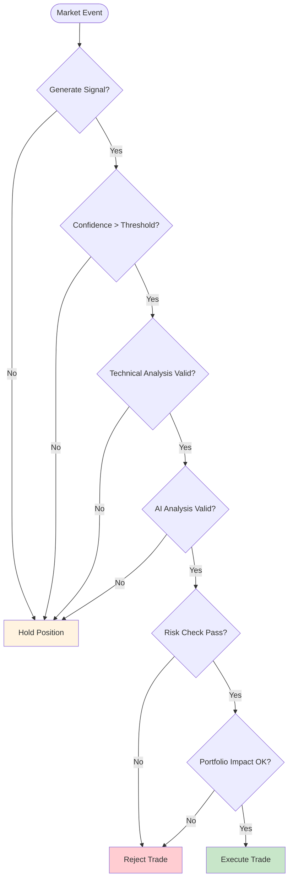

# 🎯 Trade Entry Rules & Criteria Guide

## Overview

Your Space Trading Station uses a **sophisticated multi-layered decision system** to determine when to enter trades. This guide explains all the rules, thresholds, and criteria that govern trade entry decisions.

## 🏗️ Entry Decision Architecture

### **Multi-Layer Decision Tree**



## 📊 Confidence Thresholds by Risk Profile

### **Risk Profile-Based Thresholds**

| Risk Profile | Confidence Threshold | Max Daily Trades | Position Size | Stop Loss |
|--------------|---------------------|------------------|---------------|-----------|
| **Ultra Conservative** | 80% | 3 | 2% | 3% |
| **Conservative** | 70% | 5 | 3% | 5% |
| **Moderate** | 60% | 10 | 5% | 8% |
| **Aggressive** | 50% | 15 | 8% | 12% |
| **Ultra Aggressive** | 40% | 20 | 12% | 15% |

### **Decision Tree Thresholds**

```python
confidence_thresholds = {
    'signal_quality': 0.3,      # Basic signal validation
    'technical_analysis': 0.4,  # Technical indicator validation
    'ai_analysis': 0.5,         # AI confidence check
    'risk_assessment': 0.6,     # Risk management validation
    'portfolio_impact': 0.7,    # Portfolio concentration check
    'final_decision': 0.8       # Final execution approval
}
```

## 🎯 Core Entry Rules

### **1. Signal Generation Rules**

#### **Technical Analysis Requirements**
```python
# Minimum data requirements
min_data_points = 50  # Need at least 50 data points
min_volume_ratio = 1.2  # Volume should be 20% above average
min_price_change = 0.005  # Minimum 0.5% price movement

# Technical indicator thresholds
rsi_oversold = 30  # RSI oversold threshold
rsi_overbought = 70  # RSI overbought threshold
macd_threshold = 0.001  # MACD signal threshold
bollinger_std = 2.0  # Bollinger Bands standard deviation
```

#### **Trend Confirmation Rules**
```python
trend_confirmation = True  # Require trend confirmation
trend_confirmation_weight = 0.7  # 70% weight for trend
require_positive_momentum = True  # Require positive momentum
trend_strength_threshold = 0.6  # Minimum trend strength
```

### **2. Market Condition Rules**

#### **Volatility Filters**
```python
volatility_filter = True  # Enable volatility filtering
volatility_threshold = 0.02  # 2% volatility threshold
market_regime_filter = True  # Filter by market regime
correlation_threshold = 0.3  # Maximum correlation threshold
```

#### **Market Regime Analysis**
```python
market_regime_lookback = 20  # 20-day lookback for regime
regime_confidence_threshold = 0.7  # 70% confidence for regime
```

### **3. Risk Management Rules**

#### **Position Sizing Rules**
```python
position_size = 0.05  # 5% base position size
max_position_size = 0.15  # Maximum 15% per position
min_trade_value = 50.0  # Minimum $50 per trade
max_trade_value = 15000.0  # Maximum $15,000 per trade
```

#### **Portfolio Limits**
```python
max_positions = 5  # Maximum 5 concurrent positions
max_daily_trades = 10  # Maximum 10 trades per day
max_daily_loss = 100.0  # Maximum $100 daily loss
max_drawdown_pct = 0.25  # Maximum 25% drawdown
```

### **4. Entry Signal Criteria**

#### **BUY Signal Requirements**
```python
buy_signal_criteria = {
    'rsi': 'rsi < 30 and rsi_trend > 0',  # RSI oversold with upward trend
    'macd': 'macd > signal and histogram > 0',  # MACD bullish crossover
    'bollinger': 'price < lower_band and volume > avg_volume',  # Bollinger oversold
    'momentum': 'momentum_5 > 0.02 and momentum_10 > 0.05',  # Strong momentum
    'volume': 'volume > avg_volume * 1.2',  # Above average volume
    'trend': 'sma_20 > sma_50 and price > sma_20'  # Uptrend confirmation
}
```

#### **SELL Signal Requirements**
```python
sell_signal_criteria = {
    'rsi': 'rsi > 70 and rsi_trend < 0',  # RSI overbought with downward trend
    'macd': 'macd < signal and histogram < 0',  # MACD bearish crossover
    'bollinger': 'price > upper_band and volume > avg_volume',  # Bollinger overbought
    'momentum': 'momentum_5 < -0.02 and momentum_10 < -0.05',  # Weak momentum
    'volume': 'volume > avg_volume * 1.2',  # Above average volume
    'trend': 'sma_20 < sma_50 and price < sma_20'  # Downtrend confirmation
}
```

## 🤖 AI-Enhanced Entry Rules

### **LLM Evaluation Criteria**
```python
llm_evaluation_criteria = {
    'market_context': True,  # Consider market context
    'news_impact': True,     # Consider news sentiment
    'risk_assessment': True, # AI risk assessment
    'confidence_scoring': True,  # AI confidence scoring
    'reasoning_required': True   # Require AI reasoning
}
```

### **AI Confidence Weights**
```python
ai_weights = {
    'technical_analysis': 0.4,  # 40% weight for technical
    'ai_analysis': 0.3,         # 30% weight for AI
    'news_analysis': 0.2,       # 20% weight for news
    'sentiment_analysis': 0.1   # 10% weight for sentiment
}
```

## 📰 News-Based Entry Rules

### **News Impact Assessment**
```python
news_entry_criteria = {
    'high_impact': {
        'sentiment_threshold': 0.7,  # 70% sentiment threshold
        'volume_multiplier': 2.0,    # 2x volume requirement
        'confidence_boost': 0.2      # 20% confidence boost
    },
    'medium_impact': {
        'sentiment_threshold': 0.5,  # 50% sentiment threshold
        'volume_multiplier': 1.5,    # 1.5x volume requirement
        'confidence_boost': 0.1      # 10% confidence boost
    },
    'low_impact': {
        'sentiment_threshold': 0.3,  # 30% sentiment threshold
        'volume_multiplier': 1.2,    # 1.2x volume requirement
        'confidence_boost': 0.05     # 5% confidence boost
    }
}
```

## ⚡ Entry Timing Rules

### **Market Hours Filtering**
```python
market_hours_only = True  # Only trade during market hours
pre_market_allowed = False  # No pre-market trading
after_hours_allowed = False  # No after-hours trading
```

### **Trade Interval Rules**
```python
min_trade_interval = 1  # Minimum 1 day between trades
max_trades_per_symbol = 3  # Maximum 3 trades per symbol per day
cooldown_period = 5  # 5-day cooldown after stop loss
```

## 🛡️ Risk Validation Rules

### **Pre-Entry Risk Checks**
```python
pre_entry_checks = {
    'daily_loss_limit': True,      # Check daily loss limit
    'position_size_limit': True,   # Check position size limit
    'max_positions_limit': True,   # Check maximum positions
    'portfolio_concentration': True,  # Check portfolio concentration
    'volatility_check': True,      # Check current volatility
    'market_condition': True       # Check overall market condition
}
```

### **Position Concentration Rules**
```python
concentration_limits = {
    'max_single_position': 0.15,   # 15% max per position
    'max_sector_exposure': 0.30,   # 30% max per sector
    'max_correlation': 0.70,       # 70% max correlation
    'min_diversification': 3       # Minimum 3 different positions
}
```

## 📊 Entry Signal Examples

### **Example 1: Strong BUY Signal**
```python
strong_buy_signal = {
    'technical_score': 0.85,       # Strong technical indicators
    'ai_confidence': 0.80,         # High AI confidence
    'news_sentiment': 0.75,        # Positive news sentiment
    'volume_ratio': 1.8,           # 80% above average volume
    'trend_strength': 0.85,        # Strong uptrend
    'risk_score': 0.20,            # Low risk (20% risk score)
    'overall_confidence': 0.82     # 82% overall confidence
}
```

### **Example 2: Weak BUY Signal (Rejected)**
```python
weak_buy_signal = {
    'technical_score': 0.45,       # Weak technical indicators
    'ai_confidence': 0.35,         # Low AI confidence
    'news_sentiment': 0.20,        # Neutral news sentiment
    'volume_ratio': 0.9,           # Below average volume
    'trend_strength': 0.30,        # Weak trend
    'risk_score': 0.65,            # High risk (65% risk score)
    'overall_confidence': 0.38     # 38% overall confidence (REJECTED)
}
```

## 🎯 Entry Rule Summary

### **General Rules of Thumb**

1. **Confidence First**: Only enter trades with confidence above your risk profile threshold
2. **Multiple Confirmations**: Require confirmation from technical, AI, and news analysis
3. **Risk Management**: Always check position limits and portfolio concentration
4. **Market Conditions**: Consider overall market volatility and regime
5. **Volume Confirmation**: Require above-average volume for signal validation
6. **Trend Alignment**: Ensure signal aligns with overall market trend
7. **Timing Matters**: Only trade during market hours with proper intervals

### **Quick Decision Checklist**

```python
entry_checklist = [
    "✅ Signal confidence > threshold?",
    "✅ Technical indicators aligned?",
    "✅ AI analysis positive?",
    "✅ News sentiment supportive?",
    "✅ Volume above average?",
    "✅ Risk limits respected?",
    "✅ Portfolio concentration OK?",
    "✅ Market hours?",
    "✅ Trade interval respected?",
    "✅ Stop loss defined?"
]
```

### **Entry Decision Matrix**

| Confidence | Technical | AI | News | Risk | Decision |
|------------|-----------|----|----|----|----------|
| High | Strong | Positive | Positive | Low | **EXECUTE** |
| High | Strong | Positive | Neutral | Low | **EXECUTE** |
| Medium | Strong | Positive | Positive | Low | **EXECUTE** |
| Medium | Weak | Positive | Positive | Low | **WAIT** |
| Low | Any | Any | Any | Any | **REJECT** |
| Any | Any | Any | Any | High | **REJECT** |

This comprehensive rule system ensures that only high-quality, well-validated trades are executed while maintaining proper risk management and portfolio diversification. 