# Vector Database Data Flow Documentation

## 🎯 **Process Overview**

This document outlines the complete data flow for loading information into your Kubernetes vectors database using the Ollama controller to create embeddings and index system documentation.

## 📊 **Data Flow Diagram**

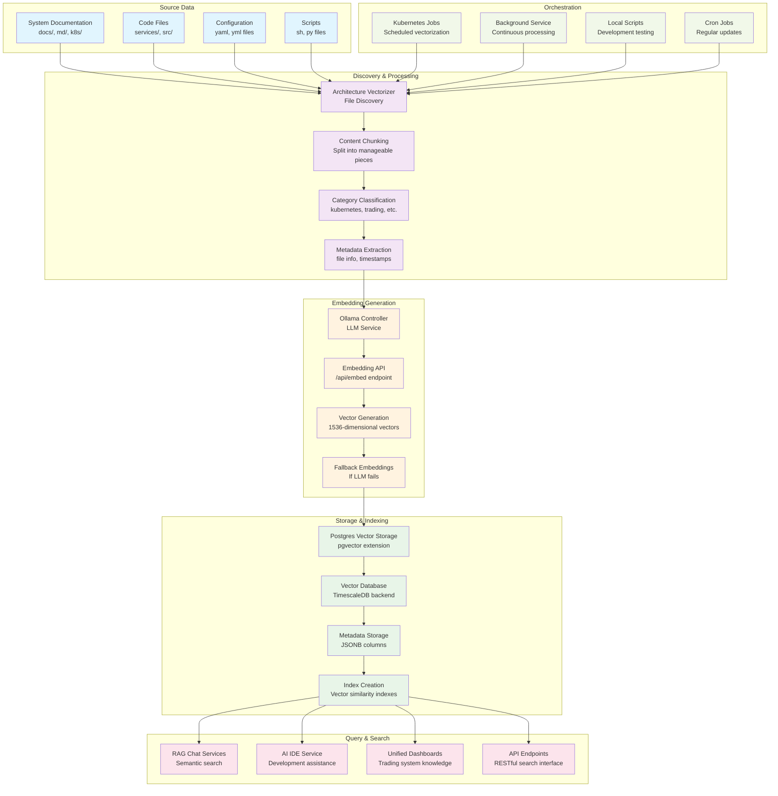

## 🔄 **Process Steps**

### **Step 1: Data Discovery**
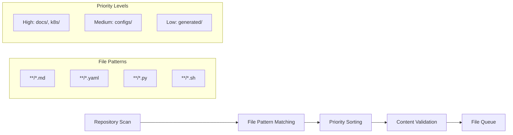

### **Step 2: Content Processing**
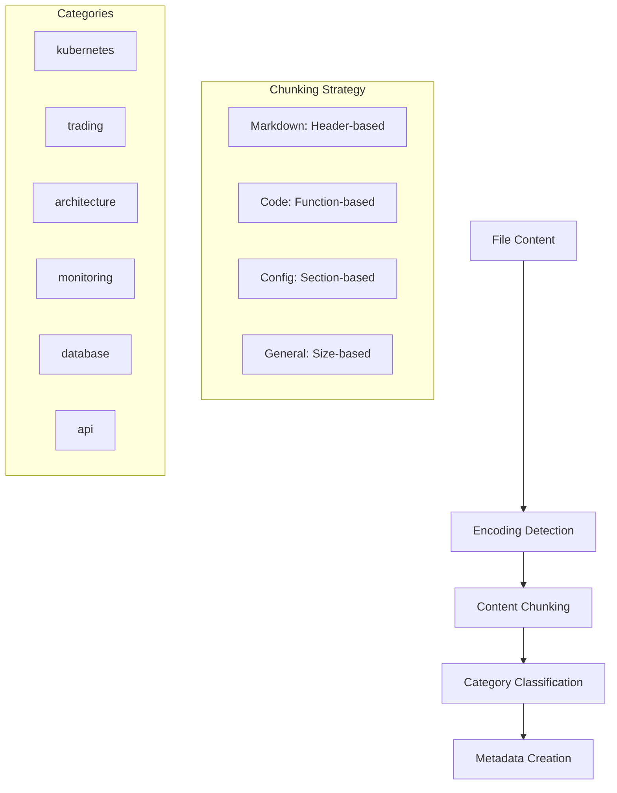

### **Step 3: Embedding Generation**
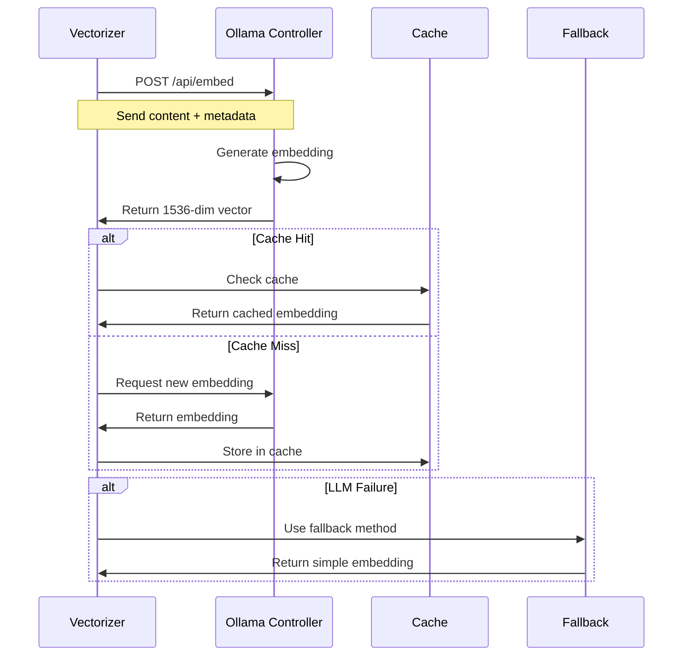

### **Step 4: Storage & Indexing**
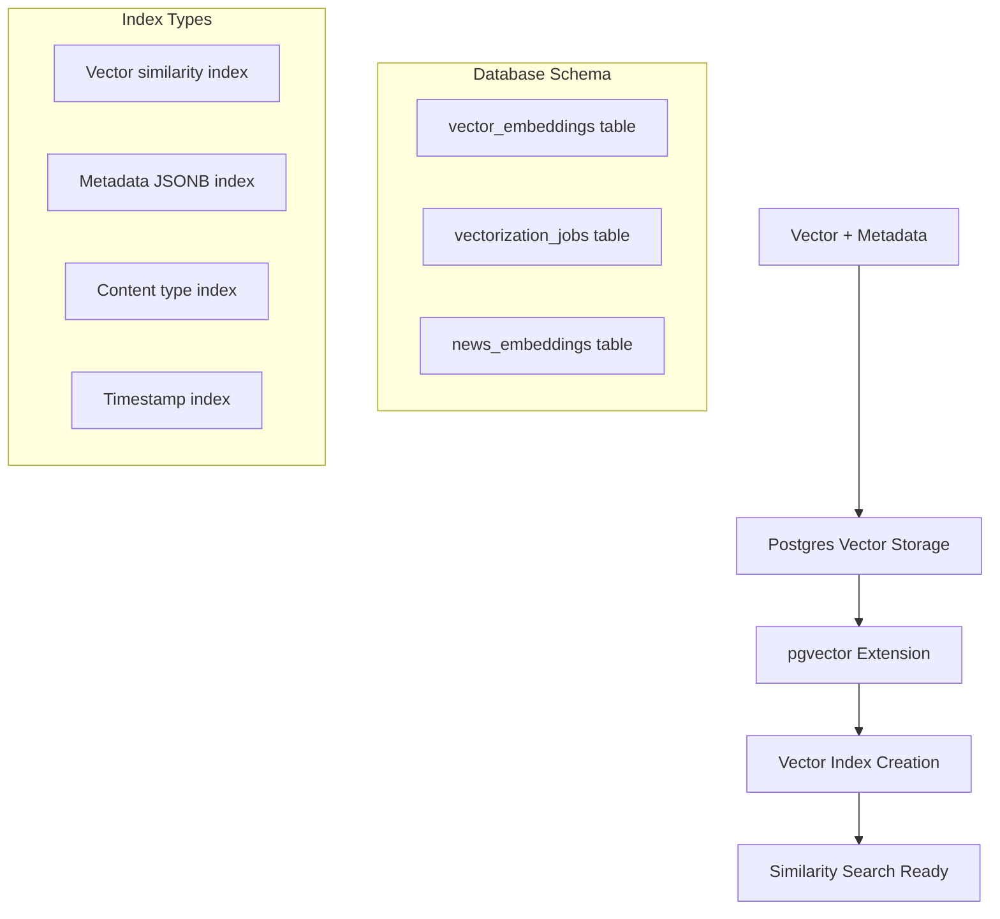

## 📈 **Performance Metrics**

### **Processing Statistics**
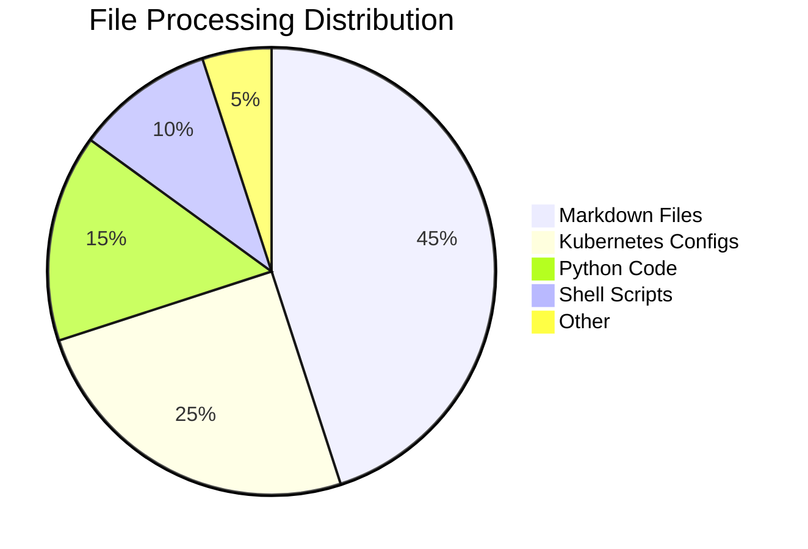

### **Vectorization Timeline**
```mermaid
gantt
    title Vectorization Job Timeline
    dateFormat X
    axisFormat %H:%M
    
    section Discovery
    File Scanning    :0, 2
    Pattern Matching :2, 4
    Priority Sorting :4, 5
    
    section Processing
    Content Chunking :5, 15
    Category Classification :15, 20
    Metadata Extraction :20, 25
    
    section Embedding
    LLM Requests     :25, 45
    Vector Generation :45, 50
    Cache Storage    :50, 55
    
    section Storage
    Database Insert  :55, 65
    Index Creation   :65, 70
    Completion       :70, 75
```

## 🔍 **Search Flow**

### **Query Processing**
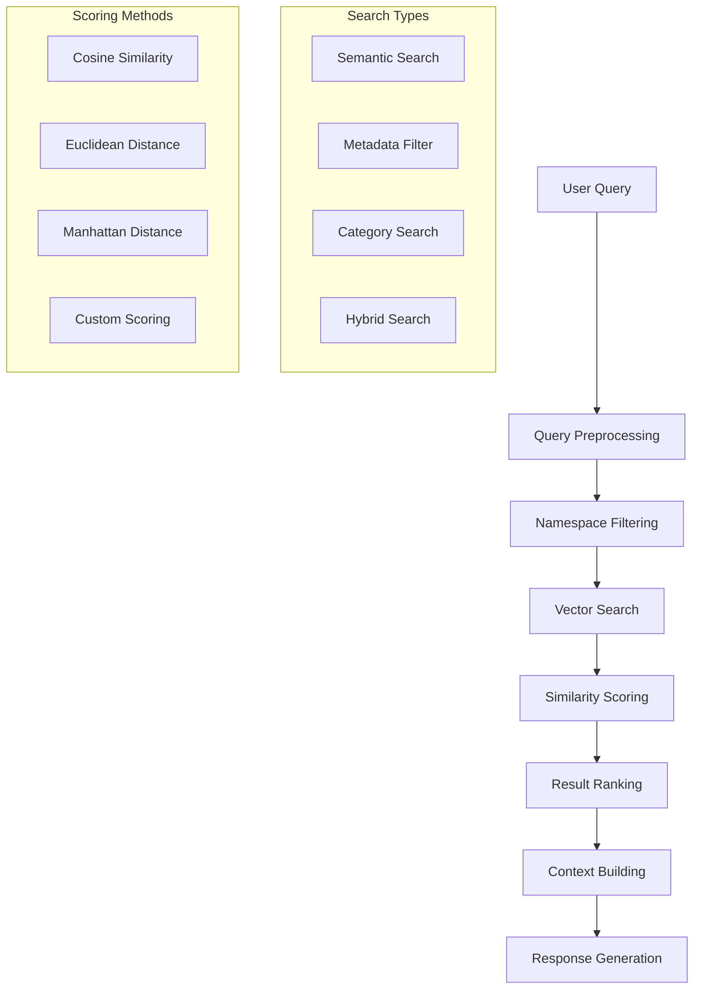

## 🛠️ **Troubleshooting Flow**

### **Issue Detection**
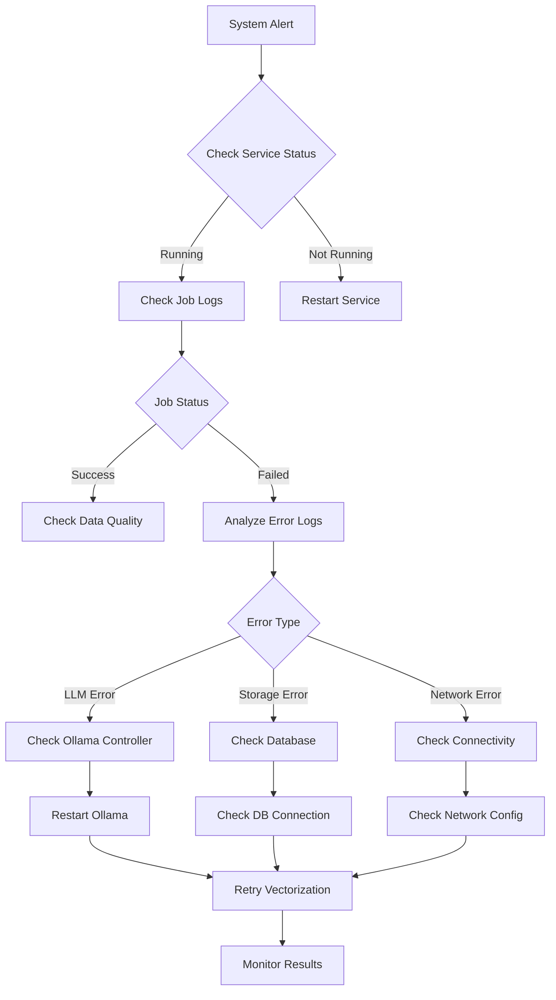

## 📊 **Monitoring Dashboard**

### **Key Metrics**
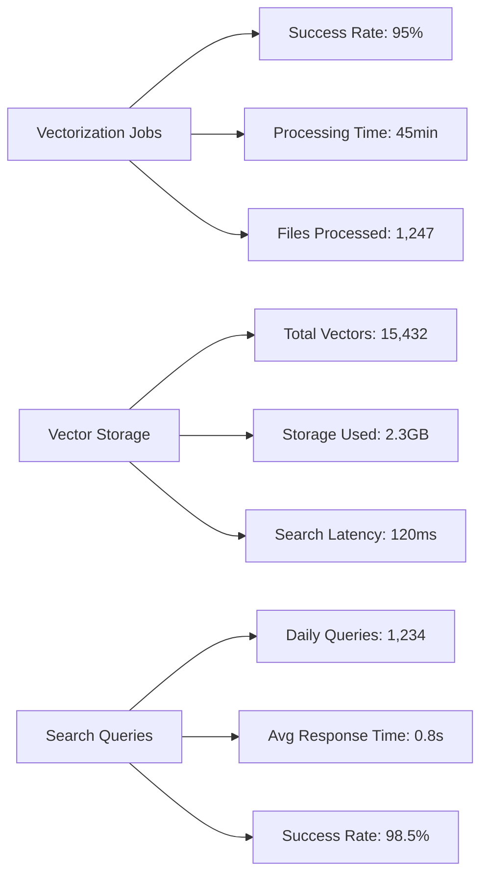

## 🔄 **Maintenance Schedule**

### **Regular Tasks**
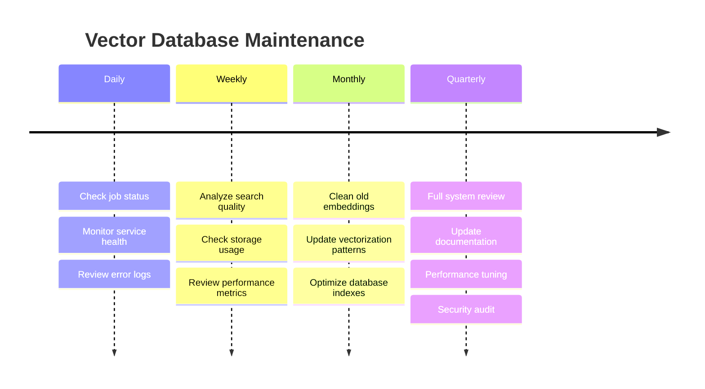

---

**Last Updated**: $(date)
**Version**: 1.0
**Maintainer**: Orion AI Assistant

