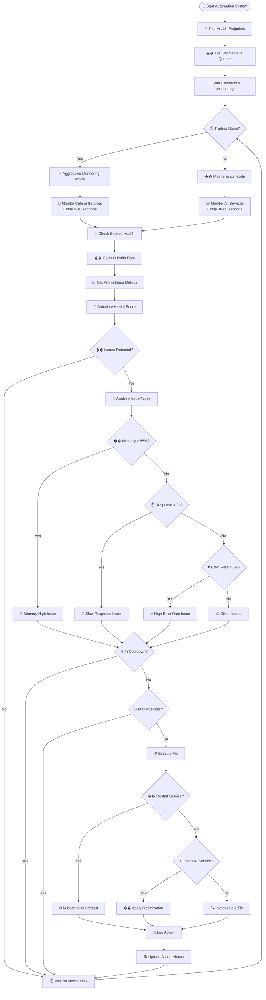

# Automated MCP Monitoring Service

## Overview

The Automated MCP Monitoring Service is an intelligent automation system that continuously monitors your trading system's health and automatically applies fixes when issues are detected. It provides 24/7 monitoring with different service tiers and automated responses based on trading hours.

## Architecture

### Service Tiers

#### Critical Services (5-10 second monitoring)
- **trading-engine**: Core trading logic
- **market-data-service**: Real-time market data
- **strategy-service**: Trading strategies

#### Important Services (30 second monitoring)
- **ai-analysis-service**: AI analysis
- **portfolio-management**: Portfolio tracking
- **risk-management**: Risk controls
- **unified-trading-dashboard**: Main UI

#### Supporting Services (60 second monitoring)
- **unified-analytics-dashboard**: Analytics UI
- **unified-news-dashboard**: News UI
- **news-service**: News processing
- **rss-feed-service**: RSS feeds
- **vector-storage**: Vector database
- **llm-proxy**: LLM proxy service
- **prometheus**: Metrics collection
- **grafana**: Monitoring dashboards

## Monitoring Process

### 1. System Initialization
```python
# Start automation system
async def start_automation_system():
    # Test health endpoints first
    health_test = await health_check_tester.test_all_endpoints()
    
    # Test Prometheus queries
    prometheus_test = await prometheus_tester.test_all_queries()
    
    # Start continuous monitoring for each tier
    tasks = []
    for tier in ServiceTier:
        task = asyncio.create_task(self._monitor_service_tier(tier))
        tasks.append(task)
```

### 2. Health Data Collection
- **Health Check Endpoints**: HTTP health checks on all services
- **Prometheus Metrics**: Memory, CPU, response time, error rates
- **Health Score Calculation**: 0-100 score based on multiple factors

### 3. Issue Detection
- **Memory High**: >85% memory usage
- **Slow Response**: >2 second response time
- **High Error Rate**: >5% error rate
- **Service Down**: Health check failures

### 4. Automated Responses
- **Memory High**: Restart service (5min cooldown, max 3 attempts)
- **Slow Response**: Optimize service (10min cooldown, max 2 attempts)
- **High Error Rate**: Investigate & fix (3min cooldown, max 3 attempts)

## Process Flow Diagram



## API Endpoints

### Health Check Testing
- `GET /api/mcp/health/test-all` - Test all health endpoints
- `GET /api/mcp/health/test/{service_name}` - Test specific service health

### Prometheus Testing
- `GET /api/mcp/prometheus/test-all` - Test all Prometheus queries

### Automation Control
- `POST /api/mcp/automation/start` - Start automation system
- `POST /api/mcp/automation/stop` - Stop automation system
- `GET /api/mcp/automation/status` - Get automation status
- `GET /api/mcp/automation/recent-actions` - Get recent automation actions

### Monitoring Integration
- `GET /api/mcp/monitoring/overview` - Get system health overview
- `GET /api/mcp/monitoring/service/{service_name}` - Get service health data

## Configuration

### Service Health Endpoints
```python
health_endpoints = {
    "unified-analytics-dashboard": "http://localhost:11115/health",
    "unified-trading-dashboard": "http://localhost:11114/health",
    "unified-news-dashboard": "http://localhost:11116/health",
    "trading-engine": "http://localhost:11080/health",
    "market-data-service": "http://localhost:11084/health",
    "strategy-service": "http://localhost:11081/health",
    "ai-analysis-service": "http://localhost:11082/health",
    "portfolio-management": "http://localhost:11083/health",
    "risk-management": "http://localhost:11085/health",
    "news-service": "http://localhost:11086/health",
    "rss-feed-service": "http://localhost:11087/health",
    "vector-storage": "http://localhost:11088/health",
    "llm-proxy": "http://localhost:12001/health",
    "prometheus": "http://localhost:11090/health",
    "grafana": "http://localhost:11091/health"
}
```

### Prometheus Queries
```python
prometheus_queries = {
    "memory_usage": "container_memory_usage_bytes{name=~\"{service_name}.*\"}",
    "cpu_usage": "rate(container_cpu_usage_seconds_total{name=~\"{service_name}.*\"}[5m])",
    "response_time": "histogram_quantile(0.95, rate(http_request_duration_seconds_bucket{service=\"{service_name}\"}[5m]))",
    "error_rate": "rate(http_requests_total{service=\"{service_name}\",status=~\"5..\"}[5m]) / rate(http_requests_total{service=\"{service_name}\"}[5m])",
    "request_rate": "rate(http_requests_total{service=\"{service_name}\"}[5m])"
}
```

### Automation Rules
```python
automation_rules = {
    "memory_high": {
        "threshold": 85,
        "action": "restart_service",
        "cooldown": 300,  # 5 minutes
        "max_attempts": 3
    },
    "response_time_slow": {
        "threshold": 2000,  # 2 seconds
        "action": "optimize_service",
        "cooldown": 600,  # 10 minutes
        "max_attempts": 2
    },
    "error_rate_high": {
        "threshold": 5,  # 5%
        "action": "investigate_and_fix",
        "cooldown": 180,  # 3 minutes
        "max_attempts": 3
    }
}
```

## Health Score Calculation

The health score (0-100) is calculated based on:

- **Health Check Status**: -30 points if unhealthy
- **Memory Usage**: -20 points if >85%, -10 points if >70%
- **Response Time**: -20 points if >2s, -10 points if >1s
- **Error Rate**: -25 points if >5%, -10 points if >1%

## Trading Hours Detection

- **Trading Hours**: 9:30 AM - 4:00 PM EST
- **Aggressive Mode**: Critical services monitored every 5-10 seconds
- **Maintenance Mode**: All services monitored every 30-60 seconds

## File Structure
services/mcp-service/
├── main.py # Main MCP service
├── mcp_tools/
│ ├── intelligent_automation_tool.py # Core automation logic
│ ├── health_check_tester.py # Health endpoint testing
│ ├── prometheus_tester.py # Prometheus query testing
│ ├── monitoring_integration.py # Real-time monitoring
│ ├── architecture_tool.py # System architecture analysis
│ ├── service_discovery_tool.py # Service discovery
│ └── system_control_tool.py # System control operations
└── clients/
└── service_client.py # Service communication client


## Usage Examples

### Start the Automation System
```bash
curl -X POST http://localhost:11117/api/mcp/automation/start
```

### Check System Status
```bash
curl -s http://localhost:11117/api/mcp/automation/status | jq '.'
```

### Test Health Endpoints
```bash
curl -s http://localhost:11117/api/mcp/health/test-all | jq '.'
```

### Get System Overview
```bash
curl -s http://localhost:11117/api/mcp/monitoring/overview | jq '.'
```

### View Recent Actions
```bash
curl -s http://localhost:11117/api/mcp/automation/recent-actions | jq '.'
```

## Benefits

### Immediate Benefits
- **24/7 System Monitoring**: Never miss an issue
- **Automatic Problem Resolution**: Fixes happen without human intervention
- **Reduced Downtime**: Issues resolved in seconds, not minutes
- **Consistent Performance**: System maintains optimal state automatically

### Advanced Capabilities
- **Learning System**: Gets smarter over time
- **Predictive Actions**: Prevents issues before they occur
- **Cost Optimization**: Automatically optimizes resource usage
- **Performance Tuning**: Continuously improves system performance

## Monitoring and Logging

### Action History
All automation actions are logged with:
- Timestamp
- Service name
- Issue type and value
- Action taken
- Success/failure status

### Health Metrics
Continuous tracking of:
- Service availability
- Response times
- Error rates
- Resource usage
- Health scores

### Alerting
- Real-time issue detection
- Automated response logging
- Performance trend analysis
- System health reporting

## Troubleshooting

### Common Issues
1. **Service Not Responding**: Check port forwarding and service status
2. **Prometheus Queries Failing**: Verify Prometheus is running and accessible
3. **Automation Not Starting**: Check service logs and configuration
4. **Health Checks Failing**: Verify service endpoints are accessible

### Debug Commands
```bash
# Check service status
kubectl get pods -l app=mcp-service

# Check logs
kubectl logs -l app=mcp-service

# Test health endpoints
curl -s http://localhost:11117/api/mcp/health/test-all

# Check automation status
curl -s http://localhost:11117/api/mcp/automation/status
```

## Future Enhancements

### Planned Features
- **Machine Learning Integration**: Learn from historical patterns
- **Advanced Alerting**: Email/Slack notifications
- **Predictive Analytics**: Forecast issues before they occur
- **Custom Automation Rules**: User-defined automation logic
- **Performance Dashboards**: Visual monitoring interfaces

### Integration Opportunities
- **External Monitoring**: Integration with external monitoring tools
- **Business Logic**: Integration with trading business rules
- **Cost Management**: Automated resource scaling based on cost
- **Compliance**: Automated compliance checking and reporting

---

*This document provides a comprehensive overview of the Automated MCP Monitoring Service. For technical implementation details, refer to the source code in the `services/mcp-service/` directory.*