# Trading System Architecture

## System Overview
**Type**: Microservices with Kubernetes  
**Total Services**: 37  
**Status**: Active with MCP Service Management  
**Python Environments**: 4 Active Virtual Environments

## Architecture Diagram

```mermaid
graph TB
    %% External Data Sources
    subgraph "External Data Sources"
        MarketData[Market Data Feeds]
        NewsData[News & RSS Feeds]
        EconomicData[Economic Calendar]
    end

    %% User Interface Layer
    subgraph "User Interface Layer"
        AnalyticsDash[Unified Analytics Dashboard<br/>Port: 11114 ✅]
        TradingDash[Unified Trading Dashboard<br/>Port: 11115 ✅]
        NewsDash[Unified News Dashboard<br/>Port: 11116 ✅]
        PerfDash[Performance Dashboard]
    end

    %% Core Trading Services
    subgraph "Core Trading Services"
        TradingEngine[Trading Engine]
        StrategyService[Strategy Service<br/>Port: 11103]
        MarketDataService[Market Data Service<br/>Port: 11084]
        PortfolioService[Portfolio Service]
        OrderService[Order Service]
        RiskService[Risk Service]
    end

    %% AI & Analytics Services
    subgraph "AI & Analytics Services"
        AIAnalysis[AI Analysis Service<br/>Port: 11085 ✅]
        LLMProxy[LLM Proxy]
        VectorStorage[Vector Storage]
        BackgroundVector[Background Vectorization Service]
    end

    %% Data Layer
    subgraph "Data Layer"
        TimescaleDB[(TimescaleDB<br/>Primary Database<br/>Port: 11140)]
        Redis[(Redis<br/>Cache & Sessions<br/>Port: 11142)]
        RabbitMQ[(RabbitMQ<br/>Message Queue<br/>Port: 11144)]
        PostgresVector[(PostgreSQL Vector Storage)]
    end

    %% Monitoring & Management
    subgraph "Monitoring & Management"
        Prometheus[Prometheus<br/>Metrics Collection<br/>Port: 11190]
        Grafana[Grafana<br/>Monitoring Dashboard<br/>Port: 11044]
        MCP[MCP Service<br/>System Management<br/>Port: 11117 ✅]
        InfraMetrics[Infrastructure Metrics Collector]
    end

    %% Backend Services
    subgraph "Backend Services"
        BacktestAPI[Backtest API<br/>Port: 11101]
        NewsService[News Service]
        SentimentAnalysis[Sentiment Analysis]
    end

    %% Data Flow Connections
    MarketData --> MarketDataService
    NewsData --> NewsService
    EconomicData --> MarketDataService

    MarketDataService --> TimescaleDB
    MarketDataService --> Redis
    MarketDataService --> StrategyService

    NewsService --> SentimentAnalysis
    SentimentAnalysis --> AIAnalysis
    AIAnalysis --> VectorStorage
    AIAnalysis --> TradingEngine

    StrategyService --> TradingEngine
    TradingEngine --> PortfolioService
    TradingEngine --> RiskService
    RiskService --> OrderService

    %% Dashboard Connections
    AnalyticsDash --> AIAnalysis
    AnalyticsDash --> TimescaleDB
    TradingDash --> TradingEngine
    TradingDash --> PortfolioService
    NewsDash --> NewsService
    NewsDash --> SentimentAnalysis

    %% MCP Service Connections
    MCP --> TradingEngine
    MCP --> MarketDataService
    MCP --> AIAnalysis
    MCP --> TimescaleDB
    MCP --> Redis
    MCP --> RabbitMQ

    %% Monitoring Connections
    Prometheus --> TradingEngine
    Prometheus --> MarketDataService
    Prometheus --> AIAnalysis
    Grafana --> Prometheus

    %% Message Queue Connections
    RabbitMQ --> TradingEngine
    RabbitMQ --> MarketDataService
    RabbitMQ --> AIAnalysis
    RabbitMQ --> BackgroundVector

    %% Backtest Connections
    BacktestAPI --> StrategyService
    BacktestAPI --> TimescaleDB
    BacktestAPI --> MarketDataService

    %% Styling
    classDef activeService fill:#90EE90,stroke:#006400,stroke-width:2px
    classDef dataService fill:#87CEEB,stroke:#4682B4,stroke-width:2px
    classDef aiService fill:#DDA0DD,stroke:#8B008B,stroke-width:2px
    classDef monitoringService fill:#F0E68C,stroke:#B8860B,stroke-width:2px
    classDef externalService fill:#FFB6C1,stroke:#DC143C,stroke-width:2px

    class AnalyticsDash,TradingDash,NewsDash,AIAnalysis,MCP activeService
    class TimescaleDB,Redis,RabbitMQ,PostgresVector dataService
    class AIAnalysis,LLMProxy,VectorStorage,BackgroundVector,SentimentAnalysis aiService
    class Prometheus,Grafana,InfraMetrics monitoringService
    class MarketData,NewsData,EconomicData externalService
```

## Service Status Legend
- ✅ **Active & Port-Forwarded**: Currently accessible via localhost
- 🔄 **Running in Cluster**: Active but not port-forwarded
- ❌ **Inactive**: Not currently running

## Data Flow Patterns
1. **Market Data Flow**: External Feeds → Market Data Service → Database → Strategy Service → Trading Engine
2. **News Analysis Flow**: News Feeds → News Service → Sentiment Analysis → AI Analysis → Trading Decisions
3. **Trading Execution Flow**: Trading Engine → Portfolio Service → Risk Service → Order Execution
4. **AI Processing Flow**: Data → Vector Storage → Background Vectorization → AI Analysis → Insights

## Development Environment

### Python Virtual Environments
The system uses **4 dedicated virtual environments** for different purposes:

1. **`.venv`** - Main development environment (Primary)
2. **`test-env`** - Testing and validation environment (New)
3. **`k8s-job-generator-env`** - Kubernetes job management
4. **`migration-env`** - Database migration and schema management

**Documentation**: [Python Virtual Environments](docs/python-virtual-environments.md)

### Testing Strategy
- **Isolated test database**: `trading_bot_test` (separate from production)
- **Test-specific Redis DB**: DB 1 (vs DB 0 for production)
- **Test RabbitMQ vhost**: `trading_vhost_test` (vs `trading_vhost` production)
- **Comprehensive test suite**: Unit, integration, and CQRS tests

## Key Features
- **Microservices Architecture**: 37 services running on Kubernetes
- **AI-Powered Trading**: LLM integration with vector storage and sentiment analysis
- **Real-time Data Processing**: Market data feeds with TimescaleDB for time-series data
- **Comprehensive Monitoring**: Prometheus + Grafana for system observability
- **MCP Management**: Centralized system control and monitoring via MCP service
- **Scalable Design**: Message queue (RabbitMQ) for async processing
- **Multi-Dashboard Interface**: Separate dashboards for analytics, trading, and news
- **Isolated Testing**: Dedicated test environment with complete data isolation
